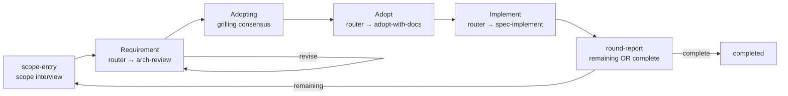
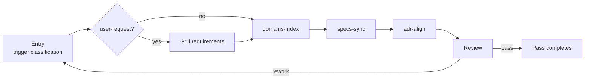
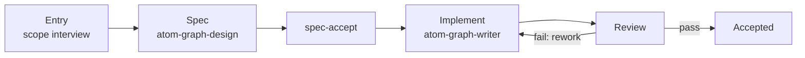

# Atomic Workflow 

> ⚠️ AI-generated README — edit [docs/readme-blueprint.md](docs/readme-blueprint.md) instead.

**Languages**: English (root) · [中文](docs/README.zh-CN.md)

Graph-Engineering for Real Engineers: Graphs define workflows; workflows build graphs. Based on mattpocock/skills.

  

## Table of Contents

**Part 1 — Out-of-the-Box Workflows**

- [arch-review-loop](#arch-review-loop)
- [estate-maintain](#estate-maintain)
- [All Built-in Workflows](#all-built-in-workflows)
- [Documentation Management](#documentation-management)

**Part 2 — Basics & Graph Making**

- [The Problem](#the-problem)
- [How It Works](#how-it-works)
- [Installation](#installation)
- [Setup](#setup)
- [Making a Graph](#making-a-graph)

**Tail**

- [Architecture](#architecture)
- [Status & Roadmap](#status--roadmap)
- [Contributing](#contributing)
- [Dependencies](#dependencies)
- [Thanks](#thanks)
- [Further Reading](#further-reading)

---

## Part 1 — Out-of-the-Box Workflows

## arch-review-loop

The flagship workflow — one loop takes the biggest remaining architectural problem from review to shipped change.

**How to read this section**: code blocks are **prompts** you send to your agent (verbatim); plain text is explanation. Every prompt follows one template; `<angle brackets>` are the parts you fill in:

```text
Use atom-pilot to run <graph name>: <your goal in plain language>
```

The loop at a glance — one round composes requirement production, adoption, and implementation; the round-report terminal re-enters the round on `remaining` (flow self-edge) or drains on `complete`; termination is the user's call at the direct-end options:



One round composes requirement production (`arch-review`) with the requirement accept loop hosted on the framework's requirement router node (accept → adopt; revise → flow self-edge re-run), adoption + spec production (`adopt-with-docs`, grilling consensus is the acceptance), and implementation (`spec-implement`); the round-report terminal re-enters the round on `remaining` (flow self-edge) or drains on `complete`; termination is the user's call at the direct-end options of scope-entry / adopting (node report `direct_end: true` → pilot advances with the end decision — run completes as `completed`, never `force_end`).

```text
Use atom-pilot to run arch-review-loop: find and fix the biggest architectural problem in this codebase.
```

### Decomposition steps

The round splits into three independently executable graphs; `arch-review-loop` composes them. Pick the entry that matches your need:

|Need|Run|
|-|-|
|Requirement production only (find problems)|`graph_start arch-review-loop` (interactive scope-entry + requirement accept loop hosted by the framework — arch-review itself is a non-interactive analysis chain)|
|Adoption + spec only (confirm a produced report, produce the change)|`graph_start arch-review-loop` (adoption interaction hosted by the framework — adopt-with-docs is a non-interactive self-deciding spec pipeline)|
|Implementation only (change exists)|`graph_start spec-implement` with `args.changeName`|
|Full round (requirement + adoption + implementation in one loop)|`graph_start arch-review-loop`|

- `arch-review` — non-interactive requirement production subgraph (`interaction: none`): explore → first-principles → present-candidates pure analysis chain. Interactive scope-entry and the requirement accept loop (accept/revise on the requirement router node, ADR 0246) are hosted by the composing framework graph (arch-review-loop / first-principles-dev), which strings this subgraph between its own interactive nodes; no standalone interactive execution.
- `adopt-with-docs` — non-interactive adoption spec-production subgraph (`interaction: none`): self-deciding spec-propose consuming the adoption consensus from the composing framework graph's interactive nodes via channels. Adoption consensus (adopting grilling — the consensus IS the acceptance, ADR 0246; the adoption goal is confirmed in the grilling first-round frontier — the adopt-scope interview is deleted, ADR 0247) are framework-hosted; raw-idea journeys route through a framework graph.
- `spec-implement` — non-interactive implementation (`interaction: none`): spec-extract reads the produced change (upstream channel when composed, `args.changeName` standalone) → track machinery → archive (tracks own post-archive doc maintenance). No spec generation, no auto-loop gate — rework is the single loop in `arch-review-loop`.

**Raw MCP tools?** The loop behind all of this is `graph_start` → execute the returned work order → `graph_advance` → repeat until null. If you want to drive the MCP tools directly instead of via atom-pilot, see the call-flow example in [packages/graph-scheduler/README.md](packages/graph-scheduler/README.md).

**Want to go deeper?** → [packages/graph-scheduler/README.md](packages/graph-scheduler/README.md) for the graph format and all tools, [packages/graph-workflow/README.md](packages/graph-workflow/README.md) for the skill system.

## estate-maintain

Doc-estate maintenance as a graph — keeps the derived-view / normative / contract doc classes in sync after a domain or skill change.



The entry classifies the trigger (domain-change / skill-change / proactive / user-request — user-request adds a grilling confirmation step, no ADR), then dispatches the matching workstream — `domains-index` (atom-doc-maintain), `specs-sync` (atom-spec-maintain), `adr-align` (atom-adr-maintain); the review is a consistency gate (requirements class + reverse-validation + read-only deployment-mirror check):

```text
Use atom-pilot to run estate-maintain: sync the doc estate after the domains change.
```

## All Built-in Workflows

Twelve workflows ship in `packages/graph-scheduler/graphs/` and run out of the box. Three get the deep treatment above (arch-review-loop, estate-maintain, graph-generate below); the rest are one-line entries — full detail in [packages/graph-scheduler/README.md](packages/graph-scheduler/README.md):

|Graph|What it does|
|-|-|
|**arch-review-loop**|See above — the flagship loop|
|**arch-review**|Non-interactive requirement production subgraph (interaction: none): explore (improve-codebase-architecture Step 1 — codebase walk, friction evidence) → first-principles (analysis over requirement input + explore digest) → present-candidates (report preserves the upstream thinking chain). Pure analysis chain — interactive scope-entry and the requirement accept loop (accept/revise on the requirement router node, ADR 0246) are hosted by the composing framework graph (arch-review-loop / first-principles-dev), which strings this subgraph between its own interactive nodes.|
|**adopt-with-docs**|Non-interactive adoption spec-production subgraph (interaction: none): spec-propose (openspec-propose — adopted requirements materialize as the OpenSpec change), a self-deciding pipeline consuming the adoption consensus from the composing framework graph's interactive nodes via channels. Interactive adoption consensus (adopting grilling — the consensus IS the acceptance, ADR 0246; adoption goal + trace intent confirmed in the grilling first-round frontier — the adopt-scope interview is deleted, ADR 0247) are hosted by the framework graph (arch-review-loop / first-principles-dev); raw-idea journeys route through a framework graph.|
|**spec-implement**|Non-interactive implementation graph (interaction: none): spec-extract (produced change — upstream channel when composed / {args.changeName} standalone) → track gate (minimal/detailed) → track-owned closure (plain archive / atom-doc-lifecycle) → workflow-done. Pure implementation of an existing change — no spec generation; rework is the loop in arch-review-loop.|
|**openspec-apply**|OpenSpec apply workflow: apply change → dual review → bounded rework decision → plain archive (openspec-archive-change)|
|**openspec-engineer**|OpenSpec detailed implementation: spec synthesis → tickets → tdd implementation → dual review → rework decision → confirmation → lifecycle closure (reverse-validated archive + ADR fold + index)|
|**e2e-minimal**|Minimal E2E: main → main confirmation loop|
|**estate-maintain**|See above — estate maintenance|
|**release-prep**|Pre-release preparation — propose (release-prep-analyze: version from git tag history, deterministic + idempotent pre-tag, never executes git tag/commit/push) → plan-grill (grilling confirmation of every planned operation — interview, never auto-gated) → apply (release-prep-apply: version bump on release-line surfaces + CHANGELOG [Unreleased] fold per spec + README list sync vs ground truth, overwrite-style + verified) → release-review (approval; continue completes the run — final report prints tag/commit commands, user executes manually; jump re-runs a phase).|
|**graph-generate**|See [Making a Graph](#making-a-graph) (Part 2) — the maker journey|
|**graph-maintain**|Graph file maintenance — the maintenance flow: entry (atom-scope-interview — target graph via graph_assets + maintenance intent) → audit (atom-graph-writer maintain mode: inventory compliance + content-vs-inventory) → propose (per-finding fix proposals) → approval (mandatory user gate) → execute (two-path bundle apply + load-probe) → review → rework decision → accept. Mirrors the maker journey; pairs with the problem-surfacing channel (graph_start problems / graph_init full pass / graph_assets query)|
|**first-principles-dev**|First-principles-prerequisite development flow with framework-hosted interaction: scope-entry (framework-owned atom-scope-interview — scope + requirement/diff input + report input + output path) → requirement (arch-review, interaction: none — pure analysis chain; the requirement accept loop is caller-declared on the router node — accept → adopt, revise → flow self-edge re-run, ADR 0246) → adopting (framework-owned grilling — the consensus IS the acceptance; adoption goal + trace intent confirmed in the first-round frontier, the adopt-scope interview is deleted, ADR 0247) → adopt (adopt-with-docs, interaction: none — self-deciding spec production) → implement (spec-implement, interaction: none) → fp-doc-update (folds requirement/diff + reasoning conclusions into docs/first-principles/development-flow.md per the fp README update-maintenance contract; reports round condition remaining \| complete — flow self-edge re-entry or drain)|

## Documentation Management

How this project's documentation is managed — **only the documents the current built-in graphs actually consume are listed**; everything else in `docs/` is legacy, kept for reference, not consumed by any graph.

The graph runtime delivers context through channels: ambient context (convention files, user-supplement config, platform estate) plus graph-declared channels, constraints, and run state. What the 12 built-in graphs actually consume:

|Class|Documents|Consumed by|
|-|-|-|
|Convention layer (default-loaded into every phase)|`CONTEXT.md` (glossary), `docs/domains.md` (domain index)|all graph phases|
|Platform estate (organic — agent-read when present, never declared)|`docs/adr/` + `index.md` + `archive/` (ADRs), `openspec/specs/**`, `openspec/changes/**` (spec assets)|estate-maintain (adr-align), openspec graphs, arch-review-loop adoption chain|
|Constraints|`.graph-scheduler/constraints.md` → `constraints.json`|activation (pilot loads once into the session; every node's Constraints block assembles from it)|
|Runtime|node run state (progress only — status/retry/timing; node content lives in the agent session, ADR 0143)|graph-scheduler DB (delta snapshots — one-line rows + changed rows per dispatch)|
|Assets|`packages/graph-scheduler/graphs/` + `registry.json` (12 graphs), `packages/graph-workflow/skills/` (17 skills)|all graph execution|
|Artifacts|`docs/reports/` (arch-review reports), `docs/adopt/` (adoption records)|arch-review / adopt-with-docs|

Specs and changes follow the OpenSpec flow: proposals become `openspec/changes/<name>/` (proposal + delta specs + design + tasks), implementation syncs deltas into `openspec/specs/`, then the change archives. ADRs record decisions; superseded ones fold into `docs/adr/archive/`. The README family itself is regenerated from this blueprint.

**Legacy, not graph-consumed**: `docs/design.md`, `docs/philosophy.md`, `docs/requirements.md`, `docs/core-requirements.md`, `docs/conventions.md`, `docs/workflow.md`, `docs/constraints.md`, `docs/specs/`, `docs/grill/`, `docs/designs/`, `docs/tickets/`, `docs/agents/`, `docs/platform/`, `docs/dev/`, `docs/readme-blueprint.md` (regeneration source, not graph input) — kept for reference.

---

## Part 2 — Basics & Graph Making

**Graph is just a tool; Attention is all you need.**

## The Problem

AI agents skip steps silently, lose context between stages, can't express conditional branches, and lack structured approval gates. These failures share a root cause: **the agent has no work-order system**. It's told "build this feature" and left to improvise. When it misses a review step or forgets to update docs, nothing in the execution model prevents it — because there _is_ no execution model. Atomic Workflow gives agents one: explicit phases, declared dependencies, runtime context injection, and non-bypassable approval gates.

---

## How It Works

**Runtime work orders with graph.** Each phase is a self-contained work order. Your agent pulls the next ready order, executes it, reports back; the scheduler advances the graph. The graph only tracks progress and reminds what's next — it executes nothing. The workflow graph captures what linear chains can't: conditional branches, approval gates, bounded rework loops, round re-entry.

**Graphs are self-contained.** Every graph is one workflow YAML that declares everything it needs: phases (task text, skill, channels), the top-level `flow` block — the transition surface, the graph's routing authority — `inventory` (one goal + constraints entry per phase), and graph-level `constraints` (prose rules: rework bounds, condition vocabulary). The graph declares its own interaction mode and catalog description. Nothing external orchestrates it: the engine validates the YAML and routes by the transition table; the agent reads the phase's own declaration. A graph is a complete work-order board, not a fragment.

**Subgraphs are just graphs.** Nested execution is `template: router` — a node whose `paths` are graph names. The router's agent selects one (a unique candidate or a hard criterion → auto-select; otherwise a recommendation card) and the frontend starts it as a sibling run: `graph_start` → drive to `node: null` → collect the result. No `use` composition, no namespaced members — every graph is standalone with its own interaction mode. A "subgraph" is just another graph; composition is running, not nesting.

**Hints, not controls — the graph never dispatches.** A graph says _what_ each phase needs — skills, context, and, optionally, agent-type preferences in priority order. Dispatch itself stays in your agent's hands: when a skill fans out sub-agents, it follows the hints, not the graph's command. The graph is a work-order board, not a manager.

**Your agent still does everything.** No code execution, no hidden engine, no new runtime language. The agent keeps its full toolkit — skills, tools, files — and does all the work. The graph only issues orders and tracks progress. That's the whole mechanism.

**Attention is all you need.** Agents fail from lost focus, not incapability. "Build this feature" is too big; "Write the User model type definition, given the schema from the previous step" is just right. A clear work order with bounded context eliminates the ambiguity that causes skipped steps, forgotten reviews, and drifting scope.

---

## Installation

### graph-scheduler

One package, two capabilities: the **MCP Server** (10 tools, stdio transport) and the `atom-graph-scheduler` bin. Two install routes — **the runtime matches the installer**:

**Option A: npm + Node runtime**

```bash
npm install -g @ai-atomic-workflow/graph-scheduler
```

Runtime: [Node](https://nodejs.org) ≥ 22. The package runs from its compiled entry — resolve the global path and register:

```bash
npm root -g   # → <npm-root>, e.g. /usr/local/lib/node_modules
```

```json
{
  "mcpServers": {
    "graph-scheduler": {
      "command": "node",
      "args": ["<npm-root>/@ai-atomic-workflow/graph-scheduler/dist/server.js"]
    }
  }
}
```

**Option B: bun**

```bash
bun add -g @ai-atomic-workflow/graph-scheduler
```

Runtime: [bun](https://bun.sh) ≥ 1. bun executes the TypeScript entry directly:

```bash
bun pm bin -g   # → <bun-bin>, e.g. ~/.bun/bin
```

```json
{
  "mcpServers": {
    "graph-scheduler": {
      "command": "bun",
      "args": ["<bun-bin>/atom-graph-scheduler"]
    }
  }
}
```

Config file locations: OMP → `~/.omp/agent/mcp.json`, OpenCode → `opencode.json`. Full details → [packages/graph-scheduler/README.md](packages/graph-scheduler/README.md).

### graph-workflow

Two install channels — pick one (all 17 built-in skills are required for graph execution):

**Option A: Claude Code marketplace**

```bash
/marketplace install makara/ai-atomic-workflow
```

**Option B: skills.sh** (third-party CLI, 76+ agent platforms — OpenCode / Codex / Cursor etc.)

```bash
npx skills add makara/ai-atomic-workflow
```

Common flags: `-a <agent>` pick platform (`-a '*'` all), `-g` global install, `-y` non-interactive, `-l` preview without installing.

### Install Dependencies

Two prerequisites for the openspec graphs and the parent skill chain:

- **OpenSpec CLI** — `npm install -g @fission-ai/openspec@latest`, then `openspec init` inside your project. → [installation docs](https://github.com/Fission-AI/OpenSpec/blob/main/docs/installation.md)
- **mattpocock/skills** — parent skills (grilling, domain modeling, TDD, code review): `npx skills add mattpocock/skills`. → [README](https://github.com/mattpocock/skills/blob/main/README.md)

## Setup

Initialize a project with the **setup-atomic-workflow** skill (the retired `atom-graph-config` CLI no longer exists):

```text
Use setup-atomic-workflow to initialize this project
```

It scaffolds `.graph-scheduler/` — `config.json` (db path, graph dir, registry paths), `graphs/`, `docs/`, and `constraints.md`. Idempotent: never overwrites existing files. Re-running it writes nothing.

## Making a Graph

The maker journey — Atomic Workflow bootstraps itself: authoring a graph is a built-in workflow, driven the same way as every graph.



Entry (atom-scope-interview, no CONTEXT.md hard dependency) → spec (topology design via atom-graph-design per atom-graph-spec) → spec-accept → implement (atom-graph-writer writes the `.yaml` + registry entry, load-probe validated) → review → rework decision (bounded rework) → accept. Single kind (graph), single operation (create) — no skill co-production. Skill production (create/edit) flows through `arch-review-loop` (improver journey) openspec changes — implementation loads the spec skill per affected domain (graph → atom-graph-spec, skill → atom-skill-spec, doc → atom-doc-maintain):

```text
Use atom-pilot to run graph-generate: generate a workflow for release notes from merged PRs.
```

---

## Architecture

**What a graph is.** A graph is a work-order board declared in a workflow YAML file — any `.yaml` document that passes schema validation, identified by its declared `name` (no suffix convention): a named set of phases wired by `dependsOn` edges. The scheduler issues each ready phase as a work order and tracks progress — it executes nothing. Your agent pulls the order, does the work, reports back; the graph advances.

**Graph structure.** Phases are the units of work — type `main` only (inline execution + decision; subgraph composition via `use` is deleted — nested execution is the `template: router` sibling run). Conditional routing lives in the top-level `flow` block (mermaid-subset transition edges — `A -->|condition| B` labeled, `A --> B` sequence default): the graph is the interpretation authority, the engine matches the reported condition value mechanically against the transition table and activates the target (no match fails loudly — missed-condition guard; `branchTo`/`routing` are deleted). Rework/loop is declared as `flow` self-edges (`A -->|fail| A` — inline bounded loops, bound in the graph's constraints prose + retryCount). Key phase fields: `task` (the work order / card text), `skill` (execution skill), `agent` (priority hints for sub-agent dispatch), `channels` (context — global `context:` + per-phase additions), `dependsOn` (topological order). Canonical top-level key order: `name → description → $schema → version → interaction → flow → inventory → constraints → context → phases` (flow before inventory, constraints after inventory).

**Built-in vs user graphs.** Built-in graphs ship in `packages/graph-scheduler/graphs/`, registered in `graphs/registry.json`. User graphs live in `.graph-scheduler/graphs/` (scaffolded by setup-atomic-workflow). Resolution is project-first: a project graph with the same name overrides a built-in.

Two packages:

|Package|Role|
|-|-|
|**graph-scheduler**|Infrastructure. MCP Server (graph execution engine, 10 tools) + built-in graphs shipped in the package.|
|**graph-workflow**|Skill system. `atom-pilot` (lifecycle loop), `atom-phase-handler` (single main dispatch), entry and reference skills.|

The 12-workflow list lives in [Part 1](#all-built-in-workflows) with the out-of-the-box pitch.

## Status & Roadmap

Atomic Workflow is in **alpha**.

**Stable** (implemented, no planned breaking changes before v1.0):

- graph-scheduler FSM engine and 10 MCP tools
- workflow YAML graph format (schema-defined identity — any `.yaml`; `$schema` + `version` self-description headers) and phase schema (main type + top-level `flow` transitions, channels, agent hints, run state)
- CRUD execution loop (`graph_start` → `graph_advance` → `graph_jump`, plus `graph_status` / `graph_list`)
- setup-atomic-workflow project initialization
- 12 built-in graphs and 17 built-in skills

**Active development** (may change):

- More control-flow features — branch-route patterns, rework decisions
- More built-in graphs / workflows
- Data maintenance tools (current `graph_clean_*` are minimal) — the MCP tool interface may change

### Roadmap

- [ ] More out-of-the-box graphs — release-notes generation, spec drafting, estate workflow extensions
- [ ] More token-saving strategies — leaner context channels, smaller graph overhead
- [ ] More convenient operations tooling — run status views, smarter history/cleanup
- [ ] Wider platform support — cross-platform MCP registration

---

## Contributing

Bug reports and pull requests welcome. See [CONTEXT.md](CONTEXT.md) for the project glossary and [docs/adr/](docs/adr/) for architectural decision records.

## Dependencies

- [OpenSpec CLI](https://github.com/Fission-AI/OpenSpec/blob/main/docs/installation.md) — spec lifecycle for the openspec graphs
- [mattpocock/skills](https://github.com/mattpocock/skills/blob/main/README.md) — parent skills for grilling, domain modeling, TDD, and more

## Thanks

- [taskflow](https://heggria.github.io/taskflow) — DAG execution model inspiration
- [Oh My Pi](https://omp.sh/) — agent harness platform

---

## Further Reading

|Document|For|
|-|-|
|[packages/graph-scheduler/README.md](packages/graph-scheduler/README.md)|Graph format, all 10 MCP tools, built-in graphs, making graphs with graphs|
|[packages/graph-workflow/README.md](packages/graph-workflow/README.md)|Skill system, full skill list, how skills drive graph execution|
|[CONTEXT.md](CONTEXT.md)|Terminology reference (project glossary)|
