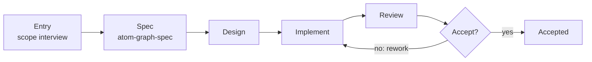
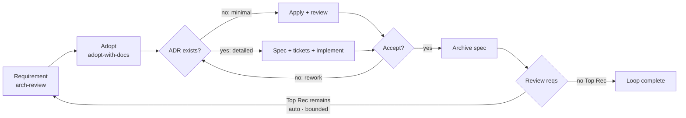

# Atomic Workflow 

> ⚠️ AI-generated README — edit [docs/readme-blueprint.md](docs/readme-blueprint.md) instead.

**Languages**: English (this file) · [中文](docs/README.zh-CN.md)

**Graph is just a tool; Attention is all you need.**

Graph-driven work-order system for AI agents — explicit phases, scoped context, and non-bypassable approval gates.

  

## Table of Contents

**Part 1 — Basics & Graph Making**

- [The Problem](#the-problem)
- [How It Works](#how-it-works)
- [Installation](#installation)
- [Setup](#setup)
- [Making a Graph](#making-a-graph)

**Part 2 — Out-of-the-Box Workflows**

- [arch-review-loop](#arch-review-loop)

**Tail**

- [Architecture](#architecture)
- [Status & Roadmap](#status--roadmap)
- [Contributing](#contributing)
- [Dependencies](#dependencies)
- [Thanks](#thanks)
- [Further Reading](#further-reading)

---

## Part 1 — Basics & Graph Making

## The Problem

AI agents skip steps silently, lose context between stages, can't express conditional branches, and lack structured approval gates. These failures share a root cause: **the agent has no work-order system**. It's told "build this feature" and left to improvise. When it misses a review step or forgets to update docs, nothing in the execution model prevents it — because there _is_ no execution model. Atomic Workflow gives agents one: explicit phases, declared dependencies, runtime context injection, and non-bypassable approval gates.

---

## How It Works

**Runtime work orders with graph.** Each phase is a self-contained work order. Your agent pulls the next ready order, executes it, reports back; the scheduler advances the graph. The graph only tracks progress and reminds what's next — it executes nothing. A DAG captures what linear chains can't: conditional branches, approval gates, parallel fan-outs.

**Scoped context with channels.** Each work order carries the exact prompt, the right skill, and a context "channel" — a focused slice of relevant decisions and artifacts, nothing heavy. Channels have two scopes: a global channel (graph-level `context:`, with the project's `config.json` as the default layer, merged once config-first) and per-phase `channels:` additions. Every node's output is a stream named `<nodeId>`: `node:<id>` entries read a non-`dependsOn` stream, `context: [node:<id>]` promotes one into the global channel. Patterns — skill names, file globs, or `node:<id>` references — resolve against the execution skill's context contract. No more "where are we?" or "what was decided earlier?" — your agent gets exactly what it needs for _this_ step.

**Hints, not controls — the graph never dispatches.** A graph says _what_ each phase needs — skills, context, and, optionally, agent-type preferences in priority order. Dispatch itself stays in your agent's hands: when a skill fans out sub-agents, it follows the hints, not the graph's command. The graph is a work-order board, not a manager.

**Your agent still does everything.** No code execution, no hidden engine, no new runtime language. The agent keeps its full toolkit — skills, tools, files — and does all the work. The graph only issues orders and tracks progress. That's the whole mechanism.

**Attention is all you need.** Agents fail from lost focus, not incapability. "Build this feature" is too big; "Write the User model type definition, given the schema from the previous step" is just right. A clear work order with bounded context eliminates the ambiguity that causes skipped steps, forgotten reviews, and drifting scope.

---

## Installation

### graph-scheduler

One package, two capabilities: the **MCP Server** (9 tools, stdio transport) and the `atom-graph-scheduler` bin. Two install routes — **the runtime matches the installer**:

**Option A: npm + Node runtime**

```bash
npm install -g @ai-atomic-workflow/graph-scheduler
```

Runtime: [Node](https://nodejs.org) ≥ 22. The package runs from its compiled entry — resolve the global path and register:

```bash
npm root -g   # → <npm-root>, e.g. /usr/local/lib/node_modules
```

```json
{
  "mcpServers": {
    "graph-scheduler": {
      "command": "node",
      "args": ["<npm-root>/@ai-atomic-workflow/graph-scheduler/dist/server.js"]
    }
  }
}
```

**Option B: bun**

```bash
bun add -g @ai-atomic-workflow/graph-scheduler
```

Runtime: [bun](https://bun.sh) ≥ 1. bun executes the TypeScript entry directly:

```bash
bun pm bin -g   # → <bun-bin>, e.g. ~/.bun/bin
```

```json
{
  "mcpServers": {
    "graph-scheduler": {
      "command": "bun",
      "args": ["<bun-bin>/atom-graph-scheduler"]
    }
  }
}
```

Config file locations: OMP → `~/.omp/agent/mcp.json`, OpenCode → `opencode.json`. Full details → [packages/graph-scheduler/README.md](packages/graph-scheduler/README.md).

### graph-workflow

Two install channels — pick one (all 12 built-in skills are required for graph execution):

**Option A: Claude Code marketplace**

```bash
/marketplace install makara/ai-atomic-workflow
```

**Option B: skills.sh** (third-party CLI, 76+ agent platforms — OpenCode / Codex / Cursor etc.)

```bash
npx skills add makara/ai-atomic-workflow
```

Common flags: `-a <agent>` pick platform (`-a '*'` all), `-g` global install, `-y` non-interactive, `-l` preview without installing.

### Install Dependencies

Two prerequisites for the openspec graphs and the parent skill chain:

- **OpenSpec CLI** — `npm install -g @fission-ai/openspec@latest`, then `openspec init` inside your project. → [installation docs](https://github.com/Fission-AI/OpenSpec/blob/main/docs/installation.md)
- **mattpocock/skills** — parent skills (grilling, domain modeling, TDD, code review): `npx skills add mattpocock/skills`. → [README](https://github.com/mattpocock/skills/blob/main/README.md)

## Setup

Initialize a project with the **setup-atomic-workflow** skill (the retired `atom-graph-config` CLI no longer exists):

```text
Use setup-atomic-workflow to initialize this project
```

It scaffolds `.graph-scheduler/` — `config.json` (db path, taskflow dir, registry paths), `graphs/`, `docs/`, and `constraints.md`. Idempotent: never overwrites existing files. Re-running it writes nothing.

## Making a Graph

Atomic Workflow bootstraps itself — the maker journey for authoring a graph is a built-in graph, driven the same way as every graph:

- `graph-generate` — the concrete maker journey graph: entry (atom-scope-interview, no CONTEXT.md hard dependency) → spec (topology design per atom-graph-spec) → spec-accept → implement (writes the `.taskflow.yaml` + registry entry + attached doc `.graph-scheduler/docs/<name>.md`) → review → gate → accept. Single kind (graph), single operation (create) — no skill co-production:

```text
Use atom-pilot to run graph-generate: generate a workflow for release notes from merged PRs.
```

- `doc-update` — update project docs (trigger → maintain → review → approval).

Skill production (create/edit) flows through `arch-review-loop` (improver journey) openspec changes — implementation loads the spec skill per affected domain (graph → atom-graph-spec, skill → atom-skill-spec, doc → atom-doc-maintenance).

The maker journey at a glance:



---

## Part 2 — Out-of-the-Box Workflows

## arch-review-loop

The flagship workflow — one loop takes the biggest remaining architectural problem from review to shipped change.

**How to read this section**: code blocks are **prompts** you send to your agent (verbatim); plain text is explanation. Every prompt follows one template; `<angle brackets>` are the parts you fill in:

```text
Use atom-pilot to run <graph name>: <your goal in plain language>
```

The loop at a glance — one round composes requirement production, adoption, and implementation (two tracks: minimal apply / detailed engineer); `loop-gate` re-enters the loop while a Top Recommendation remains (auto mode, bounded):



**1. Solve a problem end-to-end — one loop** — `arch-review-loop` composes the three parts — requirement generation (`arch-review`), adoption + spec production (`adopt-with-docs`), and implementation (`spec-implement`) — into a single loop that repeats until nothing remains:

```text
Use atom-pilot to run arch-review-loop: find and fix the biggest architectural problem in this codebase.
```

Each round: scope interview at the requirement part's entry (fresh review or an existing report) → architecture review → approve the Top Recommendation (Continue = requirement ready) → content gate (`round-continue` — Continue activates adopt + implement, End when no Top Rec remains) → adoption + spec production (`adopt-with-docs` — adoption conversation appends its record as a dated appendix; spec-propose materializes the adopted requirements as the OpenSpec change) → implementation part (spec-extract reads the change → spec machinery → archive) → round-end approval (Loop again default, Complete = you end). The loop ends when the review reports no remaining Top Recommendation — or you choose Complete. Run mode (manual/auto) is confirmed at each activation.

### Decomposition steps

The round splits into three independently executable graphs (`arch-review` = requirement production, `adopt-with-docs` = requirement adoption + spec production, `spec-implement` = implementation); `arch-review-loop` composes them. Pick the entry that matches your need:

|Need|Run|
|-|-|
|Requirement only (find problems / review the codebase)|`graph_start arch-review`|
|Adopt + spec only (confirm requirements, produce the OpenSpec change)|`graph_start adopt-with-docs`|
|Implementation only (change exists — point at the change)|`graph_start spec-implement` with `args.changeName`|
|Full round (requirement + adoption + implementation in one loop)|`graph_start arch-review-loop`|

- `arch-review` — requirement production: scope interview (scope + output path + report input fresh|existing) → arch-review report → review-accept (Continue = requirement ready, Loop again, End).
- `adopt-with-docs` — requirement adoption + spec production: adopt-scope → adopting (confirmation conversation) → adopt-accept → spec-propose (the adopted requirements materialize as the OpenSpec change).
- `spec-implement` — implementation: spec-extract reads the produced change (upstream channel when composed, `args.changeName` standalone) → track machinery → archive + doc maintenance. Spec production is NOT here — the change comes from the adopt stage; rework is the single loop in `arch-review-loop`.

**Raw MCP tools?** The loop behind all of this is `graph_start` → execute the returned work order → `graph_advance` → repeat until null. If you want to drive the MCP tools directly instead of via atom-pilot, see the call-flow example in [packages/graph-scheduler/README.md](packages/graph-scheduler/README.md).

**Want to go deeper?** → [packages/graph-scheduler/README.md](packages/graph-scheduler/README.md) for the graph format and all tools, [packages/graph-workflow/README.md](packages/graph-workflow/README.md) for the skill system.

---

## Architecture

**What a graph is.** A graph is a work-order board declared in a `.taskflow.yaml` file: a named set of phases wired by `dependsOn` edges. The scheduler issues each ready phase as a work order and tracks progress — it executes nothing. Your agent pulls the order, does the work, reports back.

**Graph structure.** Phases are the units of work. Types: `main` (inline execution), `approval` (human decision card), `gate` (machine rework judgment), and `flow` composition (reference another graph via `use`, flattened at load). Key phase fields: `task` (the work order / card text), `skill` (execution skill), `agent` (priority hints), `channels` (context — global `context:` + per-phase additions), `jumps` (gate rework conditions), `routing` (approval branch routes).

**Built-in vs user graphs.** Built-in graphs ship in `packages/graph-scheduler/graphs/`, registered in `graphs/registry.json`. User graphs live in `.graph-scheduler/graphs/` (scaffolded by setup-atomic-workflow). Resolution is project-first: a project graph with the same name overrides a built-in.

Two packages:

|Package|Role|
|-|-|
|**graph-scheduler**|Infrastructure. MCP Server (DAG execution engine, 9 tools) + built-in graphs shipped in the package.|
|**graph-workflow**|Skill system. `atom-pilot` (lifecycle loop), `atom-phase-handler` (dispatch by phase type), entry and reference skills.|

**Built-in graphs** — 9, ready to run out of the box:

|Graph|What it does|
|-|-|
|**arch-review-loop**|Composition: arch-review (requirement part) → adopt-with-docs (adoption + spec production) → spec-implement (implementation part) → loop-gate (the single loop — auto jump to the requirement entry while Top Rec remains) → loop-accept (Loop again default, Complete = user ends)|
|**arch-review**|Requirement production — serial requirement part: scope-entry interview (entry node) → arch-review report → review-accept (Continue = requirement ready / Loop again / End)|
|**adopt-with-docs**|Requirement adoption + spec production: adopt-scope → adopting (grilling conversation + inline domain-modeling side effects) → adopt-accept → spec-propose (openspec-propose)|
|**graph-generate**|Graph production — the maker journey: entry (atom-scope-interview, no CONTEXT.md hard dependency) → spec (topology design per atom-graph-spec) → spec-accept → implement (writes `.taskflow.yaml` + registry entry + attached doc `.graph-scheduler/docs/<name>.md`) → review → gate → accept. Single kind (graph), single operation (create), no skill co-production|
|**spec-implement**|Implementation: spec-extract (produced change — upstream channel / args.changeName) → track machinery → archive → doc maintenance. Pure implementation — no spec generation, no auto-loop gate|
|**openspec-apply**|OpenSpec apply: apply change → dual review → bounded rework → archive → doc maintenance|
|**openspec-engineer**|OpenSpec detailed implementation: spec synthesis → tickets → tdd implementation → dual review → bounded gate → reverse-validated archive → doc maintenance|
|**doc-update**|Document maintenance: trigger → maintain → review → approval (post-archive flow reference)|
|**e2e-minimal**|Minimal E2E: main → approval loop, for learning|

## Status & Roadmap

Atomic Workflow is in **alpha**.

**Stable** (implemented, no planned breaking changes before v1.0):

- graph-scheduler FSM engine and 9 MCP tools
- `.taskflow.yaml` graph format and phase schema (main/approval/gate + flow composition, join modes, channels, agent hints, branch routes)
- CRUD execution loop (`graph_start` → `graph_advance` → `graph_jump`, plus `graph_status` / `graph_list`)
- setup-atomic-workflow project initialization
- 9 built-in graphs and 12 built-in skills

**Active development** (may change):

- More control-flow features — branch-route patterns, gate jump conditions
- More built-in graphs / workflows
- Data maintenance tools (current `graph_clean_*` are minimal) — the MCP tool interface may change

### Roadmap to v1.0

- [ ] skill editing via arch-review-loop (alpha)
- [ ] cross-platform MCP support + phase schema v1 freeze (v1.0)

---

## Contributing

Bug reports and pull requests welcome. See [CONTEXT.md](CONTEXT.md) for the architecture overview and [docs/adr/](docs/adr/) for architectural decision records.

## Dependencies

- [OpenSpec CLI](https://github.com/Fission-AI/OpenSpec/blob/main/docs/installation.md) — spec lifecycle for the openspec graphs
- [mattpocock/skills](https://github.com/mattpocock/skills/blob/main/README.md) — parent skills for grilling, domain modeling, TDD, and more

## Thanks

- [taskflow](https://heggria.github.io/taskflow) — DAG execution model inspiration
- [Oh My Pi](https://omp.sh/) — agent harness platform

---

## Further Reading

|Document|For|
|-|-|
|[packages/graph-scheduler/README.md](packages/graph-scheduler/README.md)|Graph format, all 9 MCP tools, built-in graphs, making graphs with graphs|
|[packages/graph-workflow/README.md](packages/graph-workflow/README.md)|Skill system, full skill list, how skills drive graph execution|
|[docs/glossary.md](docs/glossary.md)|Terminology reference|
|[CONTEXT.md](CONTEXT.md)|Internal architecture reference for contributors|
