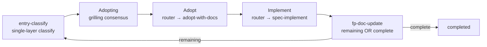
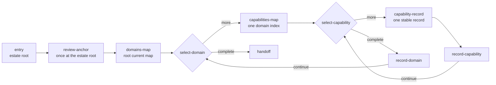
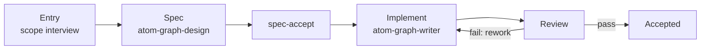

# Atomic Workflow 

> ⚠️ AI-generated README — edit [docs/readme-blueprint.md](docs/readme-blueprint.md) instead.

**Languages**: English (root) · [中文](docs/README.zh-CN.md)

Graph-Engineering for Real Engineers: Graphs define workflows; workflows build graphs. Based on mattpocock/skills.

  

## Table of Contents

**Part 1 — Out-of-the-Box Workflows**

- [arch-review-loop (RETIRED 2026-08-25)](#arch-review-loop)
- [estate-maintain](#estate-maintain)
- [All Built-in Workflows](#all-built-in-workflows)
- [Documentation Management](#documentation-management)

**Part 2 — Basics & Graph Making**

- [The Problem](#the-problem)
- [How It Works](#how-it-works)
- [Installation](#installation)
- [Setup](#setup)
- [Making a Graph](#making-a-graph)

**Tail**

- [Architecture](#architecture)
- [Public modules](#public-modules)
- [Status & Roadmap](#status--roadmap)
- [Contributing](#contributing)
- [Dependencies](#dependencies)
- [Thanks](#thanks)
- [Further Reading](#further-reading)

---

## Part 1 — Out-of-the-Box Workflows

## arch-review-loop

> **RETIRED (2026-08-25, change graph-stateless-cutover-closure N5-3)** — legacy compatibility graph; never routed from engineering-flow. The `arch-review-loop.yaml` file and its registry entry are deleted; the L3 rework loop now lives in `feature-flow` / `direct-flow` (round-review self-edges). The section below is kept for historical reference.

The flagship workflow — one loop takes the biggest remaining architectural problem from review to shipped change.

**How to read this section**: code blocks are **prompts** you send to your agent (verbatim); plain text is explanation. Every prompt follows one template; `<angle brackets>` are the parts you fill in:

```text
Use atom-pilot to run <graph name>: <your goal in plain language>
```

The loop at a glance — one round composes requirement production, adoption, and implementation; the round-report terminal re-enters the round on `remaining` (flow self-edge) or drains on `complete`; termination is the user's call at the direct-end options:


```mermaid
graph LR
   CLS[entry-classify<br/>single-layer classify] --> GRILL[Adopting<br/>grilling consensus]
   GRILL --> ADOPT[Adopt<br/>router → adopt-with-docs]
   ADOPT --> IMPL[Implement<br/>router → spec-implement]
   IMPL --> FP[fp-doc-update<br/>remaining OR complete]
   FP -->|remaining| CLS
   FP -->|complete| DONE[completed]
```

One round composes adoption + spec production (`adopt-with-docs`, grilling consensus IS the requirement review AND the acceptance) and implementation (`spec-implement`); entry-classify classifies the round input in ONE pass (requirement → adopting; implement → direct spec-implement); the fp-doc-update terminal re-enters the round on `remaining` (flow self-edge) or drains on `complete`; termination is the user's call at the direct-end options of adopting / fp-doc-update (node report `direct_end: true` → pilot advances with the end decision — run completes as `completed`, never `force_end`).

```text
Use atom-pilot to run arch-review-loop: find and fix the biggest architectural problem in this codebase.
```

### Decomposition steps

The round splits into three independently executable graphs; `arch-review-loop` composes them. Pick the entry that matches your need:

|Need|Run|
|-|-|
|Architecture deepening only (analysis chain)|`graph_get arch-review` + first `advance` (interactive: explore → first-principles → present — drains at __handoff; L1 satisfaction hosted by the parent channel router)|
|Adoption + spec only (confirm a produced report, produce the change)|`graph_get adopt-with-docs` + first `advance` (entry-classify → adopting — adoption interaction hosted by the framework; adopt-with-docs is a non-interactive self-deciding spec pipeline)|
|Implementation only (change exists)|`graph_get spec-implement` + first `advance` — `changeName` rides as entry-node session context|
|Full round (requirement + adoption + implementation in one loop)|`arch-review-loop` RETIRED 2026-08-25 — the full planning round now runs `graph_get feature-flow` + first `advance` (L1 requirement loop + L3 round-review rework loop)|
|Unified engineering entry|`graph_get engineering-flow` + first `advance` (single-layer intent classification → channel graph sibling run)|

- `arch-review` — interactive architecture deepening graph (`interaction: enabled`): explore (improve-codebase-architecture Step 1) → first-principles (fp_verdicts — law-vs-convention verdicts shaping the report) → present (Markdown report at a user-held path) → __handoff. Analysis chain only; L1 satisfaction (report review until the user is satisfied) is hosted by the parent channel requirement router (review-flow).
- `adopt-with-docs` — non-interactive adoption spec-production subgraph (`interaction: none`): self-deciding spec-propose consuming the adoption consensus from the composing framework graph's interactive nodes via the PipelineMaterial envelope. Adoption consensus (adopting grilling — the consensus IS the acceptance; the adoption goal is confirmed in the grilling first-round frontier — the adopt-scope interview is deleted) are framework-hosted; raw-idea journeys route through a framework graph.
- `spec-implement` — non-interactive implementation (`interaction: none`): spec-extract reads the produced change (upstream output when composed, `args.changeName` standalone) → track machinery → archive (tracks own post-archive doc maintenance). No spec generation, no auto-loop gate — rework is the L3 loop in the channel graphs (round-review self-edges).

**Raw MCP tools?** The loop behind all of this is `graph_get` + first `advance` → execute the returned work order → `advance` → repeat until `node: null`. If you want to drive the MCP tools directly instead of via atom-pilot, see the call-flow example in [packages/graph-workflow/README.md](packages/graph-workflow/README.md).

**Want to go deeper?** → [packages/graph-workflow/README.md](packages/graph-workflow/README.md) for the graph format, all tools, and the skill system.

## estate-maintain

Domain estate composition as a graph — uses `docs/domains/` as the root and composes domains-map, capabilities-map, and capability-record. The estate has no per-capability feasibility workflow.


```mermaid
graph LR
   ENTRY[entry<br/>estate root] --> REV[review-anchor<br/>once at the estate root]
   REV --> DM[domains-map<br/>root current map]
   DM --> SELD{select-domain}
   SELD -->|more| CM[capabilities-map<br/>one domain index]
   CM --> SELC{select-capability}
   SELC -->|more| CR[capability-record<br/>one stable record]
   CR --> RECC[record-capability]
   RECC -->|continue| SELC
   SELC -->|complete| RD[record-domain]
   RD -->|continue| SELD
   SELD -->|complete| DONE[handoff]
```

`domains-map` owns the root current map; `capabilities-map` owns one domain capability index; `capability-record` owns one stable capability record. The entry classifies the trigger and the selectors loop the estate — `select-domain` dispatches `capabilities-map`, `select-capability` dispatches `capability-record`; the graph only selects, records, and composes and does not process specs, ADRs, archives, or sync:

```text
Use atom-pilot to run estate-maintain: rebuild the docs/domains estate from the domains, capabilities, and capability records.
```

## All Built-in Workflows

Eighteen graphs ship and run out of the box: four builtin in `packages/graph-workflow/graphs/` (the capability floor — file presence is registration, no index file) and fourteen in the five family packages that carry `assets/graphs/` under `packages/workflow-<family>/graphs/`. estate-maintain gets the deep treatment above (arch-review-loop § is RETIRED 2026-08-25, kept for historical reference; graph-generate — the maker journey — is covered in Making a Graph (Part 2)); the rest are one-line entries — full detail in [packages/graph-workflow/README.md](packages/graph-workflow/README.md):

|Graph|What it does|
|-|-|
|**arch-review**|Architecture review graph - explore evidence, analyze first principles inline, validate the rebuilt solution, present candidates, and hand off one report.|
|**capabilities-map**|Capabilities map production - mandatory review anchor, then scan one domain and persist stable capability records.|
|**capability-record**|Stable capability record - mandatory review anchor, then reconcile current evidence into one docs/domains capability document.|
|**cutover**|Completed-implementation proof — establish the unique active target state and emit a Cutover Receipt.|
|**diagnosing-bugs**|Interactive bug-diagnosis graph — vendored diagnosing-bugs skill phases as graph nodes (feedback loop, reproduce, hypothesise, instrument, fix+regression, cleanup) with HITL cards, bounded flow loops, and first-principles injection.|
|**domains-map**|Domains map production - mandatory review anchor, then persist stable strategic domain records without repeated exploration.|
|**e2e-minimal**|Minimal end-to-end fixture graph: echo agent step → approval-review gate → handoff; exercises typed flow endpoints, a labeled rework self-edge, and the approval decision gate with minimal surface.|
|**estate-maintain**|Domain estate maintenance - mandatory review anchor, then domains-map, capabilities-map per domain, and capability-record per capability under docs/domains/.|
|**explore-unknowns**|Explore four unknowns quadrants, auto-close territory answers, ask only for genuine judgment, and hand off the complete map.|
|**first-principles**|Auxiliary first-principles analysis - update one supplied document in place through assumption audit, fundamental truths, atomic components, rebuild, and validation.|
|**graph-generate**|See [Making a Graph](#making-a-graph) (Part 2) — the maker journey|
|**implementation-blocker-resolution**|Resolve one implementation blocker — inventory the blocker, investigate it, grill the decision, then resolve and retry|
|**implementing**|Implement one accepted write-spec change through vertical slices — select, require, implement, verify, review, audit choices, record; explicit cutover at the end|
|**graph-maintain**|Maintenance flow — audits a graph's inventory compliance and content-vs-inventory consistency, proposes fixes, applies approved ones as an inline flow loop.|
|**reconciling**|Reconcile a completed change against stable facts — archive the change record, reconcile the stable-fact surface, then cut over|
|**release-prep**|Pre-release preparation — deterministic version proposal from git tag history, grilling confirmation of every operation, apply + review as an inline flow loop.|
|**review-anchor**|Mandatory review anchor - complete explore-unknowns and first-principles once per scope, or validate a scope-bound inherited receipt.|
|**specifying**|Unified pre-change contract graph — interview, draft, fog-audit, research, synthesize, ownership, materialize, reslice, decision-complete|
|**understanding**|Understand one change before commitment — capture, classify and confirm the carrier, persist the seed, research evidence, scope the change, resolve unknowns|
|**write-docs**|Apply one bounded documentation change, verify its observable surface, and complete its lifecycle.|

## Documentation Management

How this project's documentation is managed — **only the documents the current built-in graphs actually consume are listed**; everything else in `docs/` is legacy, kept for reference, not consumed by any graph.

The graph runtime delivers context through the static context manifest: ambient context (convention files, user-supplement config, platform estate) plus the graph-level `context:` manifest and constraints. What the 18 built-in graphs actually consume:

|Class|Documents|Consumed by|
|-|-|-|
|Convention layer (default-loaded into every phase)|`CONTEXT.md` (glossary), `docs/domains/README.md` (domain map + Estate Standards)|all graph phases|
|Platform estate (organic — agent-read when present, never declared)|`docs/changes/` (change packets, closed ones under `archive/`)|write-spec (packet production) / implement-change (packet execution + cutover); reconcile/archive (lifecycle closure)|
|Constraints|`.atomic-workflow/constraints.md` → `constraints.json`|activation (pilot loads once into the session; every node's Constraints block assembles from it)|
|Runtime|node progress line (`done/total · next-or-completed` — derived, never stored)|the agent session (free = the transcript is the cursor; follow = the in-memory `PipelineEnvelope` in the driver's own session storage — no backend session file); node CONTENT lives in the agent session / durable artifacts — never persisted, no output cap|
|Assets|`packages/graph-workflow/assets/` (the builtin capability floor — 4 graphs, 27 atoms), the five family packages `packages/workflow-<family>/assets/` (14 graphs, 54 atoms; each declaring its set via `assets/manifest.yaml`), `.atomic-workflow/` (the project estate — 3 graphs), `packages/graph-workflow/skills/` (15 skills); `flows/` retired (the tree was deleted by the tier-boundary cutover — no flow specs remain)|all graph execution|
|Artifacts|`docs/reports/` (arch-review reports), `docs/changes/<date>-<name>/` (change packets — closed ones archived under `docs/changes/archive/`)|arch-review / write-spec / implement-change|

Changes follow the change-packet flow: write-spec produces one accepted change record under `docs/changes/<date>-<name>/` (README + ordered slices + decision ledger + verification contract), implement-change executes it slice by slice and proves cutover; reconcile/archive then close the lifecycle under `docs/changes/archive/`. The README family itself is regenerated from this blueprint.

**Legacy, not graph-consumed**: `docs/design.md`, `docs/philosophy.md`, `docs/requirements.md`, `docs/core-requirements.md`, `docs/conventions.md`, `docs/workflow.md`, `docs/constraints.md`, `docs/specs/`, `docs/grill/`, `docs/designs/`, `docs/tickets/`, `docs/agents/`, `docs/platform/`, `docs/dev/`, `docs/readme-blueprint.md` (regeneration source, not graph input) — kept for reference.

---

## Part 2 — Basics & Graph Making

**Graph is just a tool; Attention is all you need.**

## The Problem

AI agents skip steps silently, lose context between stages, can't express conditional branches, and lack structured approval gates. These failures share a root cause: **the agent has no work-order system**. It's told "build this feature" and left to improvise. When it misses a review step or forgets to update docs, nothing in the execution model prevents it — because there _is_ no execution model. Atomic Workflow gives agents one: explicit phases, declared dependencies, runtime context injection, and non-bypassable approval gates.

---

## How It Works

**Runtime work orders with graph.** Each phase is a self-contained work order. Your agent pulls the next ready order, executes it, reports back; the scheduler advances the graph. The graph only tracks progress and reminds what's next — it executes nothing. The workflow graph captures what linear chains can't: conditional branches, approval gates, bounded rework loops, round re-entry.

**Graphs are self-contained.** Every graph is one workflow YAML that declares everything it needs: phases (task text, skill), the graph-level `context` manifest (static authoring-time context entries), the top-level `flow` block — the transition surface, the graph's routing authority — `inventory` (one goal + constraints entry per phase), and graph-level `constraints` (prose rules: rework bounds, condition vocabulary). The graph declares its own interaction mode and catalog description. Nothing external orchestrates it: the engine validates the YAML and routes by the transition table; the agent reads the phase's own declaration. A graph is a complete work-order board, not a fragment.

**Subgraphs are flat, siblings are runs.** Two distinct things never mix. Static nesting is the `graph:` occurrence — a node value `{ graph: <name> }` whose child graph is recursively flattened into the parent's flat execution surface at lowering (task ids qualified `parent/child/key`, depth ≤ 8, cycles fail at load). Run-time selection of a _different_ graph is a sibling run the executing agent starts inside its own node task: `graph_get` + first `advance` with a fresh executed-set (launch args ride the entry node's session context) → drive to `node: null` → collect the result. No `use` composition, no router atom, no namespaced run entities — every graph is standalone with its own interaction mode; the scheduler's cursor never leaves the flat surface.

**Hints, not controls — the graph never dispatches.** A graph says _what_ each phase needs — skills, context, and, optionally, agent-type preferences in priority order. Dispatch itself stays in your agent's hands: when a skill fans out sub-agents, it follows the hints, not the graph's command. The graph is a work-order board, not a manager.

**Your agent still does everything.** No code execution, no hidden engine, no new runtime language. The agent keeps its full toolkit — skills, tools, files — and does all the work. The graph only issues orders and tracks progress. That's the whole mechanism.

**Attention is all you need.** Agents fail from lost focus, not incapability. "Build this feature" is too big; "Write the User model type definition, given the schema from the previous step" is just right. A clear work order with bounded context eliminates the ambiguity that causes skipped steps, forgotten reviews, and drifting scope.

---

## Installation

### graph-workflow — MCP server

One package, two capabilities: the **MCP Server** (8 tools, stdio transport, no server-side run state) and the `atom-graph-scheduler` bin. The install route — **bun is the repository's single runtime face**:

```bash
bun add -g @ai-atomic-workflow/graph-workflow
```

Runtime: [bun](https://bun.sh) ≥ 1. bun runs the bundled private dist entry:

```bash
bun pm bin -g   # → <bun-bin>, e.g. ~/.bun/bin
```

```json
{
  "mcpServers": {
    "graph-workflow": {
      "command": "bun",
      "args": ["<bun-bin>/atom-graph-scheduler"]
    }
  }
}
```

Config file location: OMP → `~/.omp/agent/mcp.json`. Full details → [packages/graph-workflow/README.md](packages/graph-workflow/README.md).

### graph-workflow — skills

Two install channels — pick one (all 15 built-in skills are required for graph execution):

**Option A: Claude Code marketplace**

```bash
/marketplace install makara/ai-atomic-workflow
```

**Option B: skills.sh** (third-party CLI, 76+ agent platforms — Codex / Cursor etc.)

```bash
npx skills add makara/ai-atomic-workflow
```

Common flags: `-a <agent>` pick platform (`-a '*'` all), `-g` global install, `-y` non-interactive, `-l` preview without installing.

### Install Dependencies

One prerequisite for the parent skill chain:

- **mattpocock/skills** — parent skills (grilling, domain modeling, TDD, code review): `npx skills add mattpocock/skills`. → [README](https://github.com/mattpocock/skills/blob/main/README.md)

## Setup

Initialize a project with the **setup-atomic-workflow** skill (the retired `atom-graph-config` CLI no longer exists):

```text
Use setup-atomic-workflow to initialize this project
```

It scaffolds `.atomic-workflow/` — `config.json` (minimal `{}`; every field optional), `constraints.md`, and empty `graphs/` + `atoms/` directories (file presence is registration). Idempotent: never overwrites existing files. Re-running it writes nothing.

## Making a Graph

The maker journey — Atomic Workflow bootstraps itself: authoring a graph is a built-in workflow, driven the same way as every graph.


```mermaid
graph LR
   ENTRY[Entry<br/>scope interview] --> SPEC[Spec<br/>atom-graph-design]
   SPEC --> ACCEPT[spec-accept]
   ACCEPT --> IMPL[Implement<br/>atom-graph-writer]
   IMPL --> REVIEW[Review]
   REVIEW -->|fail: rework| IMPL
   REVIEW -->|pass| DONE[Accepted]
```

Entry (inline single-card confirmation — no CONTEXT.md hard dependency, no multi-round interview) → spec (topology design via atom-graph-design per atom-graph-spec) → spec-accept → implement (atom-graph-writer writes the `.yaml` — file presence is registration, load-probe validated) → review → rework decision (bounded rework) → accept. Single kind (graph), single operation (create) — no skill co-production. Skill production (create/edit) flows through change packets (improver journey) — implementation loads the spec skill per affected domain (graph → atom-graph-spec, skill → atom-skill-spec, doc → atom-doc-maintain):

```text
Use atom-pilot to run graph-generate: generate a workflow for release notes from merged PRs.
```

---

## Architecture

**What a graph is.** A graph is a work-order board declared in a workflow YAML file — any `.yaml` document that passes schema validation, identified by its declared `name` (no suffix convention): a named set of phases wired by `flow` transition edges. The scheduler issues each ready phase as a work order and tracks progress — it executes nothing. Your agent pulls the order, does the work, reports back; the graph advances.

**Graph structure.** Phases are the units of work — the sole dispatch kind is the atom occurrence (inline execution + decision; static nesting is the `graph:` occurrence, flattened at lowering; run-time subgraph selection is a sibling run driven by the executing agent). Conditional routing lives in the top-level `flow` block — the sole topology declaration (mermaid-subset transition edges — `A -->|condition| B` labeled, `A --> B` sequence default): the graph is the interpretation authority, the engine matches the reported condition value mechanically against the transition table and activates the target (no match fails loudly — missed-condition guard; `branchTo`/`routing` are deleted). Rework/loop is declared as `flow` self-edges (`A -->|fail| A` — inline bounded loops, bound in the graph's constraints prose + retryCount). Key occurrence fields (the `nodes:` map is nodeId-keyed; the map key is the identity): `atom` (atom occurrence — the node's task text is atom-owned, rendered at load), `graph` (static graph occurrence — flattened at lowering), `input` (machine-declared per-atom launch data, validated against the atom's strict launch schema), `inputs`, `semanticIntent` (retrieval-only); context is the graph-level `context:` static manifest (resolved at load into the run's `PipelineMaterial`) — no per-phase `channels`. Canonical top-level key order: `name → description → version → interaction → flow → entry → conditions → constraints → context → nodes` (entry is singleton-graph-only; conditions after flow, constraints after conditions).

**Built-in vs user graphs.** The builtin capability floor ships in `packages/graph-workflow/graphs/` and the business corpus in the five family packages that carry `assets/graphs/` under `packages/workflow-<family>/graphs/` — in both cases file presence is registration. User graphs live in `.atomic-workflow/graphs/` (scaffolded by setup-atomic-workflow); user-declarative prompt atoms live in `.atomic-workflow/atoms/`. Resolution is project-first: a project graph with the same name overrides a built-in.

One package, two faces:

|Package|Role|
|-|-|
|**graph-workflow**|Infrastructure and skill system in one installable: MCP Server (graph execution engine, 8 tools) + built-in graphs shipped in the package, and the `atom-pilot` (lifecycle loop) / `atom-phase-handler` (single main dispatch) skill chain with entry and reference skills.|

The built-in workflows table lives in [Part 1](#all-built-in-workflows) with the out-of-the-box pitch.

## Public modules

The published library modules ship their own README family — the fast face plus the deep docs:

- **[agentic-graphjs](packages/agentic-graphjs/README.md)** — the graph runtime kernel for agents: what / why / how, the API reference ([docs/api.md](packages/agentic-graphjs/docs/api.md)), and the schema reference ([docs/schema.md](packages/agentic-graphjs/docs/schema.md)).

## Status & Roadmap

Atomic Workflow is in **alpha**.

**Stable** (implemented, no planned breaking changes before v1.0):

- graph-workflow stateless MCP Server (8 tools — `advance` / `graph_assets` / `graph_get` / `graph_update` / `graph_delete` / `prompt_atom_assets` / `recommend_start` / `recommend_advance`; no server-side run state — the executed-set is session-held)
- workflow YAML graph format (schema-defined identity — any `.yaml`; `name` + `version` identity fields; `nodes:` a nodeId-keyed map of strict occurrence objects — atom or static graph — + top-level `flow` transitions)
- the execute→advance loop (`graph_get` + first `advance` → dispatch → `advance`)
- setup-atomic-workflow project initialization
- 18 shipped graphs (4 builtin floor + 14 in the five family packages) and 15 built-in skills

**Active development** (may change):

- More control-flow features — branch-route patterns, rework decisions
- More built-in graphs / workflows
- Session-side operations tooling (the executed-set is session-held) — the MCP tool interface may change

### Roadmap

- [ ] More out-of-the-box graphs — release-notes generation, spec drafting, estate workflow extensions
- [ ] More token-saving strategies — leaner context delivery, smaller graph overhead
- [ ] More convenient operations tooling — run status views, smarter history/cleanup
- [ ] Wider platform support — cross-platform MCP registration

---

## Contributing

Bug reports and pull requests welcome. See [CONTRIBUTING.md](CONTRIBUTING.md) for the workflow and [CONTEXT.md](CONTEXT.md) for the project glossary.

## Dependencies

- [mattpocock/skills](https://github.com/mattpocock/skills/blob/main/README.md) — parent skills for grilling, domain modeling, TDD, and more

## Thanks

- [taskflow](https://heggria.github.io/taskflow) — DAG execution model inspiration
- [Oh My Pi](https://omp.sh/) — agent harness platform

---

## Further Reading

|Document|For|
|-|-|
|[packages/graph-workflow/README.md](packages/graph-workflow/README.md)|Graph format, all 8 MCP tools, built-in graphs, making graphs with graphs, skill system, how skills drive graph execution|
|[packages/agentic-graphjs/README.md](packages/agentic-graphjs/README.md)|The published module's fast face (what / why / how) plus its deep docs — API and schema references|
|[CONTEXT.md](CONTEXT.md)|Terminology reference (project glossary)|
