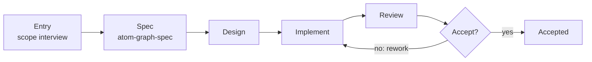
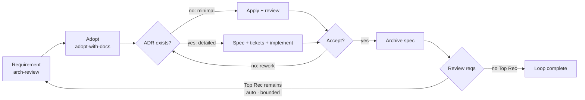

# Atomic Workflow 

> ⚠️ AI 生成的 README — 修改请编辑 [readme-blueprint.md](readme-blueprint.md)。

**Languages**: [English](../README.md) · 中文（本文件）

**Graph is just a tool; Attention is all you need.**

面向 AI 智能体的图驱动工作订单系统：显式阶段、作用域上下文与不可绕过的审批关卡。

  

## 目录（Table of Contents）

**第一部分 — 基础与制图**

- [问题](#问题the-problem)
- [工作原理](#工作原理how-it-works)
- [安装](#安装installation)
- [初始化](#初始化setup)
- [制作一个图](#制作一个图making-a-graph)

**第二部分 — 开箱即用工作流**

- [arch-review-loop](#arch-review-loop)

**尾部**

- [架构](#架构architecture)
- [状态与路线图](#状态与路线图status--roadmap)
- [贡献](#贡献contributing)
- [依赖](#依赖dependencies)
- [致谢](#致谢thanks)
- [延伸阅读](#延伸阅读further-reading)

---

## 第一部分 — 基础与制图

## 问题（The Problem）

AI 智能体会悄悄跳过步骤、在阶段之间丢失上下文、无法表达条件分支、缺少结构化的审批关卡。这些失败的共同根源是：**智能体没有工作订单系统（work-order system）**。它被告知"构建这个功能"，然后即兴发挥。当它漏掉评审步骤或忘记更新文档时，执行模型里没有任何机制阻止它——因为根本不存在执行模型。Atomic Workflow 给了智能体一个：显式阶段、声明的依赖、运行时上下文注入，以及不可绕过的审批关卡。

---

## 工作原理（How It Works）

**基于图的运行时工作订单。** 每个阶段都是一份自包含的工作订单。你的智能体拉取下一个就绪订单，执行它，回报结果；调度器推进图。图只跟踪进度、提醒下一步——它不执行任何东西。DAG 能表达线性链做不到的事：条件分支、审批关卡、并行扇出。

**基于通道的上下文隔离。** 每份工作订单携带精确的提示词、正确的技能，以及一个上下文"通道"——一份聚焦的相关决策与产物切片，不重。通道有两个作用域：全局通道（图顶层 `context:`，项目 `config.json` 为默认层，合并一次且 config 优先）与相级 `channels:` 增补。每个节点的输出即名为 `<nodeId>` 的流：`node:<id>` 条目读取非 `dependsOn` 的流，`context: [node:<id>]` 将流提升进全局通道。模式——技能名、文件 glob 或 `node:<id>` 引用——按执行技能的上下文契约解析。不再有"我们在哪？"或"之前决定过什么？"——你的智能体精确拿到_这一步_需要的东西。

**提示而非控制——图从不派发。** 图说明每个阶段_需要什么_——技能、上下文，以及（可选的）按优先级排列的智能体类型偏好。派发本身留在你的智能体手里：当技能扇出子智能体时，它遵循的是提示，而不是图的指令。图是工作订单看板，不是管理者。

**你的智能体仍然做所有事。** 没有代码执行，没有隐藏引擎，没有新的运行时语言。智能体保留完整工具箱——技能、工具、文件——并完成所有工作。图只下发订单、跟踪进度。这就是全部机制。

**Attention is all you need.** 智能体的失败源于注意力涣散，而非能力不足。"构建这个功能"太大；"给定上一步的 schema，编写 User 模型类型定义"刚刚好。一份边界清晰的工作订单消除了导致跳步、漏评审和范围漂移的歧义。

---

## 安装（Installation）

### graph-scheduler

一个包、两种能力：**MCP Server**（9 个工具，stdio 传输）和 `atom-graph-scheduler` bin。两条安装路线——**运行时与安装器匹配**：

**路线 A：npm + Node 运行时**

```bash
npm install -g @ai-atomic-workflow/graph-scheduler
```

运行时：[Node](https://nodejs.org) ≥ 22。包从编译产物运行——先解析全局路径再注册：

```bash
npm root -g   # → <npm-root>，例如 /usr/local/lib/node_modules
```

```json
{
  "mcpServers": {
    "graph-scheduler": {
      "command": "node",
      "args": ["<npm-root>/@ai-atomic-workflow/graph-scheduler/dist/server.js"]
    }
  }
}
```

**路线 B：bun**

```bash
bun add -g @ai-atomic-workflow/graph-scheduler
```

运行时：[bun](https://bun.sh) ≥ 1。bun 直接执行 TypeScript 入口：

```bash
bun pm bin -g   # → <bun-bin>，例如 ~/.bun/bin
```

```json
{
  "mcpServers": {
    "graph-scheduler": {
      "command": "bun",
      "args": ["<bun-bin>/atom-graph-scheduler"]
    }
  }
}
```

配置文件位置：OMP → `~/.omp/agent/mcp.json`，OpenCode → `opencode.json`。完整细节 → [packages/graph-scheduler/README.md](../packages/graph-scheduler/README.md)。

### graph-workflow

两条安装渠道，任选其一（执行图需要全部 12 个内置技能）：

**选项 A：Claude Code marketplace**

```bash
/marketplace install makara/ai-atomic-workflow
```

**选项 B：skills.sh**（第三方 CLI，支持 76+ 智能体平台——OpenCode / Codex / Cursor 等）

```bash
npx skills add makara/ai-atomic-workflow
```

常用参数：`-a <agent>` 选择平台（`-a '*'` 全部），`-g` 全局安装，`-y` 非交互，`-l` 只预览不安装。

### 安装依赖（Install Dependencies）

openspec 图和父级技能链的两个前置条件：

- **OpenSpec CLI** — `npm install -g @fission-ai/openspec@latest`，然后在项目内 `openspec init`。→ [安装文档](https://github.com/Fission-AI/OpenSpec/blob/main/docs/installation.md)
- **mattpocock/skills** — 父级技能（grilling、domain modeling、TDD、code review）：`npx skills add mattpocock/skills`。→ [README](https://github.com/mattpocock/skills/blob/main/README.md)

## 初始化（Setup）

用 **setup-atomic-workflow** 技能初始化项目（已退役的 `atom-graph-config` CLI 不再存在）：

```text
Use setup-atomic-workflow to initialize this project
```

它会生成 `.graph-scheduler/` — `config.json`（数据库路径、taskflow 目录、registry 路径）、`graphs/`、`docs/` 和 `constraints.md`。幂等：绝不覆盖已有文件。重复运行不写入任何内容。

## 制作一个图（Making a Graph）

Atomic Workflow 自我引导——用于制作图的原工作流本身就是内置图，驱动方式相同：

- `graph-generate` — 具体制图旅程图：入口（atom-scope-interview，不硬依赖 CONTEXT.md）→ spec（按 atom-graph-spec 设计拓扑）→ spec-accept → implement（写入 `.taskflow.yaml` + registry 条目 + 附属文档 `.graph-scheduler/docs/<name>.md`）→ review → gate → accept。单一类型（图）、单一操作（创建）——不协同生产技能：

```text
Use atom-pilot to run graph-generate: generate a workflow for release notes from merged PRs.
```

- `doc-update` — 更新项目文档（触发 → 维护 → 评审 → 审批）。

技能生产（create / edit）经 `arch-review-loop`（改进旅程）的 openspec change 机制流转——实施阶段按受影响域加载 spec 技能（graph → atom-graph-spec、skill → atom-skill-spec、doc → atom-doc-maintenance）。

制图旅程一览：



---

## 第二部分 — 开箱即用工作流

## arch-review-loop

旗舰工作流——一个循环把最大的剩余架构问题从评审一路带到已交付的变更。

**本节阅读方式**：代码块是**发送给你的智能体的提示词**（原样使用）；普通文字是说明。所有提示词遵循同一个模板；尖括号 `< >` 里的部分由你填写：

```text
Use atom-pilot to run <graph name>: <your goal in plain language>
```

循环一览——一轮组合需求生产、采纳与实施（两条轨道：minimal 直接应用 / detailed 工程化）；Top Recommendation 仍在时 `loop-gate` 重入循环（auto 模式，有界）：



**1. 端到端解决一个问题——一个 loop** — `arch-review-loop` 组合三个部分——需求生产（`arch-review`）、采纳 + spec 生产（`adopt-with-docs`）与实施（`spec-implement`）——组成单个循环，不断重复直到没有剩余问题：

```text
Use atom-pilot to run arch-review-loop: find and fix the biggest architectural problem in this codebase.
```

每一轮：需求部分入口的范围访谈（全新评审或已有报告）→ 架构评审 → 批准 Top Recommendation（Continue = 需求就绪）→ 内容门（`round-continue` — Continue 激活采纳与实施，无 Top Rec 时 End）→ 采纳 + spec 生产（`adopt-with-docs` — 采纳会话以带日期附录追加记录；spec-propose 将被采纳的需求物化为 OpenSpec change）→ 实施部分（spec-extract 读取 change → spec 机制 → 归档）→ 轮末审批（默认 Loop again，Complete = 你结束）。当评审报告显示没有剩余 Top Recommendation 时循环结束——或你选择 Complete。运行模式（manual/auto）在每次激活时确认。

### 分解步骤（Decomposition steps）

一轮被拆成三个可独立执行的图（`arch-review` = 需求生产、`adopt-with-docs` = 需求采纳 + spec 生产、`spec-implement` = 实施）；`arch-review-loop` 组合它们。按需选择入口：

|需求|运行|
|-|-|
|仅需求（发现问题 / 评审代码库）|`graph_start arch-review`|
|仅采纳 + spec（确认需求，产出 OpenSpec change）|`graph_start adopt-with-docs`|
|仅实施（change 已存在——指向它）|`graph_start spec-implement` 带 `args.changeName`|
|完整一轮（需求 + 采纳 + 实施一个 loop）|`graph_start arch-review-loop`|

- `arch-review` — 需求生产：范围访谈（范围 + 输出路径 + 报告输入 fresh\|existing）→ 架构评审报告 → review-accept（Continue = 需求就绪，Loop again，End）。
- `adopt-with-docs` — 需求采纳 + spec 生产：adopt-scope → adopting（确认对话）→ adopt-accept → spec-propose（被采纳的需求物化为 OpenSpec change）。
- `spec-implement` — 实施：spec-extract 读取既有 change（组合时经上游通道，独立运行用 `args.changeName`）→ track 机制 → 归档 + doc 维护。此处不产生 spec——change 来自采纳阶段；返工是 `arch-review-loop` 里的单一循环。

**直接用 MCP 工具？** 这一切背后的循环是 `graph_start` → 执行返回的工作订单 → `graph_advance` → 重复直到 null。如果你想绕开 atom-pilot 直接驱动 MCP 工具，参见 [packages/graph-scheduler/README.md](../packages/graph-scheduler/README.md) 中的调用流示例。

**想深入？** → [packages/graph-scheduler/README.md](../packages/graph-scheduler/README.md) 看图格式和全部工具，[packages/graph-workflow/README.md](../packages/graph-workflow/README.md) 看技能系统。

---

## 架构（Architecture）

**图是什么。** 图是在 `.taskflow.yaml` 文件中声明的工作订单板：一组以 `dependsOn` 边连接的命名阶段。调度器把每个就绪阶段作为工作订单下发并跟踪进度——它不执行任何东西。你的智能体拉取订单、完成工作、回报结果。

**图的结构。** 阶段是工作的基本单位。类型：`main`（内联执行）、`approval`（人工决策卡）、`gate`（机器返工判断）与 `flow` 组合（经 `use` 引用另一图，加载期展平）。关键阶段字段：`task`（工作订单 / 卡片文本）、`skill`（执行技能）、`agent`（优先级提示）、`channels`（上下文——全局 `context:` + 相级增补）、`jumps`（gate 返工条件）、`routing`（审批分支路线）。

**内置图与用户图。** 内置图随 `packages/graph-scheduler/graphs/` 发布，注册于 `graphs/registry.json`。用户图放在 `.graph-scheduler/graphs/`（由 setup-atomic-workflow 生成）。解析项目优先：同名用户图覆盖内置图。

两个包：

|Package|角色|
|-|-|
|**graph-scheduler**|基础设施。MCP Server（DAG 执行引擎，9 个工具）+ 随包发布的内置图。|
|**graph-workflow**|技能系统。`atom-pilot`（生命周期循环）、`atom-phase-handler`（按阶段类型派发）、入口与参考技能。|

**内置图** — 9 个，开箱即用：

|图|作用|
|-|-|
|**arch-review-loop**|组合：arch-review（需求部分）→ adopt-with-docs（采纳 + spec 生产）→ spec-implement（实施部分）→ loop-gate（单循环——Top Rec 仍在时自动跳回需求入口）→ loop-accept（默认 Loop again，Complete = 用户结束）|
|**arch-review**|需求生产（独立）：范围访谈 → 评审报告 → 接受（Continue / Loop again / End）|
|**adopt-with-docs**|需求采纳 + spec 生产：adopt-scope → adopting（grilling 对话 + 内联 domain-modeling 副作用）→ adopt-accept → spec-propose（openspec-propose — 被采纳的需求物化为 OpenSpec change）|
|**graph-generate**|图生产——制图旅程：入口（atom-scope-interview，不硬依赖 CONTEXT.md）→ spec（按 atom-graph-spec 设计拓扑）→ spec-accept → implement（写入 `.taskflow.yaml` + registry 条目 + 附属文档 `.graph-scheduler/docs/<name>.md`）→ review → gate → accept。单一类型（图）、单一操作（创建），不协同生产技能|
|**spec-implement**|纯实施图：spec-extract（既有 change——上游通道 / args.changeName）→ track 关卡（minimal/detailed）→ 归档 → doc 维护；不产生 spec，无自动 loop 关卡|
|**openspec-apply**|OpenSpec 应用：应用变更 → 双重评审 → 有界返工 → 归档 → doc 维护|
|**openspec-engineer**|OpenSpec 详细实现：spec 综合 → 工单 → tdd 实现 → 双重评审 → 有界关卡 → 反向验证归档 → doc 维护|
|**doc-update**|文档维护：触发 → 维护 → 评审 → 审批（归档后流程参考）|
|**e2e-minimal**|最小端到端：main → approval 循环，用于学习|

## 状态与路线图（Status & Roadmap）

Atomic Workflow 处于 **alpha** 阶段。

**稳定**（已实现，v1.0 前无计划中的破坏性变更）：

- graph-scheduler FSM 引擎与 9 个 MCP 工具
- `.taskflow.yaml` 图格式与阶段 schema（main/approval/gate + flow 组合、join 模式、channels、agent 提示、分支路线）
- CRUD 执行循环（`graph_start` → `graph_advance` → `graph_jump`，另有 `graph_status` / `graph_list`）
- setup-atomic-workflow 项目初始化
- 9 个内置图与 12 个内置技能

**活跃开发中**（可能变化）：

- 更多控制流特性 — 分支路线组合、gate 跳转条件
- 更多内置图 / 工作流
- 数据维护工具（当前 `graph_clean_*` 很简陋）— MCP 工具接口可能变化

### v1.0 路线图

- [ ] 经 arch-review-loop 编辑 skill（alpha）
- [ ] 跨平台 MCP 支持 + phase schema v1 冻结（v1.0）

---

## 贡献（Contributing）

欢迎提交 bug 报告与 pull request。架构概览见 [CONTEXT.md](../CONTEXT.md)，架构决策记录见 [docs/adr/](adr/)。

## 依赖（Dependencies）

- [OpenSpec CLI](https://github.com/Fission-AI/OpenSpec/blob/main/docs/installation.md) — openspec 图的 spec 生命周期
- [mattpocock/skills](https://github.com/mattpocock/skills/blob/main/README.md) — grilling、domain modeling、TDD 等父级技能

## 致谢（Thanks）

- [taskflow](https://heggria.github.io/taskflow) — DAG 执行模型灵感
- [Oh My Pi](https://omp.sh/) — 智能体工作台平台

---

## 延伸阅读（Further Reading）

|文档|用途|
|-|-|
|[packages/graph-scheduler/README.md](../packages/graph-scheduler/README.md)|图格式、全部 9 个 MCP 工具、内置图、用图制图|
|[packages/graph-workflow/README.md](../packages/graph-workflow/README.md)|技能系统、完整技能列表、技能如何驱动图执行|
|[glossary.md](glossary.md)|术语参考|
|[CONTEXT.md](../CONTEXT.md)|面向贡献者的内部架构参考|
