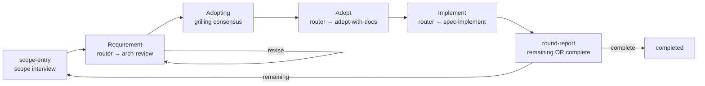
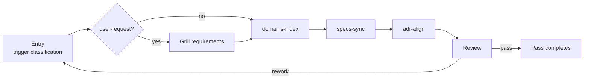
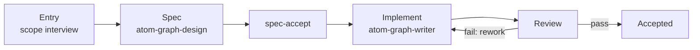

# Atomic Workflow 

> ⚠️ AI 生成的 README — 修改请编辑 [readme-blueprint.md](readme-blueprint.md)。

**Languages**: [English](../README.md) · 中文（本文件）

Graph-Engineering for Real Engineers: Graphs define workflows; workflows build graphs. Based on mattpocock/skills.

  

## 目录（Table of Contents）

**第一部分 — 开箱即用工作流**

- [arch-review-loop](#arch-review-loop)
- [estate-maintain](#estate-maintain)
- [全部内置工作流](#全部内置工作流all-built-in-workflows)
- [文档管理](#文档管理documentation-management)

**第二部分 — 基础与制图**

- [问题](#问题the-problem)
- [工作原理](#工作原理how-it-works)
- [安装](#安装installation)
- [初始化](#初始化setup)
- [制作一个图](#制作一个图making-a-graph)

**尾部**

- [架构](#架构architecture)
- [状态与路线图](#状态与路线图status--roadmap)
- [贡献](#贡献contributing)
- [依赖](#依赖dependencies)
- [致谢](#致谢thanks)
- [延伸阅读](#延伸阅读further-reading)

---

## 第一部分 — 开箱即用工作流

## arch-review-loop

旗舰工作流——一个循环把最大的剩余架构问题从评审一路带到已交付的变更。

**本节阅读方式**：代码块是**发送给你的智能体的提示词**（原样使用）；普通文字是说明。所有提示词遵循同一个模板；尖括号 `< >` 里的部分由你填写：

```text
Use atom-pilot to run <graph name>: <your goal in plain language>
```

循环一览——一轮组合需求生产、采纳与实施；round-report 终节点在 `remaining` 时经 flow 自环重入本轮、`complete` 时排空；终止由用户在 direct-end 选项处决定：



一轮组合需求生产（requirement router 启动 `arch-review`）、采纳 + spec 生产（adopt router 启动 `adopt-with-docs`）与实施（implement router 启动 `spec-implement`）；`round-report` 在 `remaining` 时经 flow 自环重入本轮、`complete` 时排空；终止由用户在 scope-entry / adopting 的 direct-end 选项处决定（节点报告 `direct_end: true` → pilot 以 end 决策推进——run 以 `completed` 结束，绝不 `force_end`）：

```text
Use atom-pilot to run arch-review-loop: find and fix the biggest architectural problem in this codebase.
```

### 分解步骤（Decomposition steps）

一轮被拆成三个可独立执行的图；`arch-review-loop` 组合它们。按需选择入口：

|需求|运行|
|-|-|
|仅需求（发现问题 / 评审代码库）|`graph_start arch-review-loop`（框架承载交互式 scope-entry 与需求接受循环——arch-review 本身是非交互分析链）|
|仅采纳 + spec（确认需求，产出 OpenSpec change）|`graph_start arch-review-loop`（框架承载采纳交互——adopt-with-docs 是非交互自决 spec 流水线）|
|仅实施（change 已存在——指向它）|`graph_start spec-implement` 带 `args.changeName`|
|完整一轮（需求 + 采纳 + 实施一个 loop）|`graph_start arch-review-loop`|

- `arch-review` — 需求生产（`interaction: none` — 纯分析链：explore → first-principles → present-candidates）；交互式 scope-entry 与需求接受循环（accept → adopt / revise → flow 自环重跑，ADR 0246）由组合框架图（arch-review-loop / first-principles-dev）承载。
- `adopt-with-docs` — 需求采纳 + spec 生产（`interaction: none`）：spec-propose — 被采纳的需求物化为 OpenSpec change — 自决流水线，经通道消费组合框架图交互节点的采纳共识；采纳共识（adopting grilling — 共识即采纳，ADR 0246；采纳目标在 grilling 首轮前沿确认 — adopt-scope 访谈已删，ADR 0247）由框架图承载。
- `spec-implement` — 实施：spec-extract 读取既有 change（组合时经上游通道，独立运行用 `args.changeName`）→ track 机制 → 归档 + doc 维护。此处不产生 spec——change 来自采纳阶段；返工是 `arch-review-loop` 里的单一循环。

**直接用 MCP 工具？** 这一切背后的循环是 `graph_start` → 执行返回的工作订单 → `graph_advance` → 重复直到 null。如果你想绕开 atom-pilot 直接驱动 MCP 工具，参见 [packages/graph-scheduler/README.md](../packages/graph-scheduler/README.md) 中的调用流示例。

**想深入？** → [packages/graph-scheduler/README.md](../packages/graph-scheduler/README.md) 看图格式和全部工具，[packages/graph-workflow/README.md](../packages/graph-workflow/README.md) 看技能系统。

## estate-maintain

文档资产维护图——在域或技能变更后保持派生视图 / 规范 / 契约三类文档同步。



入口对触发类型分类（domain-change / skill-change / proactive / user-request——user-request 增加 grilling 确认步骤，无 ADR），然后派发对应工作流——`domains-index`（atom-doc-maintain）、`specs-sync`（atom-spec-maintain）、`adr-align`（atom-adr-maintain）；评审是一致性门（requirements 类 + 反向验证 + 只读部署镜像核验）：

```text
Use atom-pilot to run estate-maintain: sync the doc estate after the domains change.
```

## 全部内置工作流（All Built-in Workflows）

12 个工作流随 `packages/graph-scheduler/graphs/` 发布，开箱即用。三个在上文有深入说明（arch-review-loop、estate-maintain、下方的 graph-generate）；其余为一行条目——完整细节见 [packages/graph-scheduler/README.md](../packages/graph-scheduler/README.md)：

|图|作用|
|-|-|
|**arch-review-loop**|见上文——旗舰循环|
|**arch-review**|需求生产图（`interaction: none` — 纯分析链：explore → first-principles → present-candidates）；交互式 scope-entry 与需求接受循环（accept → adopt / revise → flow 自环重跑，ADR 0246）由组合框架图（arch-review-loop / first-principles-dev）承载。循环把它作为需求阶段启动（router 兄弟运行）|
|**adopt-with-docs**|需求采纳 + spec 生产（`interaction: none`）：spec-propose — 被采纳的需求物化为 OpenSpec change — 自决流水线，经通道消费组合框架图交互节点的采纳共识。交互式采纳共识（adopting grilling — 共识即采纳，ADR 0246；采纳目标 + 追踪意图在 grilling 首轮前沿确认 — adopt-scope 访谈已删，ADR 0247）由框架图承载；原始想法旅程经框架图流转。组合时作为循环的 adopt 阶段——接收已产出的报告作为输入文档，并以带日期附录追加其记录|
|**spec-implement**|实施图：spec-extract（既有 change——组合时经上游通道 / 独立运行用 {args.changeName}）→ track 关卡（minimal/detailed）→ track 自有闭包（纯归档 / atom-doc-lifecycle）→ workflow-done。对既有 change 的纯实施——不产生 spec；返工是 arch-review-loop 中的循环。|
|**openspec-apply**|OpenSpec 应用工作流：应用变更 → 双重评审 → 有界自动返工关卡 → 纯归档（openspec-archive-change）|
|**openspec-engineer**|OpenSpec 详细实施：spec 综合 → 工单 → tdd 实施 → 双重评审 → 有界关卡 → 审批 → 生命周期闭包（反向验证归档 + ADR fold + index）|
|**e2e-minimal**|最小端到端：main → main 确认循环|
|**estate-maintain**|见上文——资产维护|
|**release-prep**|发布前准备——propose（release-prep-analyze：版本取自 git tag 历史，确定性 + tag 前幂等，绝不执行 git tag/commit/push）→ plan-grill（grilling 确认全部计划操作——访谈，任何模式都出卡）→ apply（release-prep-apply：release-line 版本覆盖 + CHANGELOG [Unreleased] 按规范折叠 + README 列表对照 ground truth 同步，覆盖式写入 + 验证）→ release-review（审批；continue 完成运行——最终报告打印 tag/commit 命令，用户手动执行；jump 重跑某个阶段）。|
|**graph-generate**|见 [制作一个图](#制作一个图making-a-graph)（第二部分）——制图旅程|
|**graph-maintain**|图文件维护——维护流程：entry（atom-scope-interview — 经 graph_assets 定位目标图 + 维护意图）→ audit（atom-graph-writer 维护模式：inventory 合规 + 内容-vs-inventory + 附档同步）→ propose（逐条修正提议）→ approval（强制用户关卡）→ execute（三路径捆绑应用 + load-probe）→ review → gate → accept。镜像制图旅程；与问题表面化通道配对（graph_start problems / graph_init 全 pass / graph_assets 查询）|
|**first-principles-dev**|First-principles 前提开发流程：requirement（arch-review：scope + 需求/diff 输入 → 报告 → 接受）→ adopt（adopt-with-docs：确认报告，追加带日期附录，产出 OpenSpec change）→ implement（spec-implement：change → track 机制 → 归档）→ fp-doc-update（按 fp README 更新维护契约把需求/diff + 推演结论折入 docs/first-principles/development-flow.md；报告轮次条件 `remaining` — 经 flow 自环重入 scope-entry — 合法 round-continue 模式 — 或 `complete` — 排空；终止由 direct-end 选项裁决）|

## 文档管理（Documentation Management）

本项目文档的管理方式——**只列出当前内置图实际消费的文档**；`docs/` 下其余内容均为 legacy（遗留），保留作参考，不被任何图消费。

图运行时通过通道交付上下文：约定层（平台默认加载）、用户补充配置 context、约束与运行状态。12 个内置图实际消费的内容：

|类|文档|消费方|
|-|-|-|
|约定层（默认加载进每个阶段）|`CONTEXT.md`（术语表）、`docs/domains.md`（域索引）|所有图阶段|
|平台地产（有机 — 存在即由代理读取，从不声明）|`docs/adr/` + `index.md` + `archive/`（ADR）、`openspec/specs/**`、`openspec/changes/**`（spec 资产）|estate-maintain（adr-align）、openspec 图、arch-review-loop 采纳链|
|约束|`.graph-scheduler/constraints.md` → `constraints.json`|每次运行的 `$load-constraints`|
|运行时|节点运行状态（仅进度 — status、retryCount、时间戳；时长由时间戳推导，从不存储）|graph-scheduler DB（`graph_runs` + checkpoint store）；节点内容驻留代理会话/持久产物 — 从不持久化，无输出上限|
|资产|`packages/graph-scheduler/graphs/` + `registry.json`（12 个图）、`packages/graph-workflow/skills/`（17 个技能）|所有图执行|
|产物|`docs/reports/`（arch-review 报告）、`docs/adopt/`（采纳记录）|arch-review / adopt-with-docs|

Specs 与 changes 遵循 OpenSpec 流程：提案物化为 `openspec/changes/<name>/`（proposal + delta specs + design + tasks），实施把 delta 同步进 `openspec/specs/`，之后 change 归档。ADR 记录决策；被取代的决策并入 `docs/adr/archive/`。README 家族本身由蓝图重新生成。

**Legacy、非图消费**：`docs/design.md`、`docs/philosophy.md`、`docs/requirements.md`、`docs/core-requirements.md`、`docs/conventions.md`、`docs/workflow.md`、`docs/constraints.md`、`docs/specs/`、`docs/grill/`、`docs/designs/`、`docs/tickets/`、`docs/agents/`、`docs/platform/`、`docs/dev/`、`docs/readme-blueprint.md`（重新生成源，非图输入）——保留作参考。

---

## 第二部分 — 基础与制图

**Graph is just a tool; Attention is all you need.**

## 问题（The Problem）

AI 智能体会悄悄跳过步骤、在阶段之间丢失上下文、无法表达条件分支、缺少结构化的审批关卡。这些失败的共同根源是：**智能体没有工作订单系统（work-order system）**。它被告知"构建这个功能"，然后即兴发挥。当它漏掉评审步骤或忘记更新文档时，执行模型里没有任何机制阻止它——因为根本不存在执行模型。Atomic Workflow 给了智能体一个：显式阶段、声明的依赖、运行时上下文注入，以及不可绕过的审批关卡。

---

## 工作原理（How It Works）

**基于图的运行时工作订单。** 每个阶段都是一份自包含的工作订单。你的智能体拉取下一个就绪订单，执行它，回报结果；调度器推进图。图只跟踪进度、提醒下一步——它不执行任何东西。工作流图能表达线性链做不到的事：条件分支、审批关卡、有界返工循环、轮次重入。

**图是自包含的。** 每个图就是一个 workflow YAML，声明它需要的一切：阶段（任务文本、技能、通道）、顶层 `flow` 块——转移表面，图的路径裁决权——`inventory`（每阶段一条目标 + 约束）与图级 `constraints`（散文规则：返工上界、条件词汇）。图声明自己的交互模式与目录描述。没有任何外部编排器：引擎校验 YAML、按转移表路由；智能体读阶段自己的声明。图是一整块工作订单板，不是片段。

**子图就是图。** 嵌套执行是 `template: router`——一个节点，其 `paths` 是图名。router 的智能体选一个候选（唯一候选或硬性判据 → 自动；否则出推荐卡），前端把它作为兄弟运行启动：`graph_start` → 驱动到 `node: null` → 收集结果。没有 `use` 组合、没有带命名空间成员——每个图都是独立的、自声明的。"子图"就是另一个图；组合是运行，不是嵌套。

**提示而非控制——图从不派发。** 图说明每个阶段_需要什么_——技能、上下文，以及（可选的）按优先级排列的智能体类型偏好。派发本身留在你的智能体手里：当技能扇出子智能体时，它遵循的是提示，而不是图的指令。图是工作订单看板，不是管理者。

**你的智能体仍然做所有事。** 没有代码执行，没有隐藏引擎，没有新的运行时语言。智能体保留完整工具箱——技能、工具、文件——并完成所有工作。图只下发订单、跟踪进度。这就是全部机制。

**Attention is all you need.** 智能体的失败源于注意力涣散，而非能力不足。"构建这个功能"太大；"给定上一步的 schema，编写 User 模型类型定义"刚刚好。一份边界清晰的工作订单消除了导致跳步、漏评审和范围漂移的歧义。

---

## 安装（Installation）

### graph-scheduler

一个包、两种能力：**MCP Server**（10 个工具，stdio 传输）和 `atom-graph-scheduler` bin。两条安装路线——**运行时与安装器匹配**：

**路线 A：npm + Node 运行时**

```bash
npm install -g @ai-atomic-workflow/graph-scheduler
```

运行时：[Node](https://nodejs.org) ≥ 22。包从编译产物运行——先解析全局路径再注册：

```bash
npm root -g   # → <npm-root>，例如 /usr/local/lib/node_modules
```

```json
{
  "mcpServers": {
    "graph-scheduler": {
      "command": "node",
      "args": ["<npm-root>/@ai-atomic-workflow/graph-scheduler/dist/server.js"]
    }
  }
}
```

**路线 B：bun**

```bash
bun add -g @ai-atomic-workflow/graph-scheduler
```

运行时：[bun](https://bun.sh) ≥ 1。bun 直接执行 TypeScript 入口：

```bash
bun pm bin -g   # → <bun-bin>，例如 ~/.bun/bin
```

```json
{
  "mcpServers": {
    "graph-scheduler": {
      "command": "bun",
      "args": ["<bun-bin>/atom-graph-scheduler"]
    }
  }
}
```

配置文件位置：OMP → `~/.omp/agent/mcp.json`，OpenCode → `opencode.json`。完整细节 → [packages/graph-scheduler/README.md](../packages/graph-scheduler/README.md)。

### graph-workflow

两条安装渠道，任选其一（执行图需要全部 17 个内置技能）：

**选项 A：Claude Code marketplace**

```bash
/marketplace install makara/ai-atomic-workflow
```

**选项 B：skills.sh**（第三方 CLI，支持 76+ 智能体平台——OpenCode / Codex / Cursor 等）

```bash
npx skills add makara/ai-atomic-workflow
```

常用参数：`-a <agent>` 选择平台（`-a '*'` 全部），`-g` 全局安装，`-y` 非交互，`-l` 只预览不安装。

### 安装依赖（Install Dependencies）

openspec 图和父级技能链的两个前置条件：

- **OpenSpec CLI** — `npm install -g @fission-ai/openspec@latest`，然后在项目内 `openspec init`。→ [安装文档](https://github.com/Fission-AI/OpenSpec/blob/main/docs/installation.md)
- **mattpocock/skills** — 父级技能（grilling、domain modeling、TDD、code review）：`npx skills add mattpocock/skills`。→ [README](https://github.com/mattpocock/skills/blob/main/README.md)

## 初始化（Setup）

用 **setup-atomic-workflow** 技能初始化项目（已退役的 `atom-graph-config` CLI 不再存在）：

```text
Use setup-atomic-workflow to initialize this project
```

它会生成 `.graph-scheduler/` — `config.json`（数据库路径、图目录、registry 路径）、`graphs/`、`docs/` 和 `constraints.md`。幂等：绝不覆盖已有文件。重复运行不写入任何内容。

## 制作一个图（Making a Graph）

制图旅程——Atomic Workflow 自我引导：制作图本身就是一个内置工作流，驱动方式与其他工作流完全相同。



入口（atom-scope-interview，不硬依赖 CONTEXT.md）→ spec（按 atom-graph-spec 经 atom-graph-design 设计拓扑）→ spec-accept → implement（atom-graph-writer 写入 `.yaml` + registry 条目，load-probe 验证）→ review → gate（有界返工）→ accept。单一类型（图）、单一操作（创建）——不协同生产技能。技能生产（create / edit）经 `arch-review-loop`（改进旅程）的 openspec change 机制流转——实施阶段按受影响域加载 spec 技能（graph → atom-graph-spec、skill → atom-skill-spec、doc → atom-doc-maintain）：

```text
Use atom-pilot to run graph-generate: generate a workflow for release notes from merged PRs.
```

---

## 架构（Architecture）

**图是什么。** 图是在 workflow YAML 文件（任意经 schema 校验的 `.yaml` 文档，以声明 `name` 为身份 — 无后缀约定）中声明的工作订单板：一组以 `dependsOn` 边连接的命名阶段。调度器把每个就绪阶段作为工作订单下发并跟踪进度——它不执行任何东西。你的智能体拉取订单、完成工作、回报结果。

**图的结构。** 阶段是工作的基本单位。类型：`main`（内联执行 + 决策）与 `flow` 组合（经 `use` 引用另一图，加载期展平——智能体只收到 `main` 节点）。返工由 main 任务文本内联决策（IF/ELSE 条件；决策输出携带目标，`branchTo` 应用向后重置，retryCount 有界）。关键阶段字段：`task`（工作订单 / 卡片文本）、`skill`（执行技能）、`agent`（子智能体派发优先级提示）、`channels`（上下文——全局 `context:` + 相级增补）、`routing`（main/flow 分支路线动作）、`dependsOn`（拓扑顺序）。

**内置图与用户图。** 内置图随 `packages/graph-scheduler/graphs/` 发布，注册于 `graphs/registry.json`。用户图放在 `.graph-scheduler/graphs/`（由 setup-atomic-workflow 生成）。解析项目优先：同名用户图覆盖内置图。

两个包：

|Package|角色|
|-|-|
|**graph-scheduler**|基础设施。MCP Server（图执行引擎，10 个工具）+ 随包发布的内置图。|
|**graph-workflow**|技能系统。`atom-pilot`（生命周期循环）、`atom-phase-handler`（按阶段类型派发）、入口与参考技能。|

12 个工作流清单见[第一部分](#全部内置工作流all-built-in-workflows)。

## 状态与路线图（Status & Roadmap）

Atomic Workflow 处于 **alpha** 阶段。

**稳定**（已实现，v1.0 前无计划中的破坏性变更）：

- graph-scheduler FSM 引擎与 10 个 MCP 工具
- workflow YAML 图格式（schema 定义身份 — 任意 `.yaml`；`$schema` + `version` 自描述头）与阶段 schema（main + flow 组合、join 模式、channels、agent 提示、分支路线、运行状态）
- CRUD 执行循环（`graph_start` → `graph_advance` → `graph_jump`，另有 `graph_status` / `graph_list`）
- setup-atomic-workflow 项目初始化
- 12 个内置图与 17 个内置技能

**活跃开发中**（可能变化）：

- 更多控制流特性 — 分支路线组合、gate 跳转条件
- 更多内置图 / 工作流
- 数据维护工具（当前 `graph_clean_*` 很简陋）— MCP 工具接口可能变化

### 路线图（Roadmap）

- [ ] 更多开箱即用的图 — 发布说明生成、spec 起草、estate 工作流扩展
- [ ] 更多省 token 策略 — 更精简的上下文通道、更小的图开销
- [ ] 更顺手的运维工具 — 运行状态视图、更智能的历史/清理
- [ ] 更广的平台支持 — 跨平台 MCP 注册

---

## 贡献（Contributing）

欢迎提交 bug 报告与 pull request。术语表见 [CONTEXT.md](../CONTEXT.md)；架构决策记录见 [docs/adr/](adr/)。

## 依赖（Dependencies）

- [OpenSpec CLI](https://github.com/Fission-AI/OpenSpec/blob/main/docs/installation.md) — openspec 图的 spec 生命周期
- [mattpocock/skills](https://github.com/mattpocock/skills/blob/main/README.md) — grilling、domain modeling、TDD 等父级技能

## 致谢（Thanks）

- [taskflow](https://heggria.github.io/taskflow) — DAG 执行模型灵感
- [Oh My Pi](https://omp.sh/) — 智能体工作台平台

---

## 延伸阅读（Further Reading）

|文档|用途|
|-|-|
|[packages/graph-scheduler/README.md](../packages/graph-scheduler/README.md)|图格式、全部 10 个 MCP 工具、内置图、用图制图|
|[packages/graph-workflow/README.md](../packages/graph-workflow/README.md)|技能系统、完整技能列表、技能如何驱动图执行|
|[CONTEXT.md](../CONTEXT.md)|术语参考（项目术语表）|
