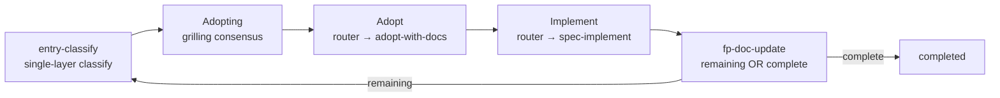
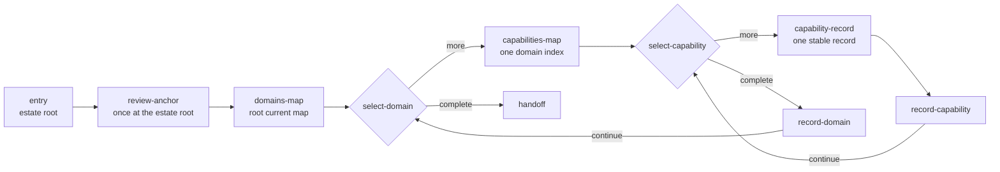
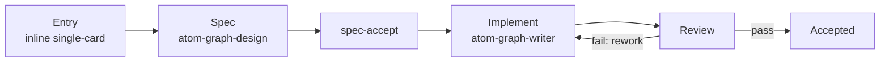

# Atomic Workflow 

> ⚠️ AI 生成的 README — 修改请编辑 [readme-blueprint.md](readme-blueprint.md)。

**Languages**: [English](../README.md) · 中文（本文件）

Graph-Engineering for Real Engineers: Graphs define workflows; workflows build graphs. Based on mattpocock/skills.

  

## 目录（Table of Contents）

**第一部分 — 开箱即用工作流**

- [arch-review-loop (RETIRED 2026-08-25)](#arch-review-loop)
- [estate-maintain](#estate-maintain)
- [全部内置工作流](#全部内置工作流all-built-in-workflows)
- [文档管理](#文档管理documentation-management)

**第二部分 — 基础与制图**

- [问题](#问题the-problem)
- [工作原理](#工作原理how-it-works)
- [安装](#安装installation)
- [初始化](#初始化setup)
- [制作一个图](#制作一个图making-a-graph)

**尾部**

- [架构](#架构architecture)
- [公开模块](#公开模块public-modules)
- [状态与路线图](#状态与路线图status--roadmap)
- [贡献](#贡献contributing)
- [依赖](#依赖dependencies)
- [致谢](#致谢thanks)
- [延伸阅读](#延伸阅读further-reading)

---

## 第一部分 — 开箱即用工作流

## arch-review-loop

> **RETIRED (2026-08-25, change graph-stateless-cutover-closure N5-3)** — legacy compatibility graph; never routed from engineering-flow. The `arch-review-loop.yaml` file and its registry entry are deleted; the L3 rework loop now lives in `feature-flow` / `direct-flow` (round-review self-edges). The section below is kept for historical reference.

旗舰工作流——一个循环把最大的剩余架构问题从评审一路带到已交付的变更。

**本节阅读方式**：代码块是**发送给你的智能体的提示词**（原样使用）；普通文字是说明。所有提示词遵循同一个模板；尖括号 `< >` 里的部分由你填写：

```text
Use atom-pilot to run <graph name>: <your goal in plain language>
```

循环一览——一轮组合采纳与实施；entry-classify 单层分类轮次输入（需求 → adopting；实施 → 直达 spec-implement）；fp-doc-update 终节点在 `remaining` 时经 flow 自环重入本轮、`complete` 时排空；终止由用户在 direct-end 选项处决定：


```mermaid
graph LR
   CLS[entry-classify<br/>single-layer classify] --> GRILL[Adopting<br/>grilling consensus]
   GRILL --> ADOPT[Adopt<br/>router → adopt-with-docs]
   ADOPT --> IMPL[Implement<br/>router → spec-implement]
   IMPL --> FP[fp-doc-update<br/>remaining OR complete]
   FP -->|remaining| CLS
   FP -->|complete| DONE[completed]
```

一轮组合采纳 + spec 生产（adopt router 启动 `adopt-with-docs`，grilling 共识即需求评审与采纳）与实施（implement router 启动 `spec-implement`）；`fp-doc-update` 在 `remaining` 时经 flow 自环重入本轮、`complete` 时排空；终止由用户在 adopting / fp-doc-update 的 direct-end 选项处决定（节点报告 `direct_end: true` → pilot 以 end 决策推进——run 以 `completed` 结束，绝不 `force_end`）：

```text
Use atom-pilot to run arch-review-loop: find and fix the biggest architectural problem in this codebase.
```

### 分解步骤（Decomposition steps）

一轮被拆成三个可独立执行的图；`arch-review-loop` 组合它们。按需选择入口：

|需求|运行|
|-|-|
|仅架构深化（分析链）|`graph_get arch-review` + 首次 `workflow_advance(issue)`（交互式：explore → first-principles → present → candidate-select → grilling-loop）|
|仅采纳 + spec（确认需求，产出 OpenSpec change）|`graph_get adopt-with-docs` + 首次 `workflow_advance(issue)`（框架承载采纳交互——adopt-with-docs 是非交互自决 spec 流水线）|
|仅实施（change 已存在——指向它）|`graph_get spec-implement` + 首次 `workflow_advance(issue)` — `changeName` 随入口节点会话上下文携带|
|完整一轮（需求 + 采纳 + 实施一个 loop）|`arch-review-loop` RETIRED 2026-08-25 — 完整规划轮现走 `graph_get feature-flow` + 首次 `workflow_advance(issue)`（L1 需求循环 + L3 round-review 返工循环）|
|统一工程入口|`graph_get engineering-flow` + 首次 `workflow_advance(issue)`（单层意图分类 → 通道图兄弟运行）|

- `arch-review` — 非交互式架构分析：explore → 辅助 first-principles graph（原地更新输入分析材料，无审批）→ present → handoff。
- `adopt-with-docs` — 需求采纳 + spec 生产（`interaction: none`）：spec-propose — 被采纳的需求物化为 OpenSpec change — 自决流水线，经通道消费组合框架图交互节点的采纳共识；采纳共识（adopting grilling — 共识即采纳；采纳目标在 grilling 首轮前沿确认 — adopt-scope 访谈已删）由框架图承载。
- `spec-implement` — 实施：spec-extract 读取既有 change（组合时经上游通道，独立运行用 `args.changeName`）→ track 机制 → 归档 + doc 维护。此处不产生 spec——change 来自采纳阶段；返工是通道图（feature-flow / direct-flow）中的 L3 循环（round-review 自环）。

**直接用 MCP 工具？** 这一切背后的循环是 `graph_get` + 首次 `workflow_advance(issue)` → 执行返回的工作订单 → `workflow_advance(accept)` → 再次 `issue` 直到 `CURSOR_TERMINAL`（游标由 Envelope+Journal 派生 — 无 runId / DB）。如果你想绕开 atom-pilot 直接驱动 MCP 工具，参见 [packages/graph-workflow/README.md](../packages/graph-workflow/README.md) 中的调用流示例。

**想深入？** → [packages/graph-workflow/README.md](../packages/graph-workflow/README.md) 看图格式、全部工具与技能系统。

## estate-maintain

域资产构图 —— 以 `docs/domains/` 为根，组合 domains-map、capabilities-map、capability-record。该资产没有逐能力的 feasibility 工作流。


```mermaid
graph LR
   ENTRY[entry<br/>estate root] --> REV[review-anchor<br/>once at the estate root]
   REV --> DM[domains-map<br/>root current map]
   DM --> SELD{select-domain}
   SELD -->|more| CM[capabilities-map<br/>one domain index]
   CM --> SELC{select-capability}
   SELC -->|more| CR[capability-record<br/>one stable record]
   CR --> RECC[record-capability]
   RECC -->|continue| SELC
   SELC -->|complete| RD[record-domain]
   RD -->|continue| SELD
   SELD -->|complete| DONE[handoff]
```

`domains-map` 维护根当前地图；`capabilities-map` 维护一个域的能力清单；`capability-record` 维护一条稳定的能力记录。estate-maintain 只负责选择、记录与组合——不处理 spec、ADR、archive 或 sync。

```text
Use atom-pilot to run estate-maintain: rebuild the docs/domains estate from the domains, capabilities, and capability records.
```

18 个图开箱即用：4 个内置基座随 `packages/graph-workflow/graphs/` 发布，14 个随五个带 `assets/graphs/` 的族包 `packages/workflow-<族>/graphs/` 发布（两侧均为文件存在即注册——无索引文件）。estate-maintain 在上文有深入说明；graph-generate —— 制图旅程 —— 见第二部分「制作一个图」；其余为一行条目——完整细节见 [packages/graph-workflow/README.md](../packages/graph-workflow/README.md)：

## 全部内置工作流（All Built-in Workflows）

18 个图开箱即用：4 个内置基座随 `packages/graph-workflow/graphs/` 发布，14 个随五个带 `assets/graphs/` 的族包 `packages/workflow-<族>/graphs/` 发布（两侧均为文件存在即注册——无索引文件）。estate-maintain 在上文有深入说明（arch-review-loop 已 RETIRED，保留作历史参考；graph-generate —— 制图旅程 —— 见第二部分「制作一个图」）；其余为一行条目——完整细节见 [packages/graph-workflow/README.md](../packages/graph-workflow/README.md)：

|图|作用|
|-|-|
|**arch-review**|架构评审图——证据探索、内联第一性原理分析、验证重建方案、呈现候选、交接一份报告。|
|**capabilities-map**|能力地图生产——强制评审锚点，然后扫描一个域并持久化稳定能力记录。|
|**capability-record**|稳定能力记录——强制评审锚点，把当前证据整合进一份 docs/domains 能力文档。|
|**cutover**|已完成实施的证明——确立唯一的活动目标状态并产出 Cutover Receipt|
|**diagnosing-bugs**|交互式缺陷诊断图——vendored diagnosing-bugs 技能阶段作为图节点（反馈循环、复现、假设、插桩、修复+回归、清理），带 HITL 卡片、有界流程循环与第一性原理注入。|
|**domains-map**|域地图生产——强制评审锚点，持久化稳定战略域记录，不重复探索。|
|**e2e-minimal**|最小端到端夹具图：echo agent 步骤 → approval-review 关卡 → 交接；以最小表面演练类型化流程端点、带标签的返工自环与审批决策关卡。|
|**estate-maintain**|见上文——域资产维护|
|**explore-unknowns**|探索四象限未知，自动闭合领域性答案，仅在真正需要判断时提问，交接完整的地图。|
|**first-principles**|辅助第一性原理分析——经假设审计、基本真理、原子组件、重建与验证，就地更新一份给定文档。|
|**graph-generate**|见 [制作一个图](#制作一个图making-a-graph)（第二部分）——制造者旅程|
|**implementation-blocker-resolution**|解决一个实施阻塞——清点阻塞、调查、质证决策，再解决并重试|
|**implementing**|实施一个已接受的 write-spec 变更——逐片 select → require → implement → verify → review → audit-choices → record；末尾显式 cutover|
|**graph-maintain**|维护流——审计图的清单合规与内容-清单一致性，提出修复，以内联流程循环应用获批项。|
|**reconciling**|将已完成变更与稳定事实对账——归档变更记录、对账稳定事实面，然后 cutover|
|**release-prep**|发布前准备——基于 git tag 历史的确定性版本提案、逐项操作的 grilling 确认、以内联流程循环执行 apply + review。|
|**review-anchor**|强制评审锚点——每范围完成一次 explore-unknowns 与 first-principles，或校验一份绑定范围的继承回执。|
|**specifying**|统一的变更前契约图——interview → draft → fog-audit → research → synthesize → ownership → materialize → reslice → decision-complete|
|**understanding**|在承诺前理解一个变更——捕获、分类并确认载体，落种子，研究证据，划定范围，消解未知|
|**write-docs**|应用一项有界文档变更，验证其可观察面，并完成其生命周期|

## 文档管理（Documentation Management）

本项目文档的管理方式——**只列出当前内置图实际消费的文档**；`docs/` 下其余内容均为 legacy（遗留），保留作参考，不被任何图消费。

图运行时经静态 ContextManifest 交付上下文：约定层（平台默认加载）、用户补充配置 context、图级 `context:` 声明（`skill:` 引用 / `node:` 报告提升 / 文件 glob — 图加载时一次解析、折入运行材料）与图级约束。当前内置图实际消费的内容：

|类|文档|消费方|
|-|-|-|
|约定层（默认加载进每个阶段）|`CONTEXT.md`（术语表）、`docs/domains/README.md`（域映射 + Estate Standards；2026-09-09 由遗留 `docs/domains.md` 吸收并删除）|所有图阶段|
|平台与规范资产|平台集成文档、`docs/changes/`（变更包，已关闭的在 `archive/` 下）|write-spec（产出契约包）/ implement-change（执行 + cutover）；reconcile（对账）/ archive（归档）；estate-maintain 不处理 spec 或 ADR|
|约束|`.atomic-workflow/constraints.md` → `constraints.json`|激活（pilot 加载一次进会话；每个节点的 Constraints 块从它组装）|
|运行时|运行状态（仅进度 — `workflow_advance` 的 `issued` 进度行 + 会话 executed-set 记录; free = 会话记录游标 / follow = 驱动端自有会话存储中的内存 `PipelineEnvelope`，无后端会话文件）|无 DB、无 run 实体 — 会话持有; 节点内容驻留代理会话/持久产物 — 从不持久化，无输出上限|
|资产|`packages/graph-workflow/`（内置基座：4 个图、27 个提示原子投影——文件存在即注册）、`packages/workflow-<族>/`（五个带 `assets/graphs/` 的族包：14 个图、54 个原子；各自经 manifest 的 `atomicWorkflow.contributes.assets` 声明目录）、`packages/graph-workflow/skills/`（15 个技能）；`flows/` 已退役（tier-boundary cutover 删除该树，无流程规格残留）|全部图执行|
|产物|`docs/reports/`（arch-review 报告）、`docs/changes/<date>-<name>/`（变更包——已关闭的归档在 `docs/changes/archive/` 下）|arch-review / write-spec / implement-change|

变更遵循变更包流程：write-spec 在 `docs/changes/<date>-<name>/` 下产出一份获批变更记录（README + 有序切片 + 决策台账 + 验证契约），implement-change 逐片执行并证明 cutover；reconcile/archive 随后关闭生命周期并将包归档到 `docs/changes/archive/`。README 家族本身由本蓝图再生。

**Legacy、非图消费**：`docs/design.md`、`docs/philosophy.md`、`docs/requirements.md`、`docs/core-requirements.md`、`docs/conventions.md`、`docs/workflow.md`、`docs/constraints.md`、`docs/specs/`、`docs/grill/`、`docs/designs/`、`docs/tickets/`、`docs/agents/`、`docs/platform/`、`docs/dev/`、`docs/readme-blueprint.md`（重新生成源，非图输入）——保留作参考。

---

## 第二部分 — 基础与制图

**Graph is just a tool; Attention is all you need.**

## 问题（The Problem）

AI 智能体会悄悄跳过步骤、在阶段之间丢失上下文、无法表达条件分支、缺少结构化的审批关卡。这些失败的共同根源是：**智能体没有工作订单系统（work-order system）**。它被告知"构建这个功能"，然后即兴发挥。当它漏掉评审步骤或忘记更新文档时，执行模型里没有任何机制阻止它——因为根本不存在执行模型。Atomic Workflow 给了智能体一个：显式的原子出现（`atoms`）、声明的 `flow` 拓扑、运行时上下文注入，以及不可绕过的审批关卡。

---

## 工作原理（How It Works）

**基于图的运行时工作订单。** 每个阶段都是一份自包含的工作订单。你的智能体拉取下一个就绪订单，执行它，回报结果；调度器推进图。图只跟踪进度、提醒下一步——它不执行任何东西。工作流图能表达线性链做不到的事：条件分支、审批关卡、有界返工循环、轮次重入。

**图是自包含的。** 每个图就是一个 workflow YAML，声明它需要的一切：`nodes`（以节点 id 为键的映射，值为严格出现对象——原子出现 `{ atom, … }` 可选 `input` / `semanticIntent` / `inputs`，或静态图出现 `{ graph }`；映射键即出现身份，任务文本由 prompt-atom 渲染，不在图里书写）、顶层 `flow` 块——唯一拓扑声明，图的路径裁决权——`conditions`（条件提示词，按出现 id 与边标签寻址）、静态 `context:` 清单与图级 `constraints`（散文规则：返工上界、条件词汇）。图声明自己的交互模式与目录描述。没有任何外部编排器：引擎校验 YAML、按转移表路由；智能体读出现自己的声明。图是一整块工作订单板，不是片段。

**子图是平铺的，兄弟是运行。** 两件事永不混淆。静态嵌套是 `graph:` 出现——节点值 `{ graph: <名字> }`，其子图在 lowering 时递归平铺进父图的扁平执行面（任务 id 限定为 `父/子/键`，深度 ≤ 8，环在加载时报错）。运行时选择*另一个*图是执行智能体在自己节点任务内启动的兄弟运行：`graph_get` + 首次 `advance`（全新 executed-set，launch 参数随入口节点的 session 上下文携带）→ 驱动到 `node: null` → 收集结果。没有 `use` 组合、没有 router atom、没有带命名空间的运行实体——每个图都是独立的、自声明的；调度器的游标从不离开扁平面。

**提示而非控制——图从不派发。** 图不声明执行面——任务文本由 prompt-atom 渲染、执行技能住在 atom 描述符里；图只声明拓扑、条件词汇、上下文清单与约束。派发本身留在你的智能体手里：当技能扇出子智能体时，它遵循的是技能契约的提示，而不是图的指令。图是工作订单看板，不是管理者。

**你的智能体仍然做所有事。** 没有代码执行，没有隐藏引擎，没有新的运行时语言。智能体保留完整工具箱——技能、工具、文件——并完成所有工作。图只下发订单、跟踪进度。这就是全部机制。

**Attention is all you need.** 智能体的失败源于注意力涣散，而非能力不足。"构建这个功能"太大；"给定上一步的 schema，编写 User 模型类型定义"刚刚好。一份边界清晰的工作订单消除了导致跳步、漏评审和范围漂移的歧义。

---

## 安装（Installation）

### graph-workflow — MCP 服务器

一个包、两种能力：**MCP Server**（8 个工具，stdio 传输，无服务端运行状态）和 `atom-graph-scheduler` bin。安装路线——**bun 是本仓库的唯一运行时面**：

```bash
bun add -g @ai-atomic-workflow/graph-workflow
```

运行时：[bun](https://bun.sh) ≥ 1。bun 运行捆绑的私有 dist 入口：

```bash
bun pm bin -g   # → <bun-bin>，例如 ~/.bun/bin
```

```json
{
  "mcpServers": {
    "graph-workflow": {
      "command": "bun",
      "args": ["<bun-bin>/atom-graph-scheduler"]
    }
  }
}
```

配置文件位置：OMP → `~/.omp/agent/mcp.json`。完整细节 → [packages/graph-workflow/README.md](../packages/graph-workflow/README.md)。

### graph-workflow — 技能

两条安装渠道，任选其一（执行图需要全部 15 个内置技能）：

**选项 A：Claude Code marketplace**

```bash
/marketplace install makara/ai-atomic-workflow
```

**选项 B：skills.sh**（第三方 CLI，支持 76+ 智能体平台——Codex / Cursor 等）

```bash
npx skills add makara/ai-atomic-workflow
```

常用参数：`-a <agent>` 选择平台（`-a '*'` 全部），`-g` 全局安装，`-y` 非交互，`-l` 只预览不安装。

### 安装依赖（Install Dependencies）

父级技能链的一个前置条件：

- **mattpocock/skills** — 父级技能（grilling、domain modeling、TDD、code review）：`npx skills add mattpocock/skills`。→ [README](https://github.com/mattpocock/skills/blob/main/README.md)

## 初始化（Setup）

用 **setup-atomic-workflow** 技能初始化项目（已退役的 `atom-graph-config` CLI 不再存在）：

```text
Use setup-atomic-workflow to initialize this project
```

它会生成 `.atomic-workflow/` — `config.json`（minimal `{}`；字段全部 optional——`graphAssetRoots`、可选 `context:`）、`constraints.md` 与空的 `graphs/` + `atoms/` 目录（文件存在即注册）。幂等：绝不覆盖已有文件。重复运行不写入任何内容。

## 制作一个图（Making a Graph）

制图旅程——Atomic Workflow 自我引导：制作图本身就是一个内置工作流，驱动方式与其他工作流完全相同。


```mermaid
graph LR
   ENTRY[Entry<br/>inline single-card] --> SPEC[Spec<br/>atom-graph-design]
   SPEC --> ACCEPT[spec-accept]
   ACCEPT --> IMPL[Implement<br/>atom-graph-writer]
   IMPL --> REVIEW[Review]
   REVIEW -->|fail: rework| IMPL
   REVIEW -->|pass| DONE[Accepted]
```

入口（内联单卡确认，不硬依赖 CONTEXT.md，无多轮访谈）→ spec（按 atom-graph-spec 经 atom-graph-design 设计拓扑）→ spec-accept → implement（atom-graph-writer 写入 `.yaml` —— 文件存在即注册，load-probe 验证）→ review → 返工决策（有界返工）→ accept。单一类型（图）、单一操作（创建）——不协同生产技能。技能生产（create / edit）经变更包（改进旅程）流转——实施阶段按受影响域加载 spec 技能（graph → atom-graph-spec、skill → atom-skill-spec、doc → atom-doc-maintain）：

```text
Use atom-pilot to run graph-generate: generate a workflow for release notes from merged PRs.
```

---

## 架构（Architecture）

**图是什么。** 图是在 workflow YAML 文件（任意经 schema 校验的 `.yaml` 文档，以声明的 `name` 为身份——无文件名后缀约定）中声明的工作订单板：一组以顶层 `flow` 转移边相连的具名阶段。调度器把每个就绪阶段下发为工作订单并跟踪进度——它本身不执行任何东西。智能体拉取订单、完成工作、回报结果；图向前推进。

**图的结构。** 阶段是工作的基本单位——唯一的派发种类是原子出现（内联执行 + 决策；静态嵌套是 `graph:` 出现，在展开期展平；运行期子图选择是由执行智能体驱动的兄弟运行）。条件路由住在顶层 `flow` 块——唯一拓扑声明（mermaid 子集转移边——`A -->|condition| B` 带标签、`A --> B` 序列默认）：图是解释权威，引擎把上报的条件值对照转移表机械匹配并激活目标（无匹配则大声失败——漏条件守卫；`branchTo`/`routing` 已删）。返工/循环声明为 `flow` 自环（`A -->|fail| A`——内联有界循环，界于图约束散文 + retryCount）。关键出现字段（`nodes:` 映射以 nodeId 为键，键即身份）：`atom`（原子出现——节点任务文本归原子，加载时渲染）、`graph`（静态图出现——展开期展平）、`input`（机器声明的逐原子启动数据，对照原子的严格启动 schema 校验）、`inputs`、`semanticIntent`（仅检索）；上下文是图级 `context:` 静态清单（加载时解析进运行的 `PipelineMaterial`）——无逐阶段 `channels`。规范顶层键序：`name → description → version → interaction → flow → entry → conditions → constraints → context → nodes`（entry 仅单例图；conditions 在 flow 之后，constraints 在 conditions 之后）。

**内置图与用户图。** 内置图随 `packages/graph-workflow/graphs/` 发布——文件存在即注册。用户图放在 `.atomic-workflow/graphs/`（由 setup-atomic-workflow 生成）。解析项目优先：同名用户图覆盖内置图。

两个包：

|Package|角色|
|-|-|
|**graph-workflow**|基础设施与技能系统合为一件可安装品：MCP Server（图执行引擎，8 个工具）+ 随包发布的内置图，以及 `atom-pilot`（生命周期循环）/ `atom-phase-handler`（单主派发）技能链与入口、参考技能。|

内置工作流清单见[第一部分](#全部内置工作流all-built-in-workflows)（含开箱即用推销叙述）。

## 公开模块（Public modules）

已发布的库模块自带 README 家族 —— 快面加深面文档：

- **[agentic-graphjs](../packages/agentic-graphjs/README.md)** —— 面向 agent 的图运行时内核：what / why / how、API 参考（[docs/api.md](../packages/agentic-graphjs/docs/api.md)）与 schema 参考（[docs/schema.md](../packages/agentic-graphjs/docs/schema.md)）。

## 状态与路线图（Status & Roadmap）

Atomic Workflow 处于 **alpha** 阶段。

**稳定**（已实现，v1.0 前无计划中的破坏性变更）：

- graph-workflow 无状态引擎与 8 个 MCP 工具
- workflow YAML 图格式（schema 定义身份 — 任意 `.yaml`；`name` + `version` 身份字段）与节点 schema（`nodes:` 以节点 id 为键的严格出现对象映射——原子或静态图——+ 顶层 `flow` 转移）
- 无状态执行循环（`graph_get` + canonical `workflow_advance`（issue/accept）；session 侧 rewind / terminate / status / history — 无 run 实体、无 DB）
- setup-atomic-workflow 项目初始化
- 18 个内置图与 15 个内置技能

**活跃开发中**（可能变化）：

- 更多控制流特性 — branch-route patterns、rework 决策
- 更多内置图 / 工作流
- 会话侧运维工具（executed-set 由会话持有）— MCP 工具接口可能变化

### 路线图（Roadmap）

- [ ] 更多开箱即用的图 — 发布说明生成、spec 起草、estate 工作流扩展
- [ ] 更多省 token 策略 — 更精简的上下文通道、更小的图开销
- [ ] 更顺手的运维工具 — 运行状态视图、更智能的历史/清理
- [ ] 更广的平台支持 — 跨平台 MCP 注册

---

## 贡献（Contributing）

欢迎提交 bug 报告与 pull request。流程见 [CONTRIBUTING.md](../CONTRIBUTING.md)，术语表见 [CONTEXT.md](../CONTEXT.md)。

## 依赖（Dependencies）

- [mattpocock/skills](https://github.com/mattpocock/skills/blob/main/README.md) — grilling、domain modeling、TDD 等父级技能

## 致谢（Thanks）

- [taskflow](https://heggria.github.io/taskflow) — DAG 执行模型灵感
- [Oh My Pi](https://omp.sh/) — 智能体工作台平台

---

## 延伸阅读（Further Reading）

|文档|用途|
|-|-|
|[packages/graph-workflow/README.md](../packages/graph-workflow/README.md)|图格式、全部 8 个 MCP 工具、内置图、用图制图、技能系统、技能如何驱动图执行|
|[packages/agentic-graphjs/README.md](../packages/agentic-graphjs/README.md)|已发布模块的快面（what / why / how）加深面文档 —— API 与 schema 参考|
|[CONTEXT.md](../CONTEXT.md)|术语参考（项目术语表）|
