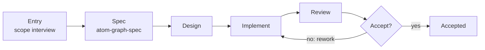
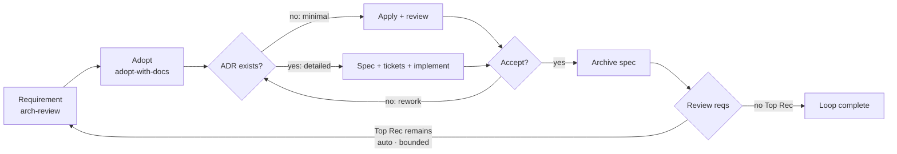

# README Blueprint — Atomic Workflow

> **Purpose**: Editing reference and regeneration source for **all four READMEs**. Edit this file to change README content, structure, or constraints — then ask an AI agent to regenerate them.
>
> **Regenerate**: "Regenerate all READMEs from docs/readme-blueprint.md"

---

## 1. Overall Constraints (all output files)

|Rule|Detail|
|-|-|
|**Language**|The four output READMEs: English only — international OSS audience. Plus a Chinese mirror of the root README at `docs/README.zh-CN.md` (zh docs live under `docs/`). Same structure, same facts, translated.|
|**Tone**|Terse, technical, no fluff. Fragments OK where clearer.|
|**AI notice**|Visible blockquote under title — "⚠️ AI-generated README — edit docs/readme-blueprint.md instead." Not hidden in HTML comments.|
|**One-sentence description**|Canonical project description (English): **"Graph-driven work-order system for AI agents — explicit phases, scoped context, and non-bypassable approval gates."** It sits under the hero tagline in the root README, under the title of both package READMEs, and in every manifest `description`: root + workspace `package.json`, `.claude-plugin/marketplace.json`. zh mirror carries the Chinese translation. Exception: `skills.sh.json` has no top-level description — schema forbids it, group descriptions only.|
|**Package facts**|Only implemented functionality in `packages/` may be described. Built-in graphs ship in `packages/graph-scheduler/graphs/` (source: `registry.json`). Skills ship in `packages/graph-workflow/skills/`.|
|**Fact sourcing**|Counts are NEVER hand-written: built-in graph count and names come from `packages/graph-scheduler/graphs/registry.json` (9 graphs); skill count comes from the `packages/graph-workflow/skills/` directory (12 skills); version comes from `package.json` (0.2.0). Any mismatch between a README literal and these sources is a defect.|
|**Diagram propagation**|Both mermaid sources — the arch-review-loop concept diagram (§3.7) and the graph-generate maker-journey diagram (§3.6) — SHALL be copied verbatim into all four output READMEs (root, zh mirror, graph-scheduler, graph-workflow). Diagram labels stay English in the zh mirror; surrounding prose translated. Byte-for-byte equality across all five files (blueprint + four outputs) is a regeneration gate (ADR 0105).|
|**Versioned names**|`graph-generate` (not graph-workflow, not graph-create). Never use retired names.|
|**Manifest grouping**|`.claude-plugin/marketplace.json` and `skills.sh.json` group **per package** — they mirror `packages/`: one marketplace `plugins[]` entry per package (field `source` → package dir, `skills` listed from it), one skills.sh `groupings[]` entry per package that ships skills (title = package name). Package-level descriptions live in those slots (`plugins[].description` / `groupings[].description`). Keep both manifests in sync with `packages/` whenever packages or their skills change. Current state: one plugin/grouping, `graph-workflow` ↔ `packages/graph-workflow` (12 skills); `graph-scheduler` ships no skills → no plugin/grouping.|
|**Dead links**|READMEs link only files that exist. `docs/technical-overview.md` and `ROADMAP.md` are planned, not yet created — never link them.|

## 2. README Architecture — one blueprint, four outputs

|File|Audience|Role|Length|TOC|
|-|-|-|-|-|
|`README.md` (root)|Skimmers + evaluators + doers|Full project pitch: main content of both packages condensed, plus the typical usage path. Most concise of the four outputs.|~200 lines|Anchor-link TOC under the hero — all H2s, grouped by part|
|`docs/README.zh-CN.md`|Chinese-speaking readers|Chinese mirror of the root README — same structure and facts, translated. Root README links to it via a language switcher in the hero; the zh file links back to the English root.|~200 lines|Same TOC rule as root, translated|
|`packages/graph-scheduler/README.md`|graph-scheduler users|Package deep-dive: install, MCP registration, graph format, all 9 tools, built-in graphs (incl. an arch-review-loop walkthrough), making graphs with graphs, FAQ. Carries both mermaid diagrams.|~300 lines|Anchor-link TOC under the hero — all H2s plus key H3s (Install, MCP Registration, Graph Format, MCP Tools, Built-in Graphs)|
|`packages/graph-workflow/README.md`|graph-workflow users|Skill-system deep-dive: install channels, full skill list, how skills drive graph execution. Carries both mermaid diagrams.|~160 lines|Anchor-link TOC under the hero — all H2s|

**Splitting rule**: Root README carries the narrative (Problem → How It Works → Install → Setup → Make a Graph → the flagship workflow) and _teasers_ for package docs. Package READMEs carry the _details_ (tool tables, graph YAML, skill tables). Never duplicate full tables in both root and package docs — root links to them.

**Diagram rule**: both diagrams live in root, zh mirror, AND both package READMEs (user decision, ADR 0105) — the split rule does not apply to diagrams; they are single-sourced in the blueprint and copied verbatim everywhere.

**zh mirror-sync rule**: `docs/README.zh-CN.md` SHALL be generated from the same fact block as the English root — identical structure, identical facts (graph count, skill count, version, table rows), prose translated only. No independent numbers, no reordering, no extra sections. The zh file is a translation of the root, never a separate document.

**Content preservation rule**: regeneration SHALL reconcile every item in §4 Content-Preservation Inventory — each current content item is either kept at its destination (Part 1 / Part 2 / tail), replaced by its listed successor, or explicitly discarded. Nothing disappears silently; every inventory item has a terminal disposition.

## 3. Root README Structure

Two labeled parts plus tail sections, emitted in this order:

- **Part 1 — Basics & Graph Making**: The Problem (§3.2), How It Works (§3.3), Installation (§3.4), Setup (§3.5), Making a Graph (§3.6).
- **Part 2 — Out-of-the-Box Workflows**: arch-review-loop (§3.7).
- **Tail sections**: Architecture (§3.8), Status & Roadmap (§3.9), Contributing (§3.10), Dependencies (§3.11), Thanks (§3.12), Further Reading (§3.13).

Part labels render as `## Part 1 — Basics & Graph Making` / `## Part 2 — Out-of-the-Box Workflows`; tail sections carry no part label. The zh mirror mirrors the same two-part structure, translated (第一部分 — 基础与制图 / 第二部分 — 开箱即用工作流).

### 3.1 Hero (title + badges + TOC)

```text
# Atomic Workflow 

> ⚠️ AI-generated README — edit docs/readme-blueprint.md instead.

**Languages**: English (root) · 中文 (docs/README.zh-CN.md)

**Graph is just a tool; Attention is all you need.**

Graph-driven work-order system for AI agents — explicit phases, scoped context, and non-bypassable approval gates.

  

## Table of Contents

**Part 1 — Basics & Graph Making** · [The Problem](#the-problem) · [How It Works](#how-it-works) · [Installation](#installation) · [Setup](#setup) · [Making a Graph](#making-a-graph)
**Part 2 — Out-of-the-Box Workflows** · [arch-review-loop](#arch-review-loop)
**Tail** · [Architecture](#architecture) · [Status & Roadmap](#status--roadmap) · [Contributing](#contributing) · [Dependencies](#dependencies) · [Thanks](#thanks) · [Further Reading](#further-reading)
```

- **Alpha badge**: orange (not red — signals "active development", not "unsafe")
- **Tagline**: bold, terse, one sentence.
- **Badge bar**: alpha status, MIT license, platform (OMP | OpenCode) — one line.
- **TOC**: anchor links, right under the hero. Root + zh list all H2s grouped by part; package READMEs list all H2s plus key H3s. TOC anchors must match GitHub heading slugs — a heading rename without a TOC update is a defect.

### 3.2 The Problem (~10 lines)

One integrated paragraph, compressed — do NOT enumerate pain points:

- Agents skip steps silently, lose context between stages, can't express conditional branches, lack structured approval gates.
- Root cause sentence: "the agent has no work-order system."
- Close with what Atomic Workflow gives: explicit phases, declared dependencies, runtime context injection, non-bypassable approval gates.

No "The Idea" section — removed. The idea is implied by How It Works.

### 3.3 How It Works (~35 lines)

Two named **key designs** and two named **design principles** — plus a third key design below. Present as short paragraphs, each with a bold heading so the names are explicit and searchable:

1. **Runtime work orders with graph** (key design): Each phase is a self-contained work order. Your agent pulls the next ready order, executes it, reports back; the scheduler advances the graph. The graph tracks progress and reminds what's next — it doesn't execute anything. DAG captures what chains can't: conditional branches, approval gates, parallel fan-outs.
2. **Scoped context with channels** (key design): Each work order carries the exact prompt, the right skill, and a context "channel" — a focused slice of relevant decisions and artifacts, nothing heavy. Channels have two scopes: a global channel (graph top-level `context:`, with the project `config.json` as the default layer — merged once, config-first) and per-phase `channels:` additions. Every node's output is a stream named `<nodeId>`; `node:<id>` entries read a non-`dependsOn` stream, `context: [node:<id>]` promotes one into the global channel. Patterns — skill names, file globs, or `node:<id>` references — resolve against the execution skill's Context Requirements contract.
3. **Hints, not controls — the graph never dispatches** (key design): A graph says _what_ each phase needs — skills, context, and, optionally, agent-type preferences in priority order. Dispatch itself stays in your agent's hands: when a skill fans out sub-agents, it follows the hints, not the graph's command. The graph is a work-order board, not a manager.
4. **Your agent still does everything** (principle): No code execution, no hidden engine, no new runtime language. The agent keeps its full toolkit; the graph only issues orders and tracks progress.
5. **Attention is all you need** (principle): Agents fail from lost focus, not incapability. "Build this feature" is too big; "Write the User model type definition, given the schema from the previous step" is just right. Bounded work orders eliminate the ambiguity that causes skipped steps and drifting scope.

### 3.4 Installation (~40 lines)

Sub-parts in order:

1. **graph-scheduler** — one package, two capabilities: MCP Server (9 tools, stdio transport) + `atom-graph-scheduler` bin. **Two install routes — runtime matches the installer**:
   - **npm + Node runtime**: `npm install -g @ai-atomic-workflow/graph-scheduler` — runtime Node ≥ 22; run the compiled entry `dist/server.js`.
   - **bun**: `bun add -g @ai-atomic-workflow/graph-scheduler` — runtime bun ≥ 1; run `server.ts` directly (bun executes TS natively). Register in the platform MCP config by invoking the runtime explicitly with the absolute entry path (resolve via `npm root -g` / `bun pm bin -g`). Config locations: OMP → `~/.omp/agent/mcp.json`, OpenCode → `opencode.json`. Full details → `packages/graph-scheduler/README.md`.
2. **graph-workflow** — two channels, pick one (all 12 built-in skills required for graph execution):
   - Claude Code marketplace: `/marketplace install makara/ai-atomic-workflow`
   - skills.sh: `npx skills add makara/ai-atomic-workflow`. Flags: `-a <agent>` / `-g` / `-y` / `-l`. Both channels are served by the same per-package manifest grouping — marketplace `plugins[]` and skills.sh `groupings[]` each mirror one package in `packages/` (see §1 **Manifest grouping**). Skill count: 12, from the `packages/graph-workflow/skills/` directory — never hand-written.
3. **Dependencies** (prerequisites for the openspec graphs and parent skills):
   - OpenSpec CLI: `npm install -g @fission-ai/openspec@latest`, then `openspec init` inside the project. → https://github.com/Fission-AI/OpenSpec/blob/main/docs/installation.md
   - mattpocock/skills (parent skills — grilling, domain modeling, TDD, code review): `npx skills add mattpocock/skills`. → https://github.com/mattpocock/skills/blob/main/README.md

### 3.5 Setup (~8 lines)

One step — invoke the **setup-atomic-workflow** skill (not a CLI; the retired `atom-graph-config` CLI is gone):

```text
Use setup-atomic-workflow to initialize this project
```

It scaffolds `.graph-scheduler/` — `config.json` (db path, taskflow dir, registry paths), `graphs/`, `docs/`, `constraints.md`. Idempotent: never overwrites existing files.

### 3.6 Making a Graph (~20 lines)

Atomic Workflow bootstraps itself — the maker journey for authoring a graph is a built-in graph, driven the same way as every graph:

- `graph-generate` — the concrete maker journey graph (name states the operation): entry (atom-scope-interview, no CONTEXT.md hard dependency) → spec (topology design via atom-graph-design per atom-graph-spec) → spec-accept → implement (atom-graph-writer writes the `.taskflow.yaml` + registry entry + attached doc `.graph-scheduler/docs/<name>.md`, load-probe validated) → review → gate → accept. Single kind (graph), single operation (create) — no skill co-production:

```text
Use atom-pilot to run graph-generate: generate a workflow for release notes from merged PRs.
```

- `doc-update` — update project docs (trigger → maintain → review → approval).

Skill production (create/edit) flows through `arch-review-loop` (improver journey) openspec changes — implementation loads the spec skill per affected domain (graph → atom-graph-spec, skill → atom-skill-spec, doc → atom-doc-maintenance).

**Maker-journey diagram** — simplified horizontal flowchart of the graph-generate chain. Rendered natively on GitHub; shows as source code on npmjs.com (accepted degradation, no SVG dual-track — ADR 0105). Source (verbatim):



Simplification principle: skeleton only — no approval details, no internal machinery. zh mirror: identical structure, diagram labels English (unchanged), surrounding prose translated.

### 3.7 arch-review-loop (~45 lines)

The flagship workflow — one loop that takes the biggest remaining architectural problem from review to shipped change. Part 2 opens with the **how-to-read legend** (moved from the retired Quick Start):

**Format rule**: prompt examples are _fenced command blocks_ (` ```text ` fence, tagged `text`) — never blockquotes. State this legend at the top of the section so readers never mix prompts with explanation: "code blocks are prompts you send to your agent, verbatim; plain text is explanation." Extend it with the shared prompt template — every example is this template filled in, so readers can tell fixed parts from user input:

```text
Use atom-pilot to run <graph name>: <your goal in plain language>
```

Prompt examples use `:` after the graph name — never `—` inside a prompt. Inside lists, indent the fence to the item's content column.

**Concept diagram** — simplified horizontal flowchart of the arch-review-loop loop. Rendered natively on GitHub; shows as source code on npmjs.com (accepted degradation, no SVG dual-track — ADR 0105). Insert after the section intro, before the decomposition steps. Source (verbatim):



Simplification principle: concept diagram shows the loop skeleton with the implement stage's two tracks (minimal / detailed) and the pipeline gates merged into a single gate display — no approval-card details, no per-phase machinery (ADR 0104 note: the round-continue content gate is structural, not drawn). zh mirror: identical structure, diagram labels English (unchanged), surrounding prose translated.

**End-to-end loop** — run `arch-review-loop`: one loop composes the three parts — requirement production (`arch-review`), adoption + spec production (`adopt-with-docs`) and implementation (`spec-implement`) — repeating rounds until nothing remains:

```text
Use atom-pilot to run arch-review-loop: find and fix the biggest architectural problem in this codebase.
```

Each round: scope interview at the requirement stage's entry (fresh review or existing report) → requirement production (`arch-review`: report → review-accept — approve the Top Recommendation, Continue = requirement ready) → content gate (`round-continue` — Continue activates adopt + implement; End when no Top Rec remains, ADR 0104) → adopt stage (`adopt-with-docs` — adoption conversation confirms the produced report, appends its record as a dated appendix; spec-propose materializes the adopted requirements as the OpenSpec change) → implementation part (spec-extract reads the produced change → track machinery → archive) → round-end approval (Loop again default, Complete = user ends). The loop ends when the review reports no remaining Top Recommendation — or you choose Complete. Run mode (manual/auto) is confirmed at each activation.

**Decomposition steps.** The round splits into three independently executable graphs; `arch-review-loop` composes them. Pick the entry that matches your need:

|Need|Run|
|-|-|
|Requirement production only (find problems)|`graph_start arch-review`|
|Adoption + spec only (confirm a produced report / raw idea, produce the change)|`graph_start adopt-with-docs`|
|Implementation only (change exists)|`graph_start spec-implement` with `args.changeName`|
|Full round (requirement + adoption + implementation in one loop)|`graph_start arch-review-loop`|

- `arch-review` — requirement production — standalone: scope interview (scope + output path + report input fresh|existing) → arch-review report (improve-codebase-architecture) → review-accept (Continue = requirement ready, Loop again, End).
- `adopt-with-docs` — requirement adoption + spec production — standalone raw-idea entry; composed, it receives the produced report as input document, appends its record as a dated appendix section, and materializes the adopted requirements as the OpenSpec change (spec-propose).
- `spec-implement` — implementation: spec-extract reads the produced change (upstream channel when composed, `args.changeName` standalone) → track machinery → archive (tracks own post-archive doc maintenance). No spec generation, no auto-loop gate — rework is the single loop in arch-review-loop.

**Raw MCP tools?** The loop behind all of this is `graph_start` → execute the returned work order → `graph_advance` → repeat until null. If you want to drive the MCP tools directly instead of via atom-pilot, see the call-flow example in `packages/graph-scheduler/README.md`.

**Want to go deeper?** → `packages/graph-scheduler/README.md` for the graph format and all tools, `packages/graph-workflow/README.md` for the skill system.

### 3.8 Architecture (~30 lines, tail)

**What a graph is.** A graph is a work-order board declared in a `.taskflow.yaml` file: a named set of phases wired by `dependsOn` edges. The scheduler issues each ready phase as a work order and tracks progress — it executes nothing. The agent pulls the order, does the work, reports back; the graph advances.

**Graph structure.** Phases are the units of work. Types: `main` (inline execution), `approval` (human decision card), `gate` (machine rework judgment), and `flow` composition (reference another graph via `use`, flattened at load). Key phase fields: `task` (the work order / card text), `skill` (execution skill), `agent` (priority hints for sub-agent dispatch), `channels` (context — global `context:` + per-phase additions, two-scope model), `jumps` (gate-only rework conditions), `routing` (approval-only branch-route actions), `dependsOn` (topological order).

**Built-in vs user graphs.** Built-in graphs ship in `packages/graph-scheduler/graphs/` and are registered in `graphs/registry.json`. User graphs live in `.graph-scheduler/graphs/` (scaffolded by setup-atomic-workflow). Resolution is project-first: a project graph with the same name overrides a built-in.

Two-package table (short — full detail lives in package READMEs):

|Package|Role|
|-|-|
|graph-scheduler|Infrastructure. MCP Server (DAG engine, 9 tools) + built-in graphs.|
|graph-workflow|Skill system. atom-pilot (lifecycle), atom-phase-handler (dispatch), entry skills.|

Built-in graphs table — full 9-graph list (names + one-line description, matching `packages/graph-scheduler/graphs/registry.json`). The concept diagram no longer lives here — it sits with the arch-review-loop narrative in Part 2 (ADR 0105).

### 3.9 Status & Roadmap (~15 lines, tail)

1. **Alpha definition** — one line.
2. **Stable** (implemented, no planned breaking changes): graph-scheduler FSM engine + 9 MCP tools, `.taskflow.yaml` phase schema (main/approval/gate + flow composition, join modes, channels, agent hints, branch routes), CRUD execution loop (`graph_start`/`graph_advance`/`graph_jump`/`graph_status`/`graph_list`), setup-atomic-workflow skill, 9 built-in graphs, 12 built-in skills.
3. **Active development** — what may change: more control-flow features (branch-route patterns, gate jump conditions), more built-in graphs/workflows, data maintenance tools (current `graph_clean_*` are minimal; the MCP tool interface may change).
4. **Roadmap** — short inline checkbox list (self-contained; no ROADMAP.md link — the file does not exist yet, READMEs must never link uncreated docs).

### 3.10 Contributing (~4 lines, tail)

2–3 lines only. Links to CONTEXT.md and docs/adr/. Do NOT link CONTRIBUTING.md — the file does not exist (dead-links rule).

### 3.11 Dependencies (~3 lines, tail)

Single bullet: OpenSpec CLI + mattpocock/skills (links as in §3.4).

### 3.12 Thanks (~4 lines, tail)

- [taskflow](https://heggria.github.io/taskflow) — DAG execution model inspiration
- [Oh My Pi](https://omp.sh/) — agent harness platform

### 3.13 Further Reading (tail)

Quick reference table: packages/graph-scheduler/README.md, packages/graph-workflow/README.md, docs/glossary.md, CONTEXT.md. **Only link files that exist** — `docs/technical-overview.md` and `ROADMAP.md` are planned, not yet created; they must not appear in any README.

## 4. Content-Preservation Inventory

Every current README content item (2026-08-05 state) with its disposition. Regeneration SHALL reconcile every item — kept items appear at their destination, replaced items are superseded by the listed successor, discarded items are gone with the stated reason.

### Root `README.md` (12 items — all kept, destinations as mapped)

|#|Item|Disposition|
|-|-|-|
|1|Hero: title + alpha badge + AI notice + languages + tagline + one-sentence description + badge bar|kept → §3.1 Hero (unchanged)|
|2|The Problem (single paragraph)|kept → §3.2 (Part 1)|
|3|How It Works (5 named concepts)|kept → §3.3 (Part 1)|
|4|Installation graph-scheduler (npm + bun routes, config locations)|kept → §3.4 (Part 1 — moved from Part 2)|
|5|Installation graph-workflow (marketplace + skills.sh, flags)|kept → §3.4 (Part 1 — moved from Part 2)|
|6|Install dependencies (OpenSpec CLI + mattpocock/skills)|kept → §3.4 (Part 1 — moved from Part 2)|
|7|Setup (setup-atomic-workflow skill, scaffolding, idempotent, retired CLI note)|kept → §3.5 (Part 1 — moved from Part 2)|
|8|Quick Start (legend, end-to-end loop, three-stage table, raw MCP, deeper links)|kept → §3.7 (Part 2) — legend + end-to-end loop → arch-review-loop section; three-stage table + per-graph bullets → §3.7 Decomposition table; raw MCP + deeper links → §3.7 end|
|9|Architecture (two-package table + 9-graph table)|kept → §3.8 (tail — moved from Part 1); **replaced content**: concept diagram leaves this section → §3.7 (ADR 0105)|
|10|Status & Roadmap (alpha, stable, active dev, roadmap)|kept → §3.9 (tail — moved from Part 1)|
|11|Contributing / Dependencies / Thanks|kept → §3.10 / §3.11 / §3.12 (tail)|
|12|Further Reading table (4 docs)|kept → §3.13 (tail)|
|13|**NEW** Making a Graph section (renamed from Making Skills and Graphs with Graphs)|added → §3.6 (Part 1) — maker-journey diagram added (ADR 0105)|

### `docs/README.zh-CN.md` (10 items)

|#|Item|Disposition|
|-|-|-|
|1|Hero (zh)|kept → translated §3.1|
|2|问题 / 工作原理 (5 concepts)|kept → translated §3.2 / §3.3|
|3|安装 graph-scheduler (2 routes)|kept → translated §3.4 (Part 1)|
|4|安装 graph-workflow (12 个内置技能 ×2)|kept → translated §3.4 (Part 1)|
|5|依赖 / 初始化 (Setup)|kept → translated §3.4 / §3.5 (Part 1)|
|6|快速开始 1: arch-review-loop 端到端循环|kept → translated §3.7 (Part 2)|
|7|快速开始 2: 三部分执行表 + 各图说明|kept → translated §3.7 分解步骤 (Part 2)|
|8|架构: two-package table + 9-row graph table + 概念图|kept → translated §3.8 (tail) — **replaced content**: concept diagram moves to §3.7; row order aligned with EN (arch-review-loop first)|
|9|状态与路线图 (9 图 / 10 技能)|kept → translated §3.9 (tail)|
|10|贡献 / 依赖 / 致谢 / 延伸阅读 + 用图制作技能与图|kept → translated §3.10–§3.13 + §3.6 制作一个图 (renamed)|

### Package READMEs (both updated — section rename + both diagrams + TOC)

|File|Disposition|
|-|-|
|`packages/graph-scheduler/README.md`|kept — **replaced content**: §10 renamed Making a Graph + maker-journey diagram; walkthrough §9 gains the concept diagram; TOC updated|
|`packages/graph-workflow/README.md`|kept — **replaced content**: both diagrams added at declared positions; TOC updated|

### Replaced content (global)

|Old content|Successor|
|-|-|
|Part labels Part 1 — Infrastructure & Philosophy / Part 2 — Out-of-the-Box Workflows (Installation/Setup/Quick Start)|Part 1 — Basics & Graph Making (Problem/HowItWorks/Installation/Setup/Making a Graph); Part 2 — Out-of-the-Box Workflows (arch-review-loop)|
|Concept diagram placement: Architecture §3.4, after the 9-graph table (ADR 0102)|Concept diagram in §3.7 arch-review-loop section (ADR 0105)|
|"Making Skills and Graphs with Graphs" section name (root + scheduler README)|"Making a Graph" (root §3.6 / scheduler README §10)|
|Quick Start section (root + zh)|Dissolved into §3.7 (Part 2)|
|Skill count 13 / 14 (root install, zh ×2, blueprint §3.4 pre-rework)|12 — from `packages/graph-workflow/skills/` directory|
|Graph count 15 / 18 (zh status, Round-1-era claims)|9 — from `packages/graph-scheduler/graphs/registry.json`|
|Retired graph names (`openspec-create`, `plan-generate`, `graph-workflow`, `skill-author`, `openspec-pipeline`)|Current graph set (`adopt-with-docs`, `spec-implement`, `graph-generate`, `arch-review-loop`)|
|`artifact-workflow` + `skill-workflow` composition pipeline (ADR 0095)|Deleted — ADR 0101 supersedes 0095; skill production (create/edit) flows through arch-review-loop openspec changes (improver journey); `graph-generate` is now the concrete maker journey graph, no longer a composition|
|CONTEXT.md version 0.1.0|0.2.0 — from `package.json`|
|shared-flow graph narrative (review-machinery, spec-entry-sharpened)|none — registry reorganized to 9 flat graphs|
|Root concept diagram 5-node drift (missing ACC[loop-accept] + Complete edge)|6-node canonical source restored (ADR 0105) — defect fixed by regeneration|

### Discarded content (terminal)

|Item|Reason|
|-|-|
|zh「同一流程的分解版本」list (retired graph chain)|graph set reorganized; no successor content — function superseded by the three-stage table (§3.7)|
|`skill-workflow` graph + its invocation blocks (root §3.9, graph-scheduler README §10)|skill-workflow deleted (ADR 0101); skill production now flows through arch-review-loop openspec changes (improver journey)|
|universal `artifact-workflow` skeleton narrative (kind switch, spec_skill injection)|skeleton deleted (ADR 0101); graph-workflow is a concrete maker journey graph — no skeleton, no kind switch|
|「The Idea」section|removed historically (blueprint §8 design decision) — idea implied by How It Works|
|`atom-graph-config` CLI install instructions|CLI retired — superseded by setup-atomic-workflow skill; READMEs note retirement, never document usage|
|legacy-skills comment + tree-subpath graph-workflow-only install method (root install, zh ×2, graph-workflow README, blueprint §3.4)|Removed — the single skills.sh command installs exactly the 12 graph-workflow skills via the manifest grouping; legacy root `skills/` are not part of `packages/`, and the tree-subpath variant is redundant|

## 5. graph-scheduler README Structure

Title: `# graph-scheduler`. AI notice blockquote (same wording). TOC right under the notice — all H2s plus key H3s (Install, MCP Registration, Graph Format, MCP Tools, Built-in Graphs).

1. **Overview** (~6 lines): title + AI notice, then the canonical one-sentence description (same sentence as root README, §1 constraint), then the pitch: DAG execution engine as a standalone MCP Server (stdio transport), 9 MCP tools. Loads `.taskflow.yaml` graphs, schedules nodes topologically, manages approval decisions, persists run state. Built on bun · Effect-TS · zod v4 · libsql.
2. **Requirements**: two supported runtimes, installer-matched — Node ≥ 22 (npm route, runs the compiled entry `dist/server.js`) or bun ≥ 1 (bun route, runs `server.ts` natively).
3. **Install**: two routes, same as root README §3.4 — npm: `npm install -g @ai-atomic-workflow/graph-scheduler` (resolve entry via `npm root -g`); bun: `bun add -g @ai-atomic-workflow/graph-scheduler` (resolve bin via `bun pm bin -g`). Verify `npm list -g @ai-atomic-workflow/graph-scheduler`. Note the `atom-graph-scheduler` bin.
4. **MCP registration**: OMP (`~/.omp/agent/mcp.json`) and OpenCode (`opencode.json`) JSON snippets invoking the runtime explicitly — npm route: `command: "node"` + `args: ["<npm-root>/@ai-atomic-workflow/graph-scheduler/dist/server.js"]`; bun route: `command: "bun"` + `args: ["<bun-bin>/atom-graph-scheduler"]`. Platform manages process lifecycle (discover → spawn → connect → health check → reconnect).
5. **Environment**: `GS_DB_PATH` (overrides `config.json` `dbPath`; scaffolded default `.graph-scheduler/data/graph-scheduler.db`; fallback `:memory:`).
6. **Project setup**: setup-atomic-workflow skill — scaffolds `.graph-scheduler/` (config.json: dbPath, taskflowDir, registryPaths, optional skillsDir; graphs/, docs/, constraints.md), idempotent. Retired `atom-graph-config` CLI no longer exists. Full skill flow summary.
7. **Graph format** (~30 lines): `.taskflow.yaml` — name, version, phases. Phase fields table: `id`, `type` (main/approval/gate dispatch types + flow composition via `use`), `dependsOn`, `task` (main work order / approval card — first line = decision-card header ≤30 chars), `skill`, `agent` (main-type priority hints for sub-agent dispatch, advisory), `channels` (patterns — `skill:<name>` skill content, file globs, `node:<id>` upstream outputs; resolved against the execution skill's Context Requirements contract; approval/gate carry `node:` entries only — judgment context), `jumps` (gate-only rework conditions `[{when, to}]` — hit → backward jump, no hit → pass through), `routing` (approval-only branch-route actions — declared only in branch-route scenarios), `join` (and/any), `route` (route membership).
8. **MCP tools** (~30 lines): table of all 9 tools (graph_start, graph_advance, graph_jump, graph_force_end, graph_status, graph_list, graph_init, graph_clean_completed, graph_clean_all) with params + one-liners. `graph_advance` takes `branchTo?` (gate rework target / approval branch-route target) and `endRun?` (approval end action — completes the run); `graph_init` also runs a full health check (entry-skill contract alignment with orphan detection + config health report). NextNode type table (main / approval / gate — flow is a load-time composition type, never dispatched). Then the raw **call flow** example — `graph_start({ graphName: "e2e-minimal" })` → execute → `graph_advance({ runId, nodeId, durationMs })` → repeat until null. This is the canonical MCP loop.
9. **Built-in graphs** (~30 lines): full table — 9 graphs from `graphs/registry.json` with descriptions aligned to the shipped YAMLs. Note project graphs: place custom `.taskflow.yaml` in `.graph-scheduler/graphs/`; project dir searched before built-in dir. Followed by an **arch-review-loop walkthrough** subsection (the loop graph gets the deep treatment): **concept diagram embedded verbatim** (ADR 0105, source = blueprint §3.7), then phases (requirement flow (arch-review: scope-entry scope interview → arch-review report → review-accept) → round-continue content gate (branch-route: proceed activates adopt+implement / end when no Top Rec, ADR 0104) → adopt flow (adopt-with-docs: adopt-scope → adopting — receives the report as input document, appends its record as a dated appendix — → adopt-accept → spec-propose — the adopted requirements materialize as the OpenSpec change) → implement flow (spec-implement: spec-extract reads the produced change → track machinery → archive) → loop-gate (auto jump to requirement/scope-entry while Top Rec remains, bounded) → loop-accept (Loop again default, Complete = user ends)).
10. **Making a Graph** (~15 lines): the maker journey — `graph-generate` is the concrete maker-journey graph: entry (atom-scope-interview — graph name + topology scope + save location, default `.graph-scheduler/graphs/`, no CONTEXT.md dependency) → spec (topology design via atom-graph-design per atom-graph-spec) → spec-accept → implement (atom-graph-writer writes `.taskflow.yaml` + registry entry + attached doc `.graph-scheduler/docs/<name>.md`) → review (code-review with atom-graph-spec) → gate (bounded rework) → accept. Single kind (graph), single operation (create), no skill co-production. **Maker-journey diagram embedded verbatim** (ADR 0105, source = blueprint §3.6). Plus `doc-update` (trigger → maintain → review → approval). Skill production (create/edit) flows through arch-review-loop openspec changes (improver journey) — spec skills load per affected domain.
11. **Development**: npm install / build (tsup) / test (vitest) / typecheck / start. Test coverage note.
12. **FAQ**: no response after graph_start (MCP connection), run history (graph_list + graph_status), stuck run (graph_force_end, irreversible), DB location and tables (graph_runs, node_states; output not persisted).

## 6. graph-workflow README Structure

Title: `# graph-workflow`. AI notice blockquote (same wording). TOC right under the notice — all H2s.

1. **Overview** (~8 lines): title + AI notice, then the canonical one-sentence description (same sentence as root README, §1 constraint), then the pitch: the skill system that drives graph execution. 12 built-in skills. Skills are the agent-side half: graph-scheduler issues work orders; these skills execute them. Distributed for any agent platform (Claude Code plugin, skills.sh, or copy the `skills/` folder). **Concept diagram embedded verbatim** (ADR 0105, source = blueprint §3.7) — the flagship loop the skill system drives.
2. **How skills drive graphs** (~15 lines): execution chain —
   - `atom-pilot` — lifecycle manager: execute→advance loop (graph_start → dispatch → graph_advance)
   - `atom-phase-handler` — central dispatch by node type (main/approval/gate base types; consumes input-node outputs, injects `## Agent hints:` / `## Run Mode:` / `## Constraints` blocks)
   - `atom-kernel` — platform primitives (task()/question()/interview()); sole dispatch-primitive source
   - `atom-scope-interview` — shared entry interview for graph entry phases (arch-review, arch-review-loop, graph-generate, adopt-with-docs)
   - entry skills (atom-doc-maintenance, atom-openspec-archive, setup-atomic-workflow; review/grilling/ADR judgment via upstream improve-codebase-architecture / grilling / domain-modeling — direct use, no local wrappers; implementation stages load spec skills per affected domain — graph → atom-graph-spec, skill → atom-skill-spec, doc → atom-doc-maintenance)
   - reference/spec skills (atom-graph-spec, atom-skill-spec, atom-mcp-contract — exact tool parameter schemas; document format rules live inside atom-doc-maintenance §Format Reference; graph-scheduler tool detection lives in atom-kernel)
3. **Making a Graph** (~10 lines): the maker journey is itself a graph — `graph-generate` (entry → spec → spec-accept → implement → review → gate → accept; single kind, single create operation). **Maker-journey diagram embedded verbatim** (ADR 0105, source = blueprint §3.6). Skill production (create/edit) flows through arch-review-loop openspec changes (improver journey).
4. **Install** (~15 lines): both channels — Claude Code marketplace (`/marketplace install makara/ai-atomic-workflow`) and skills.sh (`npx skills add makara/ai-atomic-workflow`). All 12 skills required for graph execution. Flags note.
5. **Skill list** (~35 lines): full table — 12 skills, one-line description each (source: each `SKILL.md` frontmatter, verbatim).
6. **Development**: npm install / test (vitest) / typecheck.
7. **Related docs**: link to root README and graph-scheduler README only (technical-overview.md is not yet created — never link it).

## 7. Regeneration Instructions

To regenerate all READMEs after editing this blueprint:

```text
Regenerate all READMEs from docs/readme-blueprint.md
```

The AI agent:

1. Reads this blueprint for structure and constraints
2. Reads `CONTEXT.md` for current project state
3. Reads `packages/graph-scheduler/graphs/registry.json` for the built-in graph list
4. Reads `packages/graph-scheduler/package.json` + `src/scheduler-runtime.ts` for install facts (bin, defaults)
5. Reads `packages/graph-workflow/skills/*/SKILL.md` frontmatter for the skill list
6. Reconciles §4 Content-Preservation Inventory — every item terminal (kept at destination / replaced by successor / discarded); nothing dropped silently
7. Writes all four output READMEs: root (concise, two parts), graph-scheduler (deep), graph-workflow (deep) — then the zh mirror from the same fact block, translated
8. **Copies both mermaid diagram blocks verbatim** from blueprint §3.6 / §3.7 into all four outputs at their declared positions; verifies byte-for-byte equality (ADR 0105) — a single differing byte is a regeneration defect

## 8. Design Decisions

|Decision|Rationale|
|-|-|
|Four READMEs from one blueprint|One source of truth; root stays concise, package docs carry depth. Splitting rule (§2) prevents drift.|
|Part 1 = basics + graph-making; Part 2 = the flagship workflow|Evaluators read one narrative arc: problem → how it works → install → setup → make a graph → run the out-of-the-box workflow. Reference content (architecture tables, status) relocates to the unlabeled tail so it never interrupts the arc. Maps to the two journeys of ADR 0101 (maker journey / improver journey).|
|Diagrams follow their narrative section (ADR 0105)|The concept diagram sits with the arch-review-loop section it illustrates; the maker-journey diagram sits with Making a Graph. Both propagate verbatim to all four output READMEs (user decision — package READMEs are primary surfaces for graph users).|
|No "The Idea" section in root|The idea is fully covered by "How It Works" — the four named concepts ARE the pitch. Duplicating it wastes skimmers' time.|
|"The Problem" compressed to one paragraph|Evaluators need the pain in 30 seconds, not a bulleted laundry list.|
|Four named concepts in How It Works|"Runtime work orders with graph" / "Scoped context with channels" / "Hints, not controls — the graph never dispatches" are the three key designs; "Your agent still does everything" / "Attention is all you need" are the two principles. Explicit names make them searchable and quotable.|
|Quick Start dissolved into the arch-review-loop section|The quick start WAS the flagship workflow — a separate section split its narrative from its diagram and decomposition. Legend + loop live with the workflow; decomposition is a bold-lead-in table inside the section (no separate heading — Format Reference flattening).|
|"Making a Graph" replaces "Making Skills and Graphs with Graphs"|The maker journey produces one artifact kind — a graph. Skill production flows through arch-review-loop openspec changes, not this section.|
|npm for graph-scheduler install|User-facing requirement — npm is the default global package manager; bun remains the runtime.|
|setup-atomic-workflow instead of CLI|The `atom-graph-config` CLI is retired; the skill is the implemented init path. READMEs must never document retired tools.|
|Built-in graphs table in root AND scheduler README|Root gives evaluators the capability list; scheduler README repeats it as the authoritative registry listing. Acceptable duplication — it is the package's primary feature.|
|Diagrams duplicated across all four outputs|User decision (ADR 0105). Single source per diagram (blueprint), verbatim copy everywhere; the regeneration gate makes drift a defect instead of a silent regression.|
|Skill list only in graph-workflow README|Root links to it. Avoids a 10-row table in the pitch doc.|
|Orange alpha badge, not red|Red = error signal. Orange = active development — honest without scaring early adopters.|
|Stable list uses feature-level language|"graph-scheduler FSM engine" not "core engine" — users map to specific functionality.|
|No timeline promises|Alpha projects break timeline promises. "Before v1.0" not "by Q3 2026."|
|Dependencies section lists OpenSpec + mattpocock/skills|Both are required for the openspec graphs and parent skill chain — install facts with official links.|
|Content-preservation inventory in the blueprint|The README family regenerates from this file; without an explicit per-item disposition map, regeneration silently drops content. The inventory makes every current item's fate visible and auditable.|

## 9. Related Documents

|Document|Relationship|
|-|-|
|`research/`|Original architecture-review research (release-readiness, parallel v1/v2)|
|`CONTEXT.md`|Source of truth for current architecture state|
|`docs/technical-overview.md`|Layer 2 — deep-dive technical content (**planned, not yet created** — do not link)|
|`ROADMAP.md`|Detailed roadmap (**planned, not yet created** — roadmap lives inline in the root README)|
|`packages/graph-scheduler/graphs/registry.json`|Source of the built-in graph list|
|`packages/graph-workflow/skills/*/SKILL.md`|Source of the skill list|
|ADR 0105 (`docs/adr/0105-readme-diagram-placement.md`)|Diagram placement + propagation policy (supersedes ADR 0102)|
