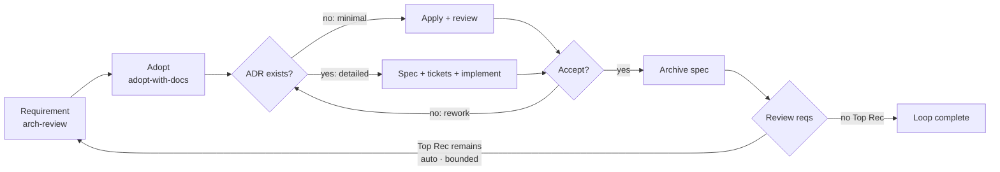
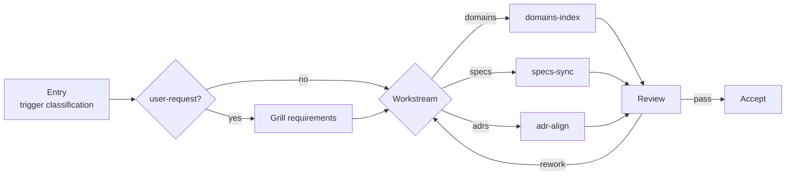
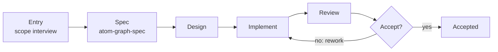

# README Blueprint — Atomic Workflow

> **Purpose**: Editing reference and regeneration source for **all four READMEs**. Edit this file to change README content, structure, or constraints — then ask an AI agent to regenerate them. **Regenerate**: "Regenerate all READMEs from docs/readme-blueprint.md"

---

## 1. Overall Constraints (all output files)

|Rule|Detail|
|-|-|
|**Language**|The four output READMEs: English only — international OSS audience. Plus a Chinese mirror of the root README at `docs/README.zh-CN.md` (zh docs live under `docs/`). Same structure, same facts, translated. **Exception — the canonical description**: the description block is English-only in ALL READMEs including the zh mirror — verbatim, never translated (non-ADR: canonical-description-english-only).|
|**Tone**|Terse, technical, no fluff. Fragments OK where clearer.|
|**AI notice**|Visible blockquote under title — "⚠️ AI-generated README — edit [docs/readme-blueprint.md](docs/readme-blueprint.md) instead." (linked form, uniform across all four outputs). Not hidden in HTML comments.|
|**Canonical description**|English original, one and only one form — **"Graph-Engineering for Real Engineers: Graphs define workflows; workflows build graphs. Based on mattpocock/skills."** It sits under the hero tagline in the root README, under the title of both package READMEs, in the zh mirror hero **verbatim (never translated)**, and in every manifest `description`: root + workspace `package.json`, `.claude-plugin/marketplace.json`. **Propagation list (complete)**: README.md hero · docs/README.zh-CN.md hero (verbatim English) · packages/graph-scheduler/README.md Overview · packages/graph-workflow/README.md Overview · package.json (root) · packages/graph-scheduler/package.json · packages/graph-workflow/package.json · .claude-plugin/marketplace.json (top-level). Exception: `skills.sh.json` has no top-level description — schema forbids it, group descriptions only. Package-level slots (`plugins[].description` / `groupings[].description`) describe the package domain, NOT the project — keep package wording.|
|**Package facts**|Only implemented functionality in `packages/` may be described. Built-in graphs ship in `packages/graph-scheduler/graphs/` (source: `registry.json`). Skills ship in `packages/graph-workflow/skills/`.|
|**Fact sourcing**|Counts are NEVER hand-written: built-in graph count and names come from `packages/graph-scheduler/graphs/registry.json` (10 graphs); skill count comes from the `packages/graph-workflow/skills/` directory (16 skills); version comes from `package.json` (0.5.0). Any mismatch between a README literal and these sources is a defect.|
|**Diagram propagation**|Both mermaid sources — the arch-review-loop concept diagram (§3.2) and the graph-generate maker-journey diagram (§3.10) — SHALL be copied verbatim into all four output READMEs (root, zh mirror, graph-scheduler, graph-workflow). The estate-maintain skeleton diagram (§3.3) propagates the same way. Diagram labels stay English in the zh mirror; surrounding prose translated. Byte-for-byte equality across all five files (blueprint + four outputs) is a regeneration gate (ADR 0105).|
|**Versioned names**|`graph-generate` (not graph-workflow, not graph-create). Never use retired names.|
|**Manifest grouping**|`.claude-plugin/marketplace.json` and `skills.sh.json` group **per package** — they mirror `packages/`: one marketplace `plugins[]` entry per package (field `source` → package dir, `skills` listed from it), one skills.sh `groupings[]` entry per package that ships skills (title = package name). Package-level descriptions live in those slots (`plugins[].description` / `groupings[].description`) — package domain wording, never the canonical project description. Keep both manifests in sync with `packages/` whenever packages or their skills change. Current state: graph-workflow ships the 16 skills split into two entries — `graph-workflow` (14 core skills) + `graph-workflow-extra` (release-prep-analyze + release-prep-apply, optional) — mirrored identically in marketplace `plugins[]` and skills.sh `groupings[]`; `graph-scheduler` ships no skills → no plugin/grouping.|
|**Dead links**|READMEs link only files that exist. `ROADMAP.md` is planned, not yet created — never link it.|

## 2. README Architecture — one blueprint, four outputs

|File|Audience|Role|Length|TOC|
|-|-|-|-|-|
|`README.md` (root)|Skimmers + evaluators + doers|Full project pitch: out-of-the-box workflows first (Part 1), then main content of both packages condensed (Part 2), plus the typical usage path. Most concise of the four outputs.|~350 lines|Anchor-link TOC under the hero — all H2s, grouped by part|
|`docs/README.zh-CN.md`|Chinese-speaking readers|Chinese mirror of the root README — same structure and facts, translated (description block verbatim English per the canonical-description record). Root README links to it via a language switcher in the hero; the zh file links back to the English root.|~370 lines|Same TOC rule as root, translated|
|`packages/graph-scheduler/README.md`|graph-scheduler users|Package deep-dive: install, MCP registration, graph format, all 9 tools, built-in graphs (incl. an arch-review-loop walkthrough), making graphs with graphs, FAQ. Carries all three mermaid diagrams.|~300 lines|Anchor-link TOC under the hero — all H2s plus key H3s (Install, MCP Registration, Graph Format, MCP Tools, Built-in Graphs)|
|`packages/graph-workflow/README.md`|graph-workflow users|Skill-system deep-dive: install channels, full skill list, how skills drive graph execution. Carries all three mermaid diagrams.|~170 lines|Anchor-link TOC under the hero — all H2s|
|**Splitting rule**: Root README carries the narrative (Part 1 = Out-of-the-Box Workflows: the flagship loop, estate maintenance, the maker journey, the workflow list, documentation management; Part 2 = The Problem → How It Works → Install → Setup → Making a Graph (the maker journey) and _teasers_ for package docs. Package READMEs carry the _details_ (tool tables, graph YAML, skill tables). Never duplicate full tables in both root and package docs — root links to them.|
|**Diagram rule**: all diagrams live in root, zh mirror, AND both package READMEs (user decision, ADR 0105) — the split rule does not apply to diagrams; they are single-sourced in the blueprint and copied verbatim everywhere.|
|**zh mirror-sync rule**: `docs/README.zh-CN.md` SHALL be generated from the same fact block as the English root — identical structure, identical facts (graph count, skill count, version, table rows), prose translated only. **The canonical description block is exempt from translation — verbatim English (canonical-description record).** No independent numbers, no reordering, no extra sections. The zh file is a translation of the root, never a separate document.|
|**Content preservation rule**: regeneration SHALL reconcile every item in §4 Content-Preservation Inventory — each current content item is either kept at its destination (Part 1 / Part 2 / tail), replaced by its listed successor, or explicitly discarded. Nothing disappears silently; every inventory item has a terminal disposition.|

## 3. Root README Structure

Two labeled parts plus tail sections, emitted in this order (workflows first — user decision 2026-08-09):

- **Part 1 — Out-of-the-Box Workflows**: arch-review-loop (§3.2), estate-maintain (§3.3), All Built-in Workflows (§3.4), Documentation Management (§3.5).
- **Part 2 — Basics & Graph Making**: The Problem (§3.6), How It Works (§3.7), Installation (§3.8), Setup (§3.9), Making a Graph (§3.10 — the maker journey).
- **Tail sections**: Architecture (§3.11), Status & Roadmap (§3.12), Contributing (§3.13), Dependencies (§3.14), Thanks (§3.15), Further Reading (§3.16). Part labels render as `## Part 1 — Out-of-the-Box Workflows` / `## Part 2 — Basics & Graph Making`; tail sections carry no part label. The zh mirror mirrors the same two-part structure, translated (第一部分 — 开箱即用工作流 / 第二部分 — 基础与制图).

### 3.1 Hero (title + badges + TOC)

```text
# Atomic Workflow 
> ⚠️ AI-generated README — edit [docs/readme-blueprint.md](docs/readme-blueprint.md) instead.
**Languages**: English (root) · 中文 (docs/README.zh-CN.md)
Graph-Engineering for Real Engineers: Graphs define workflows; workflows build graphs. Based on mattpocock/skills.
  
## Table of Contents
**Part 1 — Out-of-the-Box Workflows**

- [arch-review-loop](#arch-review-loop)
- [estate-maintain](#estate-maintain)
- [All Built-in Workflows](#all-built-in-workflows)
- [Documentation Management](#documentation-management)

**Part 2 — Basics & Graph Making**

- [The Problem](#the-problem)
- [How It Works](#how-it-works)
- [Installation](#installation)
- [Setup](#setup)
- [Making a Graph](#making-a-graph)

**Tail**

- [Architecture](#architecture)
- [Status & Roadmap](#status--roadmap)
- [Contributing](#contributing)
- [Dependencies](#dependencies)
- [Thanks](#thanks)
- [Further Reading](#further-reading)
```

- **Alpha badge**: orange (not red — signals "active development", not "unsafe")
- **Tagline**: bold, terse, one sentence — **relocated to the Part 2 opening** (user decision 2026-08-09): the hero keeps the canonical description only; Part 2 opens with "Graph is just a tool; Attention is all you need." (English in all outputs incl. zh mirror).
- **Canonical description**: the one sentence from §1 — English, verbatim, never translated, in every README and manifest description slot.
- **Badge bar**: alpha status, MIT license, platform (OMP | OpenCode) — one line.
- **TOC**: anchor links, right under the hero. Root + zh list all H2s grouped by part; package READMEs list all H2s plus key H3s. TOC anchors must match GitHub heading slugs — a heading rename without a TOC update is a defect.

### 3.2 arch-review-loop (~20 lines, Part 1 — the flagship)

The flagship workflow — one loop that takes the biggest remaining architectural problem from review to shipped change. Part 1 opens with the **how-to-read legend**: **Format rule**: prompt examples are _fenced command blocks_ (` `````text ` fence, tagged ```text`) — never blockquotes. State this legend at the top of the section so readers never mix prompts with explanation: "code blocks are prompts you send to your agent, verbatim; plain text is explanation." Extend it with the shared prompt template — every example is this template filled in, so readers can tell fixed parts from user input:

```text
Use atom-pilot to run <graph name>: <your goal in plain language>
```

Prompt examples use `:` after the graph name — never `—` inside a prompt. Inside lists, indent the fence to the item's content column. **Concept diagram** — simplified horizontal flowchart of the arch-review-loop loop. Rendered natively on GitHub; shows as source code on npmjs.com (accepted degradation, no SVG dual-track — ADR 0105). Insert after the section intro, before the decomposition steps. Source (verbatim):



Simplification principle: concept diagram shows the loop skeleton with the implement stage's two tracks (minimal / detailed) and the pipeline gates merged into a single gate display — no approval-card details, no per-phase machinery (ADR 0104 note: the round-continue content gate is structural, not drawn). zh mirror: identical structure, diagram labels English (unchanged), surrounding prose translated. **What the loop does** — prose anchors to the diagram only, no re-explaining: one round composes requirement production (`arch-review`), adoption + spec production (`adopt-with-docs`), and implementation (`spec-implement`); `loop-gate` re-enters the loop while a Top Recommendation remains (auto mode, bounded); `loop-accept` ends the round (Loop again default, Complete = user ends). Run mode (manual/auto) is confirmed at each activation.

```text
Use atom-pilot to run arch-review-loop: find and fix the biggest architectural problem in this codebase.
```

**Decomposition steps.** The round splits into three independently executable graphs; `arch-review-loop` composes them. Pick the entry that matches your need:

|Need|Run|
|-|-|
|Requirement production only (find problems)|`graph_start arch-review`|
|Adoption + spec only (confirm a produced report / raw idea, produce the change)|`graph_start adopt-with-docs`|
|Implementation only (change exists)|`graph_start spec-implement` with `args.changeName`|
|Full round (requirement + adoption + implementation in one loop)|`graph_start arch-review-loop`|

- `arch-review` — requirement production — standalone: scope interview (scope + output path + report input fresh|existing) → arch-review report (improve-codebase-architecture) → review-accept (Continue = requirement ready, Loop again, End).
- `adopt-with-docs` — requirement adoption + spec production — standalone raw-idea entry; composed, it receives the produced report as input document, appends its record as a dated appendix section, and materializes the adopted requirements as the OpenSpec change (spec-propose).
- `spec-implement` — implementation: spec-extract reads the produced change (upstream channel when composed, `args.changeName` standalone) → track machinery → archive (tracks own post-archive doc maintenance). No spec generation, no auto-loop gate — rework is the single loop in arch-review-loop. **Raw MCP tools?** The loop behind all of this is `graph_start` → execute the returned work order → `graph_advance` → repeat until null. If you want to drive the MCP tools directly instead of via atom-pilot, see the call-flow example in `packages/graph-scheduler/README.md`. **Want to go deeper?** → `packages/graph-scheduler/README.md` for the graph format and all tools, `packages/graph-workflow/README.md` for the skill system.

### 3.3 estate-maintain (~12 lines, Part 1)

Doc-estate maintenance as a graph — keeps the derived-view / normative / contract doc classes in sync after a domain or skill change. **Skeleton diagram** — simplified horizontal flowchart of the estate-maintain chain. Same rendering + propagation rules as the other diagrams. Source (verbatim):



Prose anchors to the diagram: the entry classifies the trigger (domain-change / skill-change / proactive / user-request — user-request adds a grilling confirmation step, no ADR), then dispatches the matching workstream — `domains-index` (atom-doc-maintain), `specs-sync` (atom-spec-maintain), `adr-align` (atom-adr-maintain); the review is a consistency gate (requirements class + reverse-validation + read-only deployment-mirror check).

```text
Use atom-pilot to run estate-maintain: sync the doc estate after the domains change.
```

### 3.4 All Built-in Workflows (~15 lines, Part 1)

Ten workflows ship in `packages/graph-scheduler/graphs/` and run out of the box. Two get the deep treatment above (arch-review-loop, estate-maintain); graph-generate — the maker journey — is covered in §3.10 Making a Graph (Part 2); the rest are one-line entries — full detail in `packages/graph-scheduler/README.md`. Table rows match `registry.json` descriptions:

|Graph|What it does|
|-|-|
|**arch-review-loop**|See §3.2 — the flagship loop|
|**arch-review**|Requirement production graph, standalone: scope-entry interview (entry node — scope + output path + report input fresh\|existing) → arch-review report (improve-codebase-architecture — producer) → review-accept (Continue = requirement ready / Loop again / End). Independently executable requirement production; the loop composes it as its requirement stage (adopt + implement follow in arch-review-loop).|
|**adopt-with-docs**|Requirement adoption (adopt stage) + spec production: adopt-scope (interview: idea/goal or input document) → adopting (grilling conversation, inline domain-modeling side effects) → adopt-accept (adoption approval) → spec-propose (openspec-propose — adopted requirements materialize as the OpenSpec change). Standalone raw idea entry; composed as the loop's adopt stage — receives the produced report as input document and appends its record as a dated appendix section.|
|**spec-implement**|Implementation graph: spec-extract (produced change — upstream channel when composed / {args.changeName} standalone) → track gate (minimal/detailed) → track-owned closure (plain archive / atom-doc-lifecycle) → pipeline-done. Pure implementation of an existing change — no spec generation; rework is the loop in arch-review-loop.|
|**openspec-apply**|OpenSpec apply pipeline: apply change → dual review → bounded auto-rework gate → plain archive (openspec-archive-change)|
|**openspec-engineer**|OpenSpec detailed implementation: spec synthesis → tickets → tdd implementation → dual review → bounded gate → approval → lifecycle closure (reverse-validated archive + ADR fold + index)|
|**e2e-minimal**|Minimal E2E: main → approval loop|
|**estate-maintain**|See §3.3 — estate maintenance|
|**release-prep**|Pre-release preparation — propose (release-prep-analyze: version from git tag history, deterministic + idempotent pre-tag, never executes git tag/commit/push) → plan-grill (grilling confirmation of every planned operation — interview, never auto-gated) → apply (release-prep-apply: version bump on release-line surfaces + CHANGELOG [Unreleased] fold per spec + README list sync vs ground truth, overwrite-style + verified) → release-review (approval; continue completes the run — final report prints tag/commit commands, user executes manually; jump re-runs a phase).|
|**graph-generate**|See §3.10 Making a Graph (Part 2) — the maker journey|

### 3.5 Documentation Management (~25 lines, Part 1 — end)

How this project's documentation is managed — **only the documents the current built-in graphs actually consume are listed**; everything else in `docs/` is legacy, kept for reference, not consumed by any graph. The graph runtime delivers context through channels: the convention layer (platform-default-loaded), user-supplement config context, constraints, and run state. What the 10 built-in graphs actually consume:

|Class|Documents|Consumed by|
|-|-|-|
|Convention layer (default-loaded into every phase)|`CONTEXT.md` (glossary), `docs/domains.md` (domain index)|all graph phases|
|Platform estate (organic — agent-read when present, never declared)|`docs/adr/` + `index.md` + `archive/` (ADRs), `openspec/specs/**`, `openspec/changes/**` (spec assets)|estate-maintain (adr-align), openspec graphs, arch-review-loop adoption chain|
|Constraints|`.graph-scheduler/constraints.md` → `constraints.json`|activation (pilot loads once into the session)|
|Runtime|node run state (progress only — status, retryCount, timestamps, routing; duration derived from timestamps, never stored)|graph-scheduler DB (`graph_runs` + `node_states`); node CONTENT lives in the agent session / durable artifacts — never persisted, no output cap|
|Assets|`packages/graph-scheduler/graphs/` + `registry.json` (10 graphs), `packages/graph-workflow/skills/` (16 skills)|all graph execution|
|Artifacts|`docs/reports/` (arch-review reports), `docs/adopt/` (adoption records)|arch-review / adopt-with-docs|
|Specs and changes follow the OpenSpec flow: proposals become `openspec/changes/<name>/` (proposal + delta specs + design + tasks), implementation syncs deltas into `openspec/specs/`, then the change archives. ADRs record decisions; superseded ones fold into `docs/adr/archive/`. The README family itself is regenerated from this blueprint (see §7).|
|**Legacy, not graph-consumed**: `docs/design.md`, `docs/philosophy.md`, `docs/requirements.md`, `docs/core-requirements.md`, `docs/conventions.md`, `docs/workflow.md`, `docs/constraints.md`, `docs/specs/`, `docs/grill/`, `docs/designs/`, `docs/tickets/`, `docs/agents/`, `docs/platform/`, `docs/dev/`, `docs/readme-blueprint.md` (regeneration source, not graph input) — kept for reference.|

Part 2 opens with the **tagline** (bold, one line): "Graph is just a tool; Attention is all you need." — English in all outputs incl. the zh mirror. Present in root + zh; package READMEs do not carry it.

### 3.6 The Problem (~10 lines, Part 2)

One integrated paragraph, compressed — do NOT enumerate pain points:

- Agents skip steps silently, lose context between stages, can't express conditional branches, lack structured approval gates.
- Root cause sentence: "the agent has no work-order system."
- Close with what Atomic Workflow gives: explicit phases, declared dependencies, runtime context injection, non-bypassable approval gates. No "The Idea" section — removed. The idea is implied by How It Works.

### 3.7 How It Works (~35 lines, Part 2)

Three named **key designs** and two named **design principles**. Present as short paragraphs, each with a bold heading so the names are explicit and searchable:

1. **Runtime work orders with graph** (key design): Each phase is a self-contained work order. Your agent pulls the next ready order, executes it, reports back; the scheduler advances the graph. The graph tracks progress and reminds what's next — it doesn't execute anything. DAG captures what chains can't: conditional branches, approval gates, parallel fan-outs.
2. **Scoped context with channels** (key design): Each work order carries the exact prompt, the right skill, and a context "channel" — a focused slice of relevant decisions and artifacts, nothing heavy. Channels compose in two scopes: a graph-wide channel for shared context, plus per-phase additions. The engine declares and shape-validates channels; your agent reads the skill itself and assembles the context it needs — no double parsing, no stale copies. No more "where are we?" or "what was decided earlier?" — your agent gets exactly what it needs for _this_ step.
3. **Hints, not controls — the graph never dispatches** (key design): A graph says _what_ each phase needs — skills, context, and, optionally, agent-type preferences in priority order. Dispatch itself stays in your agent's hands: when a skill fans out sub-agents, it follows the hints, not the graph's command. The graph is a work-order board, not a manager — and the engine reads no prose: it validates only its own YAML, run state, and machine facts. Skills carry the knowing.
4. **Your agent still does everything** (principle): No code execution, no hidden engine, no new runtime language. The agent keeps its full toolkit; the graph only issues orders and tracks progress — status, retry count, timestamps, routing. Nothing more, nothing less.
5. **Attention is all you need** (principle): Agents fail from lost focus, not incapability. "Build this feature" is too big; "Write the User model type definition, given the schema from the previous step" is just right. Bounded work orders eliminate the ambiguity that causes skipped steps and drifting scope.

### 3.8 Installation (~40 lines, Part 2)

Sub-parts in order:

1. **graph-scheduler** — one package, two capabilities: MCP Server (9 tools, stdio transport) + `atom-graph-scheduler` bin. **Two install routes — runtime matches the installer**:

- **npm + Node runtime**: `npm install -g @ai-atomic-workflow/graph-scheduler` — runtime Node ≥ 22; run the compiled entry `dist/server.js`.
- **bun**: `bun add -g @ai-atomic-workflow/graph-scheduler` — runtime bun ≥ 1; run `server.ts` directly (bun executes TS natively). Register in the platform MCP config by invoking the runtime explicitly with the absolute entry path (resolve via `npm root -g` `bun pm bin -g`). Config locations: OMP → `~/.omp/agent/mcp.json`, OpenCode → `opencode.json`. Full details → `packages/graph-scheduler/README.md`.

2. **graph-workflow** — two channels, pick one (all 16 built-in skills required for graph execution):

- Claude Code marketplace: `/marketplace install makara/ai-atomic-workflow`
- skills.sh: `npx skills add makara/ai-atomic-workflow`. Flags: `-a <agent>` / `-g` / `-y` / `-l`. Both channels are served by the same per-package manifest grouping — marketplace `plugins[]` and skills.sh `groupings[]` each mirror one package in `packages/` (see §1 **Manifest grouping**). Skill count: 16, from the `packages/graph-workflow/skills/` directory — never hand-written.

3. **Dependencies** (prerequisites for the openspec graphs and parent skills):

- OpenSpec CLI: `npm install -g @fission-ai/openspec@latest`, then `openspec init` inside the project. → https://github.com/Fission-AI/OpenSpec/blob/main/docs/installation.md
- mattpocock/skills (parent skills — grilling, domain modeling, TDD, code review): `npx skills add mattpocock/skills`. → https://github.com/mattpocock/skills/blob/main/README.md

### 3.9 Setup (~8 lines, Part 2)

One step — invoke the **setup-atomic-workflow** skill (not a CLI; the retired `atom-graph-config` CLI is gone):

```text
Use setup-atomic-workflow to initialize this project
```

It scaffolds `.graph-scheduler/` — `config.json` (db path, taskflow dir, registry paths; optional `context:` = user-supplement layer — user-owned ambient files, never required; the platform estate is organically discovered), `graphs/`, `docs/`, `constraints.md`. Idempotent: never overwrites existing files.

### 3.10 Making a Graph (~15 lines, Part 2)

The maker journey — Atomic Workflow bootstraps itself: authoring a graph is a built-in workflow, driven the same way as every graph.

**Maker-journey diagram** — simplified horizontal flowchart of the graph-generate chain. Rendered natively on GitHub; shows as source code on npmjs.com (accepted degradation, no SVG dual-track — ADR 0105). Source (verbatim):



Prose anchors to the diagram: entry (atom-scope-interview, no CONTEXT.md hard dependency) → spec (topology design via atom-graph-design per atom-graph-spec) → spec-accept → implement (atom-graph-writer writes the `.taskflow.yaml` + registry entry + attached doc `.graph-scheduler/docs/<name>.md`, load-probe validated) → review → gate (bounded rework) → accept. Single kind (graph), single operation (create) — no skill co-production. Skill production (create/edit) flows through `arch-review-loop` (improver journey) openspec changes — implementation loads the spec skill per affected domain (graph → atom-graph-spec, skill → atom-skill-spec, doc → atom-doc-maintain).

```text
Use atom-pilot to run graph-generate: generate a workflow for release notes from merged PRs.
```

### 3.11 Architecture (~30 lines, tail)

**What a graph is.** A graph is a work-order board declared in a `.taskflow.yaml` file: a named set of phases wired by `dependsOn` edges. The scheduler issues each ready phase as a work order and tracks progress — it executes nothing. The agent pulls the order, does the work, reports back; the graph advances. **Graph structure.** Phases are the units of work. Types: `main` (inline execution), `approval` (human decision card), `gate` (machine rework judgment), and `flow` composition (reference another graph via `use`, flattened at load). Key phase fields: `task` (the work order / card text), `skill` (execution skill), `agent` (priority hints for sub-agent dispatch), `channels` (context — global `context:` + per-phase additions, two-scope model), `jumps` (gate-only rework conditions), `routing` (approval-only branch-route actions), `dependsOn` (topological order). **Built-in vs user graphs.** Built-in graphs ship in `packages/graph-scheduler/graphs/` and are registered in `graphs/registry.json`. User graphs live in `.graph-scheduler/graphs/` (scaffolded by setup-atomic-workflow). Resolution is project-first: a project graph with the same name overrides a built-in. Two-package table (short — full detail lives in package READMEs):

|Package|Role|
|-|-|
|graph-scheduler|Infrastructure. MCP Server (DAG engine, 9 tools) + built-in graphs.|
|graph-workflow|Skill system. atom-pilot (lifecycle), atom-phase-handler (dispatch), entry skills.|
|The 10-workflow list lives in Part 1 (§3.4) with the out-of-the-box pitch; the tail keeps only the structural narrative.|

### 3.12 Status & Roadmap (~15 lines, tail)

1. **Alpha definition** — one line.
2. **Stable** (implemented, no planned breaking changes): graph-scheduler FSM engine + 9 MCP tools, `.taskflow.yaml` phase schema (main/approval/gate + flow composition, join modes, channels, agent hints, branch routes, activation prologue, run state), CRUD execution loop (`graph_start`/`graph_advance`/`graph_jump`/`graph_status`/`graph_list`), setup-atomic-workflow skill, 10 built-in graphs, 16 built-in skills.
3. **Active development** — what may change: more control-flow features (branch-route patterns, gate jump conditions), more built-in graphs/workflows, data maintenance tools (current `graph_clean_*` are minimal; the MCP tool interface may change).
4. **Roadmap** — short inline checkbox list, user-perspective (self-contained; no ROADMAP.md link — the file does not exist yet, READMEs must never link uncreated docs):

- [ ] More out-of-the-box graphs — release-notes generation, spec drafting, estate workflow extensions
- [ ] More token-saving strategies — headroom compression integration, leaner context channels, smaller graph overhead
- [ ] More convenient operations tooling — run status views, smarter history/cleanup
- [ ] Wider platform support — cross-platform MCP registration No time promises ("Before v1.0" not "by Q3 2026").

### 3.13 Contributing (~4 lines, tail)

2–3 lines only. Links to CONTEXT.md and docs/adr/. Do NOT link CONTRIBUTING.md — the file does not exist (dead-links rule).

### 3.14 Dependencies (~3 lines, tail)

Single bullet: OpenSpec CLI + mattpocock/skills (links as in §3.8).

### 3.15 Thanks (~4 lines, tail)

- [taskflow](https://heggria.github.io/taskflow) — DAG execution model inspiration
- [Oh My Pi](https://omp.sh/) — agent harness platform

### 3.16 Further Reading (tail)

Quick reference table: packages/graph-scheduler/README.md, packages/graph-workflow/README.md, CONTEXT.md. **Only link files that exist** — `ROADMAP.md` is planned, not yet created; it must not appear in any README.

## 4. Content-Preservation Inventory

Every current README content item (2026-08-05 state, plus 2026-08-09 additions) with its disposition. Regeneration SHALL reconcile every item — kept items appear at their destination, replaced items are superseded by the listed successor, discarded items are gone with the stated reason.

### Root `README.md` (15 items — all kept, destinations as mapped)

|#|Item|Disposition|
|-|-|-|
|1|Hero: title + alpha badge + AI notice + languages + tagline + one-sentence description + badge bar|kept → §3.1 Hero — **description replaced** by the canonical sentence (canonical-description record); languages switcher kept|
|2|The Problem (single paragraph)|kept → §3.6 (Part 2)|
|3|How It Works (5 named concepts)|kept → §3.7 (Part 2)|
|4|Installation graph-scheduler (npm + bun routes, config locations)|kept → §3.8 (Part 2)|
|5|Installation graph-workflow (marketplace + skills.sh, flags)|kept → §3.8 (Part 2) — **skill count fixed to 16** (verified 2026-08-09)|
|6|Install dependencies (OpenSpec CLI + mattpocock/skills)|kept → §3.8 (Part 2)|
|7|Setup (setup-atomic-workflow skill, scaffolding, idempotent, retired CLI note)|kept → §3.9 (Part 2)|
|8|Quick Start (legend, end-to-end loop, three-stage table, raw MCP, deeper links)|kept → §3.2 (Part 1) — slimmed to ~20 lines around the concept diagram|
|9|Making a Graph section (maker journey + diagram)|kept → §3.10 Making a Graph (Part 2) — full journey restored (user decision 2026-08-09; the round-1 move to the workflows chapter was reverted)|
|10|Architecture (two-package table + 10-graph table)|kept → §3.11 (tail) — 10-graph table moved to §3.4 (Part 1) with the workflow pitch|
|11|Status & Roadmap (alpha, stable, active dev, roadmap)|kept → §3.12 (tail) — **facts refreshed** (0.4.0, 10 graphs, 16 skills, activation prologue + run state in stable list); **roadmap replaced** by user-perspective items (2026-08-09)|
|12|Contributing|
|Dependencies|
|Thanks|kept → §3.13 / §3.14 / §3.15 (tail)|
|13|Further Reading table (3 docs)|kept → §3.16 (tail) — **docs/glossary.md row dropped** (file does not exist — dead link; CONTEXT.md row kept)|
|14|Documentation Management section|kept → §3.5 (Part 1 — moved with the workflows part) — **graph count fixed to 10** (verified 2026-08-09)|
|15|**NEW** estate-maintain workflow section|added → §3.3 (Part 1) — 2026-08-09|

### `docs/README.zh-CN.md` (12 items)

|#|Item|Disposition|
|-|-|-|
|1|Hero (zh)|kept → translated §3.1 — **description block replaced with canonical English verbatim** (canonical-description record); rest translated|
|2|问题|
|工作原理 (5 concepts)|kept → translated §3.6 / §3.7 (Part 2)|
|3|安装 graph-scheduler (2 routes)|kept → translated §3.8 (Part 2)|
|4|安装 graph-workflow (16 个内置技能 ×2)|kept → translated §3.8 (Part 2) — count 16 (verified 2026-08-09)|
|5|依赖|
|初始化 (Setup)|kept → translated §3.8 / §3.9 (Part 2)|
|6|快速开始 1: arch-review-loop 端到端循环|kept → translated §3.2 (Part 1) — slimmed|
|7|快速开始 2: 三部分执行表 + 各图说明|kept → translated §3.2 分解步骤 (Part 1)|
|8|制作一个图 (maker journey + diagram)|kept → translated §3.10 Making a Graph (Part 2) — 完整旅程恢复（用户决策 2026-08-09 回退）|
|9|架构: two-package table + graph table|kept → translated §3.11 (tail) — graph table → §3.4 (Part 1)|
|10|状态与路线图 (facts)|kept → translated §3.12 (tail) — **facts refreshed** (0.4.0, 10/16); roadmap replaced|
|11|贡献|
|依赖|
|致谢|
|延伸阅读|kept → translated §3.13–§3.16|
|12|文档管理 (Documentation Management) section|kept → translated §3.5 (Part 1) — count 10|

### Package READMEs (both updated — section rename + diagrams + TOC)

|File|Disposition|
|-|-|
|`packages/graph-scheduler/README.md`|kept — **description replaced** (canonical, Overview); facts refreshed (10 graphs, 16 skills); all three diagrams verbatim; TOC updated|
|`packages/graph-workflow/README.md`|kept — **description replaced** (canonical, Overview); facts refreshed; all three diagrams verbatim; TOC updated|

### Replaced content (global)

|Old content|Successor|
|-|-|
|Part labels: Part 1 — Basics & Graph Making first, Part 2 — Out-of-the-Box Workflows|**Part 1 — Out-of-the-Box Workflows first** (user decision 2026-08-09); Part 2 — Basics & Graph Making|
|Concept diagram placement: Architecture §3.4, after the 10-graph table (ADR 0102)|Concept diagram in §3.2 arch-review-loop section (Part 1) (ADR 0105)|
|"Making Skills and Graphs with Graphs" section name|Making a Graph (root §3.10 / scheduler README §10) — full journey section|
|Quick Start section (root + zh)|Dissolved into §3.2 (Part 1)|
|Skill count 13|
|14|
|12 (root install, zh ×2, blueprint pre-rework)|16 — from `packages/graph-workflow/skills/` directory (verified 2026-08-09)|
|Graph count 9|
|15|
|18 (zh status, blueprint §3.7, Round-1-era claims)|10 — from `packages/graph-scheduler/graphs/registry.json` (verified 2026-08-09)|
|Retired graph names (`openspec-create`, `plan-generate`, `graph-workflow`, `skill-author`, `openspec-pipeline`)|Current graph set (`adopt-with-docs`, `spec-implement`, `graph-generate`, `arch-review-loop`, `estate-maintain`, …)|
|`artifact-workflow` + `skill-workflow` composition pipeline (ADR 0095)|Deleted — ADR 0101 supersedes 0095; `graph-generate` is now the concrete maker journey graph|
|CONTEXT.md version 0.2.0|0.4.0 — from `package.json`|
|shared-flow graph narrative|none — registry reorganized to 9 flat graphs → 10 with estate-maintain|
|Root concept diagram 5-node drift|6-node canonical source restored (ADR 0105)|
|Canonical description "Graph-driven work-order system for AI agents — explicit phases, scoped context, and non-bypassable approval gates."|**Replaced by the canonical sentence (canonical-description record)** — English-only, never translated|
|zh mirror translated description (面向 AI 智能体的图驱动工作订单系统…)|Description block = canonical English verbatim (canonical-description record); prose stays translated|
|Roadmap: skill editing via arch-review-loop (alpha) + phase schema v1 freeze|User-perspective roadmap items (2026-08-09) — more out-of-the-box graphs, token-saving strategies, operations tooling, platform support|
|graph-generate as the last section of the workflows chapter (2026-08-09 round 1)|**Reverted same day (user decision)** — back to Making a Graph §3.10; workflows chapter row becomes a pointer|
|estate-maintain (table row only)|Featured section §3.3 (2026-08-09)|
|Further Reading row `docs/glossary.md` (dead link — file does not exist)|Replaced by `CONTEXT.md` row (glossary) — 2026-08-09|

### Discarded content (terminal)

|Item|Reason|
|-|-|
|`docs/README.md` (legacy docs index)|**Deleted 2026-08-09** — orphan outside the blueprint family; stale references (deleted docs/domains/ tree, retired workflow.md, to-spec .scratch PRD flow); true facts folded into §3.5 Documentation Management|
|zh「同一流程的分解版本」list (retired graph chain)|graph set reorganized; function superseded by the three-stage table (§3.2)|
|`skill-workflow` graph + its invocation blocks|skill-workflow deleted (ADR 0101)|
|universal `artifact-workflow` skeleton narrative|skeleton deleted (ADR 0101)|
|「The Idea」section|removed historically — idea implied by How It Works|
|`atom-graph-config` CLI install instructions|CLI retired — superseded by setup-atomic-workflow skill|
|legacy-skills comment + tree-subpath graph-workflow-only install method|Removed — the single skills.sh command installs exactly the 16 graph-workflow skills via the manifest grouping|

## 5. graph-scheduler README Structure

Title: `# graph-scheduler`. AI notice blockquote (same wording). TOC right under the notice — all H2s plus key H3s (Install, MCP Registration, Graph Format, MCP Tools, Built-in Graphs).

1. **Overview** (~6 lines): title + AI notice, then the canonical description (same sentence as root README, §1 constraint), then the pitch: DAG execution engine as a standalone MCP Server (stdio transport), 9 MCP tools. Loads `.taskflow.yaml` graphs, schedules nodes topologically, manages approval decisions, persists run state. Built on bun · Effect-TS · zod v4 · libsql.
2. **Requirements**: two supported runtimes, installer-matched — Node ≥ 22 (npm route, runs the compiled entry `dist/server.js`) or bun ≥ 1 (bun route, runs `server.ts` natively).
3. **Install**: two routes, same as root README §3.8 — npm: `npm install -g @ai-atomic-workflow/graph-scheduler` (resolve entry via `npm root -g`); bun: `bun add -g @ai-atomic-workflow/graph-scheduler` (resolve bin via `bun pm bin -g`). Verify `npm list -g @ai-atomic-workflow/graph-scheduler`. Note the `atom-graph-scheduler` bin.
4. **MCP registration**: OMP (`~/.omp/agent/mcp.json`) and OpenCode (`opencode.json`) JSON snippets invoking the runtime explicitly — npm route: `command: "node"` + `args: ["<npm-root>/@ai-atomic-workflow/graph-scheduler/dist/server.js"]`; bun route: `command: "bun"` + `args: ["<bun-bin>/atom-graph-scheduler"]`. Platform manages process lifecycle (discover → spawn → connect → health check → reconnect).
5. **Environment**: `GS_DB_PATH` (overrides `config.json` `dbPath`; scaffolded default `.graph-scheduler/data/graph-scheduler.db`; fallback `:memory:`).
6. **Project setup**: setup-atomic-workflow skill — scaffolds `.graph-scheduler/` (config.json: dbPath, taskflowDir, registryPaths; graphs/, docs/, constraints.md), idempotent. Retired `atom-graph-config` CLI no longer exists. Full skill flow summary.
7. **Graph format** (~30 lines): `.taskflow.yaml` — name, phases (`version` removed — dead field, loud rejection). Phase fields table: `id`, `type` (main/approval/gate dispatch types + flow composition via `use`), `dependsOn`, `task` (main work order / approval card — first line = decision-card header ≤30 chars), `skill`, `agent` (main-type priority hints for sub-agent dispatch, advisory), `channels` (patterns — `skill:<name>` skill content, file globs, `node:<id>` upstream outputs; resolved against the execution skill's Context Requirements contract; approval/gate carry `node:` entries only — judgment context), `jumps` (gate-only rework conditions `[{when, to}]` — hit → backward jump, no hit → pass through), `routing` (approval-only branch-route actions — declared only in branch-route scenarios), `join` (and/any), `route` (route membership).
8. **MCP tools** (~30 lines): table of all 9 tools (graph_start, graph_advance, graph_jump, graph_force_end, graph_status, graph_list, graph_init, graph_clean_completed, graph_clean_all) with params + one-liners. `graph_advance` takes `branchTo?` (gate rework target / approval branch-route target) and `endRun?` (approval end action — completes the run); duration is derived from timestamps, never reported. `graph_init` runs a machine health check (graph YAML parse + config health report) — entry-skill alignment is agent-side (estate-maintain). NextNode type table (main / approval / gate — flow is a load-time composition type, never dispatched). Then the raw **call flow** example — `graph_start({ graphName: "e2e-minimal" })` → execute → `graph_advance({ runId, nodeId })` → repeat until null. This is…
9. **Built-in graphs** (~30 lines): full table — 10 graphs from `graphs/registry.json` with descriptions aligned to the shipped YAMLs. Note project graphs: place custom `.taskflow.yaml` in `.graph-scheduler/graphs/`; project dir searched before built-in dir. Followed by an **arch-review-loop walkthrough** subsection (the loop graph gets the deep treatment): **concept diagram embedded verbatim** (ADR 0105, source = blueprint §3.2), then phases (requirement flow (arch-review: scope-entry scope interview → arch-review report → review-accept) → round-continue content gate (branch-route: proceed activates adopt+implement end when no Top Rec, ADR 0104) → adopt flow (adopt-with-docs: adopt-scope → adopting — receives the report as input document, appends its record as a dated appendix — → adopt-accept → spec-propose — the adopted requirements materialize as the OpenSpec change) → implement flow (spec-implement: spec-extract reads the produced change → track machinery → archive) → loop-gate (auto jump to requirement/scope-entry while Top Rec remains, bounded) → loop-accept (Loop again default, Complete = user ends)). The root README (§3.3) features estate-maintain; graph-generate is covered in Making a Graph (§3.10); the scheduler README covers them in the built-in graphs table + walkthrough focus stays on arch-review-loop.
10. **Making a Graph** (~15 lines): the maker journey — `graph-generate` is the concrete maker-journey graph: entry (atom-scope-interview — graph name + topology scope + save location, default `.graph-scheduler/graphs/`, no CONTEXT.md dependency) → spec (topology design via atom-graph-design per atom-graph-spec) → spec-accept → implement (atom-graph-writer writes `.taskflow.yaml` + registry entry + attached doc `.graph-scheduler/docs/<name>.md`) → review (code-review with atom-graph-spec) → gate (bounded rework) → accept. Single kind (graph), single operation (create), no skill co-production. **Maker-journey diagram embedded verbatim** (ADR 0105, source = blueprint §3.10). Skill production (create/edit) flows through arch-review-loop openspec changes (improver journey) — spec skills load per affected domain. Post-archive closure — each track owns it: openspec-apply archives plain (openspec-archive-change); openspec-engineer closes through atom-doc-lifecycle (reverse-validated archive + ADR fold + index); spec-implement tracks own post-archive doc maintenance. All of them are driven by atom-pilot from graph-workflow.
11. **Development**: npm install / build (tsup) / test (vitest) / typecheck / start. Test coverage note.
12. **FAQ**: no response after graph_start (MCP connection), run history (graph_list + graph_status), stuck run (graph_force_end, irreversible), DB location and tables (graph_runs, node_states; output not persisted).

## 6. graph-workflow README Structure

Title: `# graph-workflow`. AI notice blockquote (same wording). TOC right under the notice — all H2s.

1. **Overview** (~8 lines): title + AI notice, then the canonical description (same sentence as root README, §1 constraint), then the pitch: the skill system that drives graph execution. 16 built-in skills. Skills are the agent-side half: graph-scheduler issues work orders; these skills execute them. Distributed for any agent platform (Claude Code plugin, skills.sh, or copy the `skills/` folder). **Concept diagram embedded verbatim** (ADR 0105, source = blueprint §3.2) — the flagship loop the skill system drives. **estate-maintain skeleton diagram embedded verbatim** (source = blueprint §3.3).
2. **How skills drive graphs** (~15 lines): execution chain —

- `atom-pilot` — lifecycle manager: execute→advance loop (graph_start → dispatch → graph_advance)
- `atom-phase-handler` — central dispatch by node type (main/approval/gate base types; consumes input-node outputs, injects `## Agent hints:` / `## Run Mode:` / `## Constraints` blocks)
- `atom-kernel` — platform primitives (task()/approval()/interview()/judge()); sole dispatch-primitive source
- `atom-scope-interview` — shared entry interview for graph entry phases (arch-review, arch-review-loop, graph-generate, adopt-with-docs, estate-maintain)
- entry skills (atom-doc-lifecycle, atom-doc-maintain, setup-atomic-workflow; review/grilling/ADR judgment via upstream improve-codebase-architecture / grilling / domain-modeling — direct use, no local wrappers; implementation stages load spec skills per affected domain — graph → atom-graph-spec, skill → atom-skill-spec, doc → atom-doc-maintain)
- reference/spec skills (atom-graph-spec, atom-skill-spec; exact tool parameter schemas live in atom-kernel §Tool Schemas; document format rules live inside atom-doc-maintain §Format Reference; graph-scheduler tool detection lives in atom-kernel)

3. **Making a Graph** (~10 lines): the maker journey is itself a graph — `graph-generate` (entry → spec → spec-accept → implement → review → gate → accept; single kind, single create operation). **Maker-journey diagram embedded verbatim** (ADR 0105, source = blueprint §3.10). Skill production (create/edit) flows through arch-review-loop openspec changes (improver journey).
4. **Install** (~15 lines): both channels — Claude Code marketplace (`/marketplace install makara/ai-atomic-workflow`) and skills.sh (`npx skills add makara/ai-atomic-workflow`). All 16 skills required for graph execution. Flags note.
5. **Skill list** (~35 lines): full table — 16 skills, one-line description each (source: each `SKILL.md` frontmatter, verbatim).
6. **Development**: npm install / test (vitest) / typecheck.
7. **Related docs**: link to root README and graph-scheduler README only; CONTEXT.md may be linked when relevant.

## 7. Regeneration Instructions

To regenerate all READMEs after editing this blueprint:

```text
Regenerate all READMEs from docs/readme-blueprint.md
```

The AI agent:

1. Reads this blueprint for structure and constraints
2. Reads packages state for current project state (counts/names; CONTEXT.md is the glossary)
3. Reads `packages/graph-scheduler/graphs/registry.json` for the built-in graph list
4. Reads `packages/graph-scheduler/package.json` + `src/scheduler-runtime.ts` for install facts (bin, defaults)
5. Reads `packages/graph-workflow/skills/*/SKILL.md` frontmatter for the skill list
6. Reconciles §4 Content-Preservation Inventory — every item terminal (kept at destination / replaced by successor / discarded); nothing dropped silently
7. Writes all four output READMEs: root (concise, two parts — **Part 1 Out-of-the-Box Workflows first**, Part 2 Basics & Graph Making), graph-scheduler (deep), graph-workflow (deep) — then the zh mirror from the same fact block, translated (canonical description verbatim English, per the canonical-description record)
8. **Copies all three mermaid diagram blocks verbatim** from blueprint §3.2 / §3.3 / §3.10 into all four outputs at their declared positions; verifies byte-for-byte equality (ADR 0105) — a single differing byte is a regeneration defect
9. **Syncs manifest descriptions** to the canonical sentence: root + workspace `package.json` ×3, `.claude-plugin/marketplace.json` top-level; confirms `skills.sh.json` untouched (no top-level description; package-level groupings unchanged)
10. **Verifies the canonical description** appears verbatim in all 8 description slots (4 READMEs × 1 + 3 package.json + 1 marketplace.json)

## 8. Design Decisions

|Decision|Rationale|
|-|-|
|Four READMEs from one blueprint|One source of truth; root stays concise, package docs carry depth. Splitting rule (§2) prevents drift.|
|Part 1 = out-of-the-box workflows; Part 2 = basics + graph making (user decision 2026-08-09)|Evaluators see working workflows first — the out-of-the-box value pitch; infrastructure narrative (problem → how → install → setup → make) follows in Part 2. Reference content (architecture, status) relocates to the unlabeled tail.|
|Featured workflow sections are diagram-first|Each featured section (arch-review-loop, estate-maintain, graph-generate in Making a Graph) leads with a skeleton mermaid diagram; prose anchors to it, ≤8 lines; prompts follow the shared template. The diagram is the explanation — prose never re-explains the topology (2026-08-09).|
|3 of 10 workflows get featured sections|User decision during adoption grilling (2026-08-09): arch-review-loop (flagship) and estate-maintain (new) get Part 1 sections; graph-generate (maker journey) gets the Part 2 Making a Graph section; the other 7 stay one-line table rows from `registry.json`. Root README stays concise; package READMEs carry depth.|
|Diagrams follow their narrative section (ADR 0105)|The concept diagram sits with the arch-review-loop section it illustrates; the maker-journey diagram sits with Making a Graph (§3.10); estate-maintain skeleton sits with its section. All propagate verbatim to all four output READMEs.|
|No "The Idea" section in root|The idea is fully covered by "How It Works" — the four named concepts ARE the pitch.|
|"The Problem" compressed to one paragraph|Evaluators need the pain in 30 seconds, not a bulleted laundry list.|
|Four named concepts in How It Works|Three key designs + two principles. Explicit names make them searchable and quotable.|
|Quick Start dissolved into the arch-review-loop section|The quick start WAS the flagship workflow — a separate section split its narrative from its diagram and decomposition.|
|graph-generate lives in Making a Graph (Part 2)|User decision 2026-08-09 (revert of the round-1 move): the maker journey is Part 2 content — how to make a graph — not an out-of-the-box workflow. Full journey + diagram in §3.10; the workflows chapter table points to it.|
|npm for graph-scheduler install|User-facing requirement — npm is the default global package manager; bun remains the runtime.|
|setup-atomic-workflow instead of CLI|The `atom-graph-config` CLI is retired; the skill is the implemented init path. READMEs must never document retired tools.|
|Built-in graphs table in root AND scheduler README|Root gives evaluators the capability list; scheduler README repeats it as the authoritative registry listing. Acceptable duplication — it is the package's primary feature.|
|Diagrams duplicated across all four outputs|User decision (ADR 0105). Single source per diagram (blueprint), verbatim copy everywhere; the regeneration gate makes drift a defect instead of a silent regression.|
|Skill list only in graph-workflow README|Root links to it. Avoids a 10-row table in the pitch doc.|
|Orange alpha badge, not red|Red = error signal. Orange = active development — honest without scaring early adopters.|
|Stable list uses feature-level language|Users map to specific functionality.|
|No timeline promises|Alpha projects break timeline promises. "Before v1.0" not "by Q3 2026."|
|Roadmap is user-perspective|Roadmap items describe user-visible value (more out-of-the-box graphs, token-saving strategies, operations tooling, platform support) — not internal implementation items (2026-08-09).|
|Dependencies section lists OpenSpec + mattpocock/skills|Both are required for the openspec graphs and parent skill chain — install facts with official links.|
|Content-preservation inventory in the blueprint|Without an explicit per-item disposition map, regeneration silently drops content.|
|Canonical description English-only in all READMEs (non-ADR record)|Bilingual family kept; the description is the brand line — one English original, verbatim everywhere, never translated. Positioning terms (Graph-Engineering, real engineers, mattpocock/skills) stay intact across languages.|
|Documentation Management section in Part 1|User requirement: explain the doc management model in the README's workflow part, listing only docs the built-in graphs actually consume — readers can tell active docs from legacy.|
|Legacy docs/README.md deleted (2026-08-09)|Orphan outside the blueprint family; stale content; navigation role folded into the Documentation Management section.|

## 9. Related Documents

|Document|Relationship|
|-|-|
|`research/`|Original architecture-review research (release-readiness, parallel v1/v2)|
|`CONTEXT.md`|Project glossary (term disambiguation per domain-modeling CONTEXT-FORMAT.md)|
|`ROADMAP.md`|Detailed roadmap (**planned, not yet created** — roadmap lives inline in the root README)|
|`packages/graph-scheduler/graphs/registry.json`|Source of the built-in graph list|
|`packages/graph-workflow/skills/*/SKILL.md`|Source of the skill list|
|ADR 0105 (`docs/adr/0105-readme-diagram-placement.md`)|Diagram placement + propagation policy (supersedes ADR 0102)|
|Canonical-description record (`docs/non-adr-canonical-description-english-only.md`)|Canonical description English-only policy (bilingual READMEs; description never translated)|
