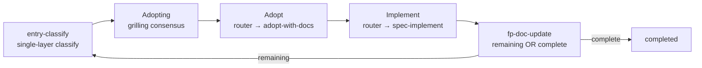
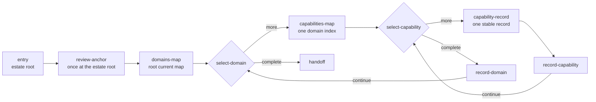
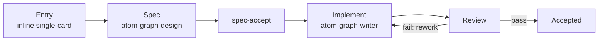

# README Blueprint — Atomic Workflow

> **Purpose**: Editing reference and regeneration source for the **README family** — the four estate READMEs (root, zh mirror, graph-workflow, historical scheduler) **plus the module README family** (§2.1). Edit this file to change README content, structure, or constraints — then ask an AI agent to regenerate them. **Regenerate**: "Regenerate all READMEs from docs/readme-blueprint.md"

---

## 1. Overall Constraints (all output files)

|Rule|Detail|
|-|-|
|**Language**|The four estate output READMEs: English only — international OSS audience. Plus a Chinese mirror of the root README at `docs/README.zh-CN.md` (zh docs live under `docs/`). Same structure, same facts, translated. **Module README family (§2.1)**: English primary + zh mirror in the same package directory (`README.zh-CN.md`, `docs/*.zh-CN.md`). **Exception — the canonical description**: the description block is English-only in ALL READMEs including the zh mirrors — verbatim, never translated (non-ADR: canonical-description-english-only).|
|**Tone**|Terse, technical, no fluff. Fragments OK where clearer.|
|**AI notice**|Visible blockquote under title — "⚠️ AI-generated README — edit [docs/readme-blueprint.md](docs/readme-blueprint.md) instead." (linked form, uniform across all outputs, module READMEs included). Not hidden in HTML comments.|
|**Canonical description**|English original, one and only one form — **"Graph-Engineering for Real Engineers: Graphs define workflows; workflows build graphs. Based on mattpocock/skills."** It sits under the hero tagline in the root README, under the title of both package READMEs, in the zh mirror hero **verbatim (never translated)**, and in every manifest `description`: root + workspace `package.json`, `.claude-plugin/marketplace.json`. **Propagation list (complete)**: README.md hero · docs/README.zh-CN.md hero (verbatim English) · packages/graph-workflow/README.md Overview · package.json (root) · packages/graph-workflow/package.json · .claude-plugin/marketplace.json (top-level). Exception: `skills.sh.json` has no top-level description — schema forbids it, group descriptions only. Package-level slots (`plugins[].description` / `groupings[].description`) describe the package domain, NOT the project — keep package wording. **Module READMEs do NOT carry the canonical description** — they describe their own module (their own hero + why/how).|
|**Package facts**|Only implemented functionality in `packages/` may be described. The **capability floor** ships builtin in `packages/graph-workflow/` (`graphs/` — 4 graphs, `atoms/` — 27 prompt-atom bodies; file presence is registration). The **business corpus** ships in the family packages `packages/workflow-<family>/` (six carry an `assets/` tree — arch-review · dev-workflow · diagnose · doc-estate · omp · release — of which five carry `assets/graphs`; each declaring its asset dirs through `atomicWorkflow.contributes.assets` in its own manifest; source: manifest scan — the module names carry the `workflow-` prefix). Skills ship in `packages/graph-workflow/skills/` (15) and `packages/awf/skills/` (2). MCP tools ship in the graph-workflow MCP Server (8 tools — source: graph-workflow README MCP Tools table).|
|**Fact sourcing**|Counts are NEVER hand-written: graph and atom counts come from the **declared asset roots** — the capability floor under `packages/graph-workflow/` plus each family manifest's `atomicWorkflow.contributes.assets` entries under `packages/workflow-<family>/` (file presence is registration — the `registry.json` index is retired); skill count comes from the `packages/graph-workflow/skills/` directory (15 skills; `packages/awf/skills/` holds 2); MCP tool count comes from the scheduler README MCP Tools table (8 tools); version comes from `package.json` (0.6.0). **Module README facts** (exports / ports / refusal codes / counts / version) come from the module's own source faces — `packages/agentic-graphjs/src/` + its `package.json` — and are verified by `bun run check:docs`. Any mismatch between a README literal and these sources is a defect.|
|**Diagram propagation**|Both mermaid sources — the arch-review-loop concept diagram (§3.2) and the graph-generate maker-journey diagram (§3.10) — SHALL be copied verbatim into all three estate output READMEs (root, zh mirror, graph-workflow). The estate-maintain skeleton diagram (§3.3) propagates the same way. Diagram labels stay English in the zh mirror; surrounding prose translated. Byte-for-byte equality across all four files (blueprint + three outputs) is a regeneration gate. **The module README family carries no blueprint diagrams.**|
|**Versioned names**|`graph-generate` (not graph-workflow, not graph-create). Never use retired names.|
|**Manifest grouping**|`.claude-plugin/marketplace.json` and `skills.sh.json` group **per package** — they mirror `packages/`: one marketplace `plugins[]` entry per package (field `source` → package dir, `skills` listed from it), one skills.sh `groupings[]` entry per package that ships skills (title = package name). Package-level descriptions live in those slots (`plugins[].description` / `groupings[].description`) — package domain wording, never the canonical project description. Keep both manifests in sync with `packages/` whenever packages or their skills change. Current state: `graph-workflow` ships its **15** skills in **one** entry — mirrored identically in marketplace `plugins[]` and the `Graph Workflow` `groupings[]` entry; the marketplace additionally lists `awf` / `workflow-omp` / `workflow-pi`; **no `graph-workflow-extra` package exists** — never document one.|
|**Dead links**|READMEs link only files that exist (module READMEs included). `ROADMAP.md` is planned, not yet created — never link it.|

## 2. README Architecture — one blueprint; four estate outputs + the module README family

|File|Audience|Role|Length|TOC|
|-|-|-|-|-|
|`README.md` (root)|Skimmers + evaluators + doers|Full project pitch: out-of-the-box workflows first (Part 1), then main content of both packages condensed (Part 2), plus the typical usage path. Most concise of the three estate outputs.|~350 lines|Anchor-link TOC under the hero — all H2s, grouped by part|
|`docs/README.zh-CN.md`|Chinese-speaking readers|Chinese mirror of the root README — same structure and facts, translated (description block verbatim English per the canonical-description record). Root README links to it via a language switcher in the hero; the zh file links back to the English root.|~370 lines|Same TOC rule as root, translated|
|`packages/graph-workflow/README.md`|graph-workflow users|Skill-system deep-dive: install channels, full skill list, how skills drive graph execution. Carries all three mermaid diagrams.|~170 lines|Anchor-link TOC under the hero — all H2s|
|**Module README family** (§2.1): `packages/agentic-graphjs/README.md` + `README.zh-CN.md` + `docs/api.md` / `docs/schema.md` (+ zh mirrors)|npm consumers of the module|Fast face (what / why / how) + deep docs (API reference, schema reference); shipped with the package (`files`) and committed in-repo.|~120 lines fast face + deep docs|Anchor-link TOC under the hero — all H2s|
|**Splitting rule**: Root README carries the narrative (Part 1 = Out-of-the-Box Workflows: the flagship loop, estate maintenance, the maker journey, the workflow list, documentation management; Part 2 = The Problem → How It Works → Install → Setup → Making a Graph (the maker journey) and _teasers_ for package docs. Package READMEs carry the _details_ (tool tables, graph YAML, skill tables). Never duplicate full tables in both root and package docs — root links to them.|
|**Diagram rule**: all diagrams live in root, zh mirror, AND both estate package READMEs (user decision) — the split rule does not apply to diagrams; they are single-sourced in the blueprint and copied verbatim everywhere. The module README family is outside this rule (no blueprint diagrams).|
|**zh mirror-sync rule**: `docs/README.zh-CN.md` SHALL be generated from the same fact block as the English root — identical structure, identical facts (graph count, skill count, version, table rows), prose translated only. **The canonical description block is exempt from translation — verbatim English (canonical-description record).** No independent numbers, no reordering, no extra sections. The zh file is a translation of the root, never a separate document. The module zh mirrors follow the same rule against their English faces.|
|**Content preservation rule**: regeneration SHALL reconcile every item in §4 Content-Preservation Inventory — each current content item is either kept at its destination (Part 1 / Part 2 / tail), replaced by its listed successor, or explicitly discarded. Nothing disappears silently; every inventory item has a terminal disposition.|

### 2.1 Module README Family (module output family — added 2026-10-07)

The published library modules carry their **own** README family — not estate content. First member: `agentic-graphjs` (`packages/agentic-graphjs/`).

- **Fast face** — `README.md` (EN primary) + `README.zh-CN.md` (zh mirror, same directory): hero → **What** (one paragraph: what the module is) → **Why** (the problem it answers) → **How** (the three-step usage model + one code block) → **What it is not** → **Relationship to the adjacent framework** → reference tables (ports / refusal codes / compat matrix) → pointers (deep docs / CHANGELOG / repository). Explanation-first: why/how prose leads; tables follow.
- **Deep docs** — `docs/api.md` (EN) + `docs/api.zh-CN.md`; `docs/schema.md` (EN) + `docs/schema.zh-CN.md`: API reference (method/port/refusal-code shapes with parameters, returns, failure codes; type surface as name + one-liner + source pointer) and schema reference (IR, asset declaration, checkpoint, receipts/artifacts, events, refusal payloads, port table).
- **Carrier rule**: deep docs live **inside the package** (`packages/<module>/docs/`) and ride the package `files` list — the npm consumer sees them; the repo sees them too (package trees are committed). The root `docs/` tree is NOT the module carrier.
- **Language rule**: EN primary + zh mirror in the same directory (`*.zh-CN.md`); every EN face has its mirror.
- **Mechanical-face rule**: names, counts, and code lists in module READMEs are derived from the module's source faces (`src/` export surfaces, ports, refusal codes) — never hand-maintained duplicates; `bun run check:docs` verifies the faces (bilingual pairs, mechanical names, links, counts, `files` coverage, mirror equality).
- **Zero-coordinate rule**: module READMEs reference no internal coordinates (change ids, report sections, internal doc ids) — the package is self-contained; the coordinate gate (`check:self-containment`) enforces it over the package tree including `docs/` and the zh mirrors.
- **Claims rule**: "usable with any agent / or to build your own" — positioning language must not claim readiness or compatibility ("ready for any agent" is forbidden; closed agents cannot be guaranteed).

## 3. Root README Structure

Two labeled parts plus tail sections, emitted in this order (workflows first — user decision 2026-08-09):

- **Part 1 — Out-of-the-Box Workflows**: arch-review-loop (§3.2), estate-maintain (§3.3), All Built-in Workflows (§3.4), Documentation Management (§3.5).
- **Part 2 — Basics & Graph Making**: The Problem (§3.6), How It Works (§3.7), Installation (§3.8), Setup (§3.9), Making a Graph (§3.10 — the maker journey).
- **Tail sections**: Architecture (§3.11), Public modules (§3.12), Status & Roadmap (§3.13), Contributing (§3.14), Dependencies (§3.15), Thanks (§3.16), Further Reading (§3.17). Part labels render as `## Part 1 — Out-of-the-Box Workflows` / `## Part 2 — Basics & Graph Making`; tail sections carry no part label. The zh mirror mirrors the same two-part structure, translated (第一部分 — 开箱即用工作流 / 第二部分 — 基础与制图).

### 3.1 Hero (title + badges + TOC)

```text
# Atomic Workflow 
> ⚠️ AI-generated README — edit [docs/readme-blueprint.md](docs/readme-blueprint.md) instead.
**Languages**: English (root) · 中文 (docs/README.zh-CN.md)
Graph-Engineering for Real Engineers: Graphs define workflows; workflows build graphs. Based on mattpocock/skills.
  
## Table of Contents
**Part 1 — Out-of-the-Box Workflows**

- [arch-review-loop (RETIRED 2026-08-25)](#arch-review-loop)
- [estate-maintain](#estate-maintain)
- [All Built-in Workflows](#all-built-in-workflows)
- [Documentation Management](#documentation-management)

**Part 2 — Basics & Graph Making**

- [The Problem](#the-problem)
- [How It Works](#how-it-works)
- [Installation](#installation)
- [Setup](#setup)
- [Making a Graph](#making-a-graph)

**Tail**

- [Architecture](#architecture)
- [Public modules](#public-modules)
- [Status & Roadmap](#status--roadmap)
- [Contributing](#contributing)
- [Dependencies](#dependencies)
- [Thanks](#thanks)
- [Further Reading](#further-reading)
```

- **Alpha badge**: orange (not red — signals "active development", not "unsafe")
- **Tagline**: bold, terse, one sentence — **relocated to the Part 2 opening** (user decision 2026-08-09): the hero keeps the canonical description only; Part 2 opens with "Graph is just a tool; Attention is all you need." (English in all outputs incl. zh mirror).
- **Canonical description**: the one sentence from §1 — English, verbatim, never translated, in every README and manifest description slot.
- **Badge bar**: alpha status, Apache-2.0 license, platform (OMP) — one line.
- **TOC**: anchor links, right under the hero. Root + zh list all H2s grouped by part; package READMEs list all H2s plus key H3s. TOC anchors must match GitHub heading slugs — a heading rename without a TOC update is a defect.

### 3.2 arch-review-loop (~20 lines, Part 1 — the flagship; RETIRED 2026-08-25 — section kept for historical reference)

The flagship workflow — one loop that takes the biggest remaining architectural problem from review to shipped change. **RETIRED (2026-08-25, change graph-stateless-cutover-closure N5-3)** — the `arch-review-loop.yaml` file and its registry entry are deleted (legacy compatibility graph; never routed from engineering-flow; the L3 rework loop now lives in `feature-flow` / `direct-flow`). The section opens with a **RETIRED banner** and is kept for historical reference — the topology below is the historical one (do not modernize it). Part 1 opens with the **how-to-read legend**: **Format rule**: prompt examples are _fenced command blocks_ (` `````text ` fence, tagged ```text`) — never blockquotes. State this legend at the top of the section so readers never mix prompts with explanation: "code blocks are prompts you send to your agent, verbatim; plain text is explanation." Extend it with the shared prompt template — every example is this template filled in, so readers can tell fixed parts from user input:

```text
Use atom-pilot to run <graph name>: <your goal in plain language>
```

Prompt examples use `:` after the graph name — never `—` inside a prompt. Inside lists, indent the fence to the item's content column. **Concept diagram** — simplified horizontal flowchart of the arch-review-loop loop. Rendered natively on GitHub; shows as source code on npmjs.com (accepted degradation, no SVG dual-track). Insert after the section intro, before the decomposition steps. Source (verbatim):


```mermaid
graph LR
   CLS[entry-classify<br/>single-layer classify] --> GRILL[Adopting<br/>grilling consensus]
   GRILL --> ADOPT[Adopt<br/>router → adopt-with-docs]
   ADOPT --> IMPL[Implement<br/>router → spec-implement]
   IMPL --> FP[fp-doc-update<br/>remaining OR complete]
   FP -->|remaining| CLS
   FP -->|complete| DONE[completed]
```

Simplification principle: concept diagram shows the loop skeleton — the framework round (entry-classify → adopting → adopt → implement; stage graphs run as router-launched sibling runs) and the fp-doc-update re-entry — no approval-card details, no per-phase machinery. zh mirror: identical structure, diagram labels English (unchanged), surrounding prose translated. **What the loop does** — prose anchors to the diagram only, no re-explaining: one round composes adoption + implementation (the requirement router launches `arch-review`), adoption + spec production (the adopt router launches `adopt-with-docs`), and implementation (the implement router launches `spec-implement`); `round-report` re-enters the round on `remaining` (flow self-edge) or drains on `complete`; termination is the user's call at the direct-end options of scope-entry / adopting (node report `direct_end: true` → pilot advances with the end decision — run completes as `completed`, never `force_end`).

```text
Use atom-pilot to run arch-review-loop: find and fix the biggest architectural problem in this codebase.
```

**Decomposition steps.** The round splits into three independently executable graphs; `arch-review-loop` composes them. Pick the entry that matches your need:

|Need|Run|
|-|-|
|Requirement production only (find problems)|`graph_get arch-review` + first `workflow_advance(op: "issue")`|
|Adoption + spec only (confirm a produced report / raw idea, produce the change)|`graph_get adopt-with-docs` + first `workflow_advance(op: "issue")`|
|Implementation only (change exists)|`graph_get spec-implement` + first `workflow_advance(op: "issue")` — `changeName` rides as entry-node session context|
|Full round (requirement + adoption + implementation)|`arch-review-loop` RETIRED 2026-08-25 — no single full-round graph ships; run the composition `arch-review` → `adopt-with-docs` → `spec-implement` (each entered with `graph_get` + first `workflow_advance(op: "issue")`; the L3 round-review rework lives inside each graph's review node)|

- `arch-review` — architecture analysis (`interaction: none`): explore -> auxiliary first-principles graph (updates supplied analysis material in place, no approval) -> present Markdown report -> handoff.
- `write-spec` — unified pre-change contract — settle slices → research → synthesize → audit → materialize → own → hand off one change record under `docs/changes/<date>-<name>/` (replaced `adopt-with-docs` + spec-propose; change 2026-09-01-taskflow-graph-composition).
- `spec-implement` — non-interactive implementation (`interaction: none`): spec-extract reads the produced change (upstream output when composed, `args.changeName` standalone) → track machinery → archive (tracks own post-archive doc maintenance). No spec generation, no auto-loop gate — rework is the L3 loop in the channel graphs (round-review self-edges). **Raw MCP tools?** The loop behind all of this is `workflow_advance(op: "issue")` → execute the returned WorkOrder → `workflow_advance(op: "accept")` → repeat until the cursor reports terminal (the pure transition has no standalone MCP tool — `workflow_advance` is the sole write face). If you want to drive the MCP tools directly instead of via atom-pilot, see the call-flow example in `packages/graph-workflow/skills/atom-pilot/SKILL.md`. **Want to go deeper?** → `packages/graph-workflow/skills/atom-graph-spec/SKILL.md` for the graph format and the `workflow_advance` contract, `packages/graph-workflow/README.md` for the skill system.

### 3.3 estate-maintain (~12 lines, Part 1)

Domain estate composition as a graph - uses `docs/domains/` as the root and composes domains-map, capabilities-map, and capability-record. The estate has no per-capability feasibility workflow.


```mermaid
graph LR
   ENTRY[entry<br/>estate root] --> REV[review-anchor<br/>once at the estate root]
   REV --> DM[domains-map<br/>root current map]
   DM --> SELD{select-domain}
   SELD -->|more| CM[capabilities-map<br/>one domain index]
   CM --> SELC{select-capability}
   SELC -->|more| CR[capability-record<br/>one stable record]
   CR --> RECC[record-capability]
   RECC -->|continue| SELC
   SELC -->|complete| RD[record-domain]
   RD -->|continue| SELD
   SELD -->|complete| DONE[handoff]
```

`domains-map` owns the root current map; `capabilities-map` owns one domain capability index; `capability-record` owns one stable capability record. estate-maintain only selects, records, and composes. It does not process specs, ADRs, archives, or sync.

```text
Use atom-pilot to run estate-maintain: rebuild the docs/domains estate from the domains, capabilities, and capability records.
```

Eighteen graphs ship and run out of the box: four builtin in `packages/graph-workflow/graphs/` (the capability floor) and fourteen in the five family packages that carry `assets/graphs/` under `packages/workflow-<family>/`. estate-maintain gets the deep treatment above; graph-generate - the maker journey - is covered in §3.10 Making a Graph (Part 2); the rest are one-line entries - full detail in `packages/graph-workflow/README.md`. Table rows match the shipped YAML top-level `description` fields (catalog single source):

### 3.4 All Built-in Workflows (~15 lines, Part 1)

Eighteen graphs ship and run out of the box: four builtin in `packages/graph-workflow/graphs/` (the capability floor) and fourteen in the five family packages that carry `assets/graphs/` under `packages/workflow-<family>/`. estate-maintain gets the deep treatment above (§3.3; arch-review-loop §3.2 is RETIRED 2026-08-25, kept for historical reference); graph-generate - the maker journey - is covered in §3.10 Making a Graph (Part 2); the rest are one-line entries - full detail in `packages/graph-workflow/README.md`. Table rows match the shipped YAML top-level `description` fields (catalog single source):

|Graph|What it does|
|-|-|
|**arch-review**|Architecture review graph - explore evidence, analyze first principles inline, validate the rebuilt solution, present candidates, and hand off one report.|
|**capabilities-map**|Capabilities map production - mandatory review anchor, then scan one domain and persist stable capability records.|
|**capability-record**|Stable capability record - mandatory review anchor, then reconcile current evidence into one docs/domains capability document.|
|**change-map**|Change brief production - mandatory review anchor, group affected domains and capabilities, review scope once, and hand off to unified write-spec.|
|**change-readiness**|Change readiness screen - mandatory review anchor, then classify one proposed capability change before write-spec.|
|**diagnosing-bugs**|Interactive bug-diagnosis graph — vendored diagnosing-bugs skill phases as graph nodes (feedback loop, reproduce, hypothesise, instrument, fix+regression, cleanup) with HITL cards, bounded flow loops, and first-principles injection.|
|**domains-map**|Domains map production - mandatory review anchor, then persist stable strategic domain records without repeated exploration.|
|**e2e-minimal**|Minimal end-to-end fixture graph: echo agent step → approval-review gate → handoff; exercises typed flow endpoints, a labeled rework self-edge, and the approval decision gate with minimal surface.|
|**estate-maintain**|Domain estate composition: domains-map -> capabilities-map per domain -> capability-record per capability -> handoff; root is `docs/domains/`, with no spec or ADR workstream.|
|**explore-unknowns**|Explore four unknowns quadrants, auto-close territory answers, ask only for genuine judgment, and hand off the complete map.|
|**first-principles**|Auxiliary first-principles analysis - update one supplied document in place through assumption audit, fundamental truths, atomic components, rebuild, and validation.|
|**graph-generate**|See §3.10 Making a Graph (Part 2) — the maker journey|
|**graph-maintain**|Maintenance flow — audits a graph's inventory compliance and content-vs-inventory consistency, proposes fixes, applies approved ones as an inline flow loop.|
|**implement-change**|Implement one accepted write-spec change through vertical slices, verification, review, choice audit, and explicit cutover; downstream reconcile/archive consumes the Cutover Receipt.|
|**release-prep**|Pre-release preparation — propose (release-prep-analyze: version from git tag history, deterministic + idempotent pre-tag, never executes git tag/commit/push) → plan-grill (grilling confirmation of every planned operation — interview, never auto-gated) → apply (release-prep-apply: version bump on release-line surfaces + CHANGELOG [Unreleased] fold per spec + README list sync vs ground truth, overwrite-style + verified) → release-review (approval; continue completes the run — final report prints tag/commit commands, user executes manually; jump re-runs a phase).|
|**review-anchor**|Mandatory review anchor - complete explore-unknowns and first-principles once per scope, or validate a scope-bound inherited receipt.|
|**write-spec**|Unified pre-change contract graph - settle slices, research, synthesize, audit, materialize, own, and hand off one change record.|

### 3.5 Documentation Management (~25 lines, Part 1 — end)

How this project's documentation is managed - **only the documents the current built-in graphs actually consume are listed**; everything else in `docs/` is legacy, kept for reference, not consumed by any graph. The graph runtime delivers context through the static context manifest: the convention layer (platform-default-loaded), user-supplement config context, and constraints. Domain estate output is rooted at `docs/domains/`; spec production belongs to separate workflows, decision records to change packets.

|Class|Documents|Consumed by|
|-|-|-|
|Convention layer (default-loaded into every phase)|`CONTEXT.md` (glossary), `docs/domains/README.md` (domain map + Estate Standards)|all graph phases|
|Platform and specification assets (separate lifecycle)|platform integration docs, `docs/changes/**` (change packets, closed ones under `archive/`)|write-spec (packet production) / implement-change (packet execution + closure archive); estate-maintain does not process specs or ADRs|
|Constraints|`.atomic-workflow/constraints.md` → `constraints.json`|activation (pilot loads once into the session)|
|Runtime|node progress line (`done/total · next-or-completed` — derived, never stored)|the agent session (free = the transcript is the cursor; follow = the in-memory `PipelineEnvelope` in the driver's own session storage — no backend session file); node CONTENT lives in the agent session / durable artifacts — never persisted, no output cap|
|Assets|`packages/graph-workflow/` (the builtin capability floor — 4 graphs, 27 prompt-atom bodies; file presence is registration), `packages/workflow-<family>/` (six family packages carry `assets/`; five carry `assets/graphs` — 14 graphs, 54 atoms; each declaring its dirs via `atomicWorkflow.contributes.assets`), `packages/graph-workflow/skills/` (15 skills); `flows/` retired (the tree was deleted by the tier-boundary cutover — no flow specs remain)|all graph execution|
|Artifacts|`docs/reports/` (arch-review reports), `docs/changes/<date>-<name>/` (change packets — closed ones archived under `docs/changes/archive/`)|arch-review / write-spec / implement-change|
|Changes follow the change-packet flow: write-spec produces one accepted change record under `docs/changes/<date>-<name>/` (README + ordered slices + decision ledger + verification contract), implement-change executes it slice by slice and proves cutover; reconcile/archive then close the lifecycle under `docs/changes/archive/`. The README family itself is regenerated from this blueprint (see §7).|
|**Legacy, not graph-consumed**: `docs/design.md`, `docs/philosophy.md`, `docs/requirements.md`, `docs/core-requirements.md`, `docs/conventions.md`, `docs/workflow.md`, `docs/constraints.md`, `docs/specs/`, `docs/grill/`, `docs/designs/`, `docs/tickets/`, `docs/agents/`, `docs/platform/`, `docs/dev/`, `docs/readme-blueprint.md` (regeneration source, not graph input) — kept for reference.|

Part 2 opens with the **tagline** (bold, one line): "Graph is just a tool; Attention is all you need." — English in all outputs incl. the zh mirror. Present in root + zh; package READMEs do not carry it.

### 3.6 The Problem (~10 lines, Part 2)

One integrated paragraph, compressed — do NOT enumerate pain points:

- Agents skip steps silently, lose context between stages, can't express conditional branches, lack structured approval gates.
- Root cause sentence: "the agent has no work-order system."
- Close with what Atomic Workflow gives: explicit phases, declared dependencies, runtime context injection, non-bypassable approval gates. No "The Idea" section — removed. The idea is implied by How It Works.

### 3.7 How It Works (~35 lines, Part 2)

Four named **key designs** and two named **design principles**. Present as short paragraphs, each with a bold heading so the names are explicit and searchable:

1. **Runtime work orders with graph** (key design): Each phase is a self-contained work order. Your agent pulls the next ready order, executes it, reports back; the scheduler advances the graph. The graph tracks progress and reminds what's next — it doesn't execute anything. The workflow graph captures what chains can't: conditional branches, approval gates, bounded rework loops, round re-entry.
2. **Graphs are self-contained** (key design): Every graph is one workflow YAML that declares everything it needs: phases (task text, skill, channels), the top-level `flow` block — the transition surface, the graph's routing authority — `inventory` (one goal + constraints entry per phase), and graph-level `constraints` (prose rules: rework bounds, condition vocabulary). The graph declares its own interaction mode and catalog description. Nothing external orchestrates it: the engine validates the YAML and routes by the transition table; the agent reads the phase's own declaration. A graph is a complete work-order board, not a fragment.
3. **Subgraphs are flat, siblings are runs** (key design): Two distinct things never mix. Static nesting is the `graph:` occurrence — a node value `{ graph: <name> }` whose child graph is recursively flattened into the parent's flat execution surface at lowering (task ids qualified `parent/child/key`, depth ≤ 8, ≤ 256 references, cycles fail at load). Run-time selection of a _different_ graph is a sibling run the executing agent starts inside its own node task: `graph_get` + first `workflow_advance(op: "issue")` with a fresh executed-set (launch args ride the entry node's session context) → drive to `node: null` → collect the result. No `use` composition, no router atom, no namespaced run entities — every graph is standalone with its own interaction mode; the scheduler's cursor never leaves the flat surface.
4. **Hints, not controls — the graph never dispatches** (key design): A graph says _what_ each phase needs — skills, context, and, optionally, agent-type preferences in priority order. Dispatch itself stays in your agent's hands: when a skill fans out sub-agents, it follows the hints, not the graph's command. The graph is a work-order board, not a manager — and the engine reads no prose: it validates only its own YAML, the session-provided executed set, and machine facts. Skills carry the knowing.
5. **Your agent still does everything** (principle): No code execution, no hidden engine, no new runtime language. The agent keeps its full toolkit; the graph only issues orders and tracks progress — status, retry count, timestamps, routing. Nothing more, nothing less.
6. **Attention is all you need** (principle): Agents fail from lost focus, not incapability. "Build this feature" is too big; "Write the User model type definition, given the schema from the previous step" is just right. Bounded work orders eliminate the ambiguity that causes skipped steps and drifting scope.

### 3.8 Installation (~40 lines, Part 2)

Sub-parts in order:

1. **graph-workflow (MCP server)** — one package, two capabilities: MCP Server (8 tools, stdio transport) + `atom-graph-scheduler` bin. **The install route — bun is the repository's single runtime face**:

- **bun**: `bun add -g @ai-atomic-workflow/graph-workflow` — runtime bun ≥ 1; run the bundled private dist entry via the `atom-graph-scheduler` bin (resolve via `bun pm bin -g`). Register in the platform MCP config by invoking the runtime explicitly with the absolute entry path. Config location: OMP → `~/.omp/agent/mcp.json`. Full details → `packages/graph-workflow/README.md`.

2. **graph-workflow (skills)** — two channels, pick one (all 15 built-in skills required for graph execution):

- Claude Code marketplace: `/marketplace install makara/ai-atomic-workflow`
- skills.sh: `npx skills add makara/ai-atomic-workflow`. Flags: `-a <agent>` / `-g` / `-y` / `-l`. Both channels are served by the same per-package manifest grouping — marketplace `plugins[]` and skills.sh `groupings[]` each mirror one package in `packages/` (see §1 **Manifest grouping**). Skill count: 15, from the `packages/graph-workflow/skills/` directory — never hand-written.

3. **Dependencies** (prerequisites for the graphs and parent skills):

- mattpocock/skills (parent skills — grilling, domain modeling, TDD, code review): `npx skills add mattpocock/skills`. → https://github.com/mattpocock/skills/blob/main/README.md

### 3.9 Setup (~8 lines, Part 2)

One step — invoke the **setup-atomic-workflow** skill (not a CLI; the retired `atom-graph-config` CLI is gone):

```text
Use setup-atomic-workflow to initialize this project
```

It scaffolds `.atomic-workflow/` — `config.json` (minimal `{}`; every field optional — `graphAssetRoots`, optional `context:` = user-supplement layer — user-owned ambient files, never required; the platform estate is organically discovered), `constraints.md`, and empty `graphs/` + `atoms/` directories (file presence is registration). Idempotent: never overwrites existing files.

### 3.10 Making a Graph (~15 lines, Part 2)

The maker journey — Atomic Workflow bootstraps itself: authoring a graph is a built-in workflow, driven the same way as every graph.

**Maker-journey diagram** — simplified horizontal flowchart of the graph-generate chain. Rendered natively on GitHub; shows as source code on npmjs.com (accepted degradation, no SVG dual-track). Source (verbatim):


```mermaid
graph LR
   ENTRY[Entry<br/>inline single-card] --> SPEC[Spec<br/>atom-graph-design]
   SPEC --> ACCEPT[spec-accept]
   ACCEPT --> IMPL[Implement<br/>atom-graph-writer]
   IMPL --> REVIEW[Review]
   REVIEW -->|fail: rework| IMPL
   REVIEW -->|pass| DONE[Accepted]
```

- Prose anchors to the diagram: entry (inline single-card confirmation, no CONTEXT.md hard dependency) → spec (topology design via atom-graph-design per atom-graph-spec) → spec-accept → implement (atom-graph-writer writes the `.yaml` — file presence is registration, load-probe validated) → review → rework decision (bounded rework) → accept. Single kind (graph), single operation (create) — no skill co-production. Skill production (create/edit) flows through change records (improver journey) — implementation loads the spec skill per affected domain (graph → atom-graph-spec, skill → atom-skill-spec, doc → atom-doc-maintain).

```text
Use atom-pilot to run graph-generate: generate a workflow for release notes from merged PRs.
```

### 3.11 Architecture (~30 lines, tail)

- **What a graph is.** A graph is a work-order board declared in a workflow YAML file — any `.yaml` document that passes schema validation, identified by its declared `name` (no suffix convention): a named set of phases wired by `flow` transition edges. The scheduler issues each ready phase as a work order and tracks progress — it executes nothing. The agent pulls the order, does the work, reports back; the graph advances. **Graph structure.** Phases are the units of work — the sole dispatch kind is the atom occurrence (inline execution + decision; static nesting is the `graph:` occurrence, flattened at lowering; run-time subgraph selection is a sibling run driven by the executing agent). Conditional routing lives in the top-level `flow` block — the sole topology declaration (mermaid-subset transition edges — `A -->|condition| B` labeled, `A --> B` sequence default): the graph is the interpretation authority, the engine matches the reported condition value mechanically against the transition table and activates the target (no match fails loudly — missed-condition guard; `branchTo`/`routing` are deleted). Rework/loop is declared as `flow` self-edges (`A -->|fail| A` — inline bounded loops, bound in the graph's constraints prose + retryCount). Key occurrence fields (the `nodes:` map is nodeId-keyed; the map key is the identity): `atom` (atom occurrence — the node's task text is atom-owned, rendered at load), `graph` (static graph occurrence — flattened at lowering), `input` (machine-declared per-atom launch data, validated against the atom's strict launch schema), `inputs`, `semanticIntent` (retrieval-only); context is the graph-level `context:` static manifest (resolved at load into the run's `PipelineMaterial`) — no per-phase `channels`. Canonical top-level key order: `name → description → version → interaction → flow → entry → conditions → constraints → context → nodes` (entry is singleton-graph-only; conditions after flow, constraints after conditions). **Built-in vs user graphs.** Built-in graphs ship in `packages/graph-workflow/graphs/` — file presence is the registration (the `registry.json` index is retired). User graphs live in `.atomic-workflow/graphs/` (scaffolded by setup-atomic-workflow). Resolution is project-first: a project graph with the same name overrides a built-in. Two-package table (short — full detail lives in package READMEs):

|Package|Role|
|-|-|
|graph-workflow|Infrastructure and skill system in one installable: MCP Server (graph execution engine, 8 tools) + built-in graphs, and the atom-pilot (lifecycle) / atom-phase-handler (single main dispatch) skill chain with entry and reference skills.|
|The built-in workflows table lives in Part 1 (§3.4) with the out-of-the-box pitch; the tail keeps only the structural narrative.|

### 3.12 Public modules (~6 lines, tail)

Two to four lines naming the published library modules and pointing at their READMEs — the module README family (§2.1) carries the depth; this section never duplicates it:

- `agentic-graphjs` — graph-engineering runtime kernel for agents (what / why / how + API and schema references) → `packages/agentic-graphjs/README.md`
- Module rows list only modules that ship; link only files that exist (§1 Dead links). One line per module, no tables.

### 3.13 Status & Roadmap (~15 lines, tail)

1. **Alpha definition** — one line.
2. **Stable** (implemented, no planned breaking changes): the graph-workflow stateless MCP Server (8 tools — `workflow_advance` (the sole write face) / `graph_get` / `graph_assets` / `graph_update` / `graph_delete` / `prompt_atom_assets` / `recommend_start` / `recommend_advance`; no standalone `advance` tool — the pure transition is an internal seam; no server-side run state — the executed-set is session-held), workflow YAML graph schema (schema-defined identity — any `.yaml`; `name` + `version` identity fields; `nodes:` a nodeId-keyed map of strict occurrence objects — atom or static graph — + top-level `flow` transitions), the execute→advance loop (`graph_get` + first `workflow_advance(op: "issue")` → dispatch → `advance`), setup-atomic-workflow skill, 18 built-in graphs, 15 built-in skills.
3. **Active development** — what may change: more control-flow features (branch-route patterns, rework decisions), more built-in graphs/workflows, session-side operations tooling (the executed-set is session-held; the MCP tool interface may change).
4. **Roadmap** — short inline checkbox list, user-perspective (self-contained; no ROADMAP.md link — the file does not exist yet, READMEs must never link uncreated docs):

- [ ] More out-of-the-box graphs — release-notes generation, spec drafting, estate workflow extensions
- [ ] More token-saving strategies — leaner context channels, smaller graph overhead
- [ ] More convenient operations tooling — run status views, smarter history/cleanup
- [ ] Wider platform support — cross-platform MCP registration No time promises ("Before v1.0" not "by Q3 2026").

### 3.14 Contributing (~4 lines, tail)

2–3 lines only. Links to `CONTRIBUTING.md` (the file exists since 2026-10-07 — the dead-links rule now links it) and to CONTEXT.md.

### 3.15 Dependencies (~3 lines, tail)

Single bullet: mattpocock/skills (links as in §3.8).

### 3.16 Thanks (~4 lines, tail)

- [taskflow](https://heggria.github.io/taskflow) — DAG execution model inspiration
- [Oh My Pi](https://omp.sh/) — agent harness platform

### 3.17 Further Reading (tail)

Quick reference table: packages/graph-workflow/README.md, packages/agentic-graphjs/README.md (module fast face + deep docs), CONTEXT.md. **Only link files that exist** — `ROADMAP.md` is planned, not yet created; it must not appear in any README.

## 4. Content-Preservation Inventory

> Historical record of the 2026-08-24 README-regeneration pass. The `graph-scheduler` package was deleted at the 2026-09-10 single-registration cutover (change `2026-09-10-atoms-single-registration`); its rows below are kept as provenance, not as live targets.

Every current README content item (2026-08-05 state, plus 2026-08-09 additions) with its disposition. Regeneration SHALL reconcile every item — kept items appear at their destination, replaced items are superseded by the listed successor, discarded items are gone with the stated reason.

### Root `README.md` (15 items — all kept, destinations as mapped)

|#|Item|Disposition|
|-|-|-|
|1|Hero: title + alpha badge + AI notice + languages + tagline + one-sentence description + badge bar|kept → §3.1 Hero — **description replaced** by the canonical sentence (canonical-description record); languages switcher kept|
|2|The Problem (single paragraph)|kept → §3.6 (Part 2)|
|3|How It Works (5 named concepts)|kept → §3.7 (Part 2)|
|4|Installation graph-scheduler (npm + bun routes, config locations)|kept → §3.8 (Part 2)|
|5|Installation graph-workflow (marketplace + skills.sh, flags)|kept → §3.8 (Part 2) — **skill count fixed to 18** (verified 2026-09-02)|
|6|Install dependencies (mattpocock/skills)|kept → §3.8 (Part 2)|
|7|Setup (setup-atomic-workflow skill, scaffolding, idempotent, retired CLI note)|kept → §3.9 (Part 2)|
|8|Quick Start (legend, end-to-end loop, three-stage table, raw MCP, deeper links)|kept → §3.2 (Part 1) — slimmed to ~20 lines around the concept diagram|
|9|Making a Graph section (maker journey + diagram)|kept → §3.10 Making a Graph (Part 2) — full journey restored (user decision 2026-08-09; the round-1 move to the workflows chapter was reverted)|
|10|Architecture (two-package table + 10-graph table)|kept → §3.11 (tail) — 10-graph table moved to §3.4 (Part 1) with the workflow pitch|
|11|Status & Roadmap (alpha, stable, active dev, roadmap)|kept → §3.13 (tail) — **facts refreshed** (0.4.0, 11 graphs, 16 skills, activation prologue + run state in stable list); **roadmap replaced** by user-perspective items (2026-08-09)|
|12|Contributing|
|Dependencies|
|Thanks|kept → §3.14 / §3.15 / §3.16 (tail)|
|13|Further Reading table (3 docs)|kept → §3.17 (tail) — **docs/glossary.md row dropped** (file does not exist — dead link; CONTEXT.md row kept)|
|14|Documentation Management section|kept → §3.5 (Part 1 — moved with the workflows part) — **graph count fixed to 10** (verified 2026-08-09)|
|15|**NEW** estate-maintain workflow section|added → §3.3 (Part 1) — 2026-08-09|

### `docs/README.zh-CN.md` (12 items)

|#|Item|Disposition|
|-|-|-|
|1|Hero (zh)|kept → translated §3.1 — **description block replaced with canonical English verbatim** (canonical-description record); rest translated|
|2|问题|
|工作原理 (5 concepts)|kept → translated §3.6 / §3.7 (Part 2)|
|3|安装 graph-scheduler (2 routes)|kept → translated §3.8 (Part 2)|
|4|安装 graph-workflow (16 个内置技能 ×2)|kept → translated §3.8 (Part 2) — count 16 (verified 2026-08-09)|
|5|依赖|
|初始化 (Setup)|kept → translated §3.8 / §3.9 (Part 2)|
|6|快速开始 1: arch-review-loop 端到端循环|kept → translated §3.2 (Part 1) — slimmed|
|7|快速开始 2: 三部分执行表 + 各图说明|kept → translated §3.2 分解步骤 (Part 1)|
|8|制作一个图 (maker journey + diagram)|kept → translated §3.10 Making a Graph (Part 2) — 完整旅程恢复（用户决策 2026-08-09 回退）|
|9|架构: two-package table + graph table|kept → translated §3.11 (tail) — graph table → §3.4 (Part 1)|
|10|状态与路线图 (facts)|kept → translated §3.13 (tail) — **facts refreshed** (0.4.0, 10/16); roadmap replaced|
|11|贡献|
|依赖|
|致谢|
|延伸阅读|kept → translated §3.14–§3.17|
|12|文档管理 (Documentation Management) section|kept → translated §3.5 (Part 1) — count 10|

### Module READMEs (module output family — NEW 2026-10-07)

|#|Item|Disposition|
|-|-|-|
|1|Module fast face — `packages/agentic-graphjs/README.md` + `README.zh-CN.md`|added → §2.1 (module family) — what / why / how + reference tables + pointers; EN primary + zh mirror in the same directory|
|2|Module deep docs — `docs/api*.md`, `docs/schema*.md` (in-package)|added → §2.1 — shipped via the package `files` list; EN + zh mirror|
|3|Root README **Public modules** section + Further Reading module row|added → §3.12 / §3.17 — one line per shipped module, pointing at its README|
|4|Module package CHANGELOG (`CHANGELOG.md` + zh mirror, in-package)|module-owned — not estate README content; follows the same EN + zh mirror rule|

### Package READMEs (both updated — section rename + diagrams + TOC)

|File|Disposition|
|-|-|
|`packages/graph-scheduler/README.md`|kept at that pass — **description replaced** (canonical, Overview); facts refreshed (11 graphs, 16 skills); all three diagrams verbatim; TOC updated — file deleted 2026-09-10 with the package (single-registration cutover)|
|`packages/graph-workflow/README.md`|kept — **description replaced** (canonical, Overview); facts refreshed; all three diagrams verbatim; TOC updated|

### Replaced content (global)

|Old content|Successor|
|-|-|
|Part labels: Part 1 — Basics & Graph Making first, Part 2 — Out-of-the-Box Workflows|**Part 1 — Out-of-the-Box Workflows first** (user decision 2026-08-09); Part 2 — Basics & Graph Making|
|Concept diagram placement: Architecture §3.4, after the 10-graph table|Concept diagram in §3.2 arch-review-loop section (Part 1)|
|"Making Skills and Graphs with Graphs" section name|Making a Graph (root §3.10 / scheduler README §10) — full journey section|
|Quick Start section (root + zh)|Dissolved into §3.2 (Part 1)|
|Skill count 13|
|14|
|12 (root install, zh ×2, blueprint pre-rework)|16 — from `packages/graph-workflow/skills/` directory (verified 2026-08-09)|
|Graph count 9|
|15|
|18 (zh status, blueprint §3.7, Round-1-era claims)|10 — from `packages/graph-workflow/graphs/registry.json` (verified 2026-08-09)|
|Retired graph names (`openspec-create`, `plan-generate`, `graph-workflow`, `skill-author`, `openspec-pipeline`)|Current graph set (`write-spec`, `implement-change`, `review-anchor`, `graph-generate`, `estate-maintain`, … — `adopt-with-docs`/`spec-implement`/`openspec-apply`/`openspec-engineer` retired by change 2026-09-01-taskflow-graph-composition)|
|`artifact-workflow` + `skill-workflow` composition pipeline|Deleted — `graph-generate` is now the concrete maker journey graph|
|CONTEXT.md version 0.2.0|0.4.0 — from `package.json`|
|shared-flow graph narrative|none — registry reorganized to 9 flat graphs → 10 with estate-maintain|
|Root concept diagram 5-node drift|6-node canonical source restored|
|Canonical description "Graph-driven work-order system for AI agents — explicit phases, scoped context (ideal state — the current means is proactive context pruning, shake/prune), and non-bypassable approval gates."|**Replaced by the canonical sentence (canonical-description record)** — English-only, never translated|
|zh mirror translated description (面向 AI 智能体的图驱动工作订单系统…)|Description block = canonical English verbatim (canonical-description record); prose stays translated|
|Roadmap: skill editing via arch-review-loop (alpha) + phase schema v1 freeze|User-perspective roadmap items (2026-08-09) — more out-of-the-box graphs, token-saving strategies, operations tooling, platform support|
|graph-generate as the last section of the workflows chapter (2026-08-09 round 1)|**Reverted same day (user decision)** — back to Making a Graph §3.10; workflows chapter row becomes a pointer|
|estate-maintain (table row only)|Featured section §3.3 (2026-08-09)|
|Further Reading row `docs/glossary.md` (dead link — file does not exist)|Replaced by `CONTEXT.md` row (glossary) — 2026-08-09|

### Discarded content (terminal)

|Item|Reason|
|-|-|
|`docs/README.md` (legacy docs index)|**Deleted 2026-08-09** — orphan outside the blueprint family; stale references (deleted docs/domains/ tree, retired workflow.md, to-spec .scratch PRD flow); true facts folded into §3.5 Documentation Management|
|zh「同一流程的分解版本」list (retired graph chain)|graph set reorganized; function superseded by the three-stage table (§3.2)|
|`skill-workflow` graph + its invocation blocks|skill-workflow deleted|
|universal `artifact-workflow` skeleton narrative|skeleton deleted|
|「The Idea」section|removed historically — idea implied by How It Works|
|`atom-graph-config` CLI install instructions|CLI retired — superseded by setup-atomic-workflow skill|
|legacy-skills comment + tree-subpath graph-workflow-only install method|Removed — the single skills.sh command installs exactly the 15 graph-workflow skills via the manifest grouping|

## 5. graph-scheduler README Structure (historical)

> Historical — this section specifies the README of the standalone `graph-scheduler` package, deleted at the 2026-09-10 single-registration cutover (change `2026-09-10-atoms-single-registration`). The merged package ships one README (`packages/graph-workflow/README.md`, §6); its server-side content follows the section list below.

Title: `# graph-workflow`. AI notice blockquote (same wording). TOC right under the notice — all H2s plus key H3s (Install, MCP Registration, Graph Format, MCP Tools, Built-in Graphs).

1. **Overview** (~6 lines): title + AI notice, then the canonical description (same sentence as root README, §1 constraint), then the pitch: graph execution engine as a standalone MCP Server (stdio transport), 8 MCP tools, no server-side run state (stateless). Loads workflow YAML graphs (any YAML passing schema validation) and computes the next work order as a pure function of (graph, executed set, reported node, condition) — routes by the flow transition table (condition channel — missed-condition guard); the executed-set is held by the session (free mode: the transcript; follow mode: the in-memory `PipelineEnvelope` in the driver's own session storage — no backend session file). Built on bun · Effect-TS · zod v4 · MCP SDK (stdio transport).
2. **Requirements**: one runtime face — bun ≥ 1 (the repository's single runtime; the server runs from the bundled private dist entry).
3. **Install**: one route, same as root README §3.8 — bun: `bun add -g @ai-atomic-workflow/graph-workflow` (resolve bin via `bun pm bin -g`). Verify `bun pm ls -g`. Note the `atom-graph-scheduler` bin.
4. **MCP registration**: the OMP config (`~/.omp/agent/mcp.json`) JSON snippet invoking the runtime explicitly — `command: "bun"` + `args: ["<bun-bin>/atom-graph-scheduler"]`. Platform manages process lifecycle (discover → spawn → connect → health check → reconnect).
5. **Environment**: `GS_GRAPH_ASSET_ROOTS` (comma-separated extra project graph asset roots — scanned after the built-in `graphs/` root and before the fixed project root `.atomic-workflow/graphs`; later roots win, so the fixed project root shadows an extra root and any project root shadows a same-named built-in; `config.json` `graphAssetRoots` fills this slot when the env var is unset). `GS_TASKFLOW_DIR` and `GS_REGISTRY_PATHS` are retired — a leftover value fails resolution hard. Priority: env vars → `config.json` → built-in defaults.

6. **Project setup**: setup-atomic-workflow skill — scaffolds `.atomic-workflow/` (optional config.json: `graphAssetRoots`; optional `context:` = user-supplement layer; `graphs/`, `atoms/`, constraints.md), idempotent. Retired `atom-graph-config` CLI no longer exists. Full skill flow summary.

- 7. **Graph format** (~30 lines): workflow YAML — suffix-free (`<name>.yaml`, any YAML passing schema validation IS a graph); `name` (required identity field, non-empty) + `version` (semver — major mismatch rejected loudly at load), `flow` (the sole topology declaration — mermaid-subset transition edges), `nodes:` a nodeId-keyed map of strict occurrence objects — the map key is the occurrence identity, the value carries no `id`. Two mutually exclusive shapes: atom occurrence fields table `atom` (required — any registered atom name; the node's task text is atom-owned, rendered from the atom at load time), `input` (machine-declared per-atom launch data, shape-validated against the atom's strict launch schema at load), `inputs`, `semanticIntent` (retrieval-only); static graph occurrence `graph` (referenced graph name — recursively flattened at lowering into the flat execution surface, ids qualified `parent/child/key`; depth ≤ 8, ≤ 256 references, ≤ 1024 atoms, ≤ 4096 edges, cycles fail at load); attributes outside this closed set fail at load.

8. **MCP tools** (~30 lines): table of all 8 tools (advance, graph_assets, graph_get, graph_update, graph_delete, prompt_atom_assets, recommend_start, recommend_advance) with params + one-liners. `advance` = pure transition computation — `{ graph, executed: string[], reportedNode?, condition?, end? }` → `{ snapshot: { progress }, node | null }`; identical inputs → identical outputs across restarts; `condition` = the flow-defined value matched against the reported node's outgoing flow-edge labels (string equality; no match fails loudly — missed-condition guard; omitted = sequence default); `end` = direct-end (reported node done, run completes without resuming); the executed-set is driver-owned (session-held) — the server persists nothing. `graph_assets` = the read-only perception/health catalog — merged registries (project-first) plus schema-valid fallback YAMLs, per-graph `{ id, description, run_conditions, source, problems }` (graph selection, run-condition awareness, problem surfacing). `graph_get` = raw YAML `document` + `structureHash` (SHA-256 of raw bytes, recomputed at read time — the CAS token) + registry provenance + meta (resolvedFrom, problems). `graph_update` / `graph_delete` = CAS-gated (expectedHash must match the current structure hash; mismatch fails with the current hash + file path, no write), project scope only (built-ins read-only). `prompt_atom_assets` = the atom catalog (`{ atoms: [{ id, description, provenance, state, capabilities }], source_diagnostics }`). `recommend_start` / `recommend_advance` = read-only advisory ranking of a frontend-derived closed candidate set / next-transition advice (flow-identity + cursor-revision bound; acceptance is frontend policy; the driver commits through `advance`). No jump / force-end / status / list / clean tools — rework is the session-side rewind (executed-set truncation), stop is the session-side stop, history is the session-computed execution trace.
9. **Built-in graphs** (~30 lines): full table — builtin graphs by file presence from `packages/graph-workflow/graphs/` (registration is presence — the `registry.json` index is retired) with descriptions aligned to the shipped YAMLs (arch-review-loop row marked RETIRED 2026-08-25 — legacy compatibility graph, never routed from engineering-flow; yaml + registry entry deleted; L3 rework now lives in feature-flow / direct-flow). Note project graphs: place custom workflow YAML (`.yaml`) in `.atomic-workflow/graphs/`; project dir searched before built-in dir. Followed by an **arch-review-loop walkthrough** subsection — kept for historical reference, opened by a RETIRED banner (2026-08-25, change graph-stateless-cutover-closure N5-3): the concept diagram embedded verbatim (source = blueprint §3.2), then the historical phase table (startup → scope-entry → requirement (router → arch-review) → adopting → adopt (router → adopt-with-docs) → implement (router → spec-implement) → round-report) and the key-semantics bullets — historical topology only, launch-args wording, never legacy tool names.
10. **Making a Graph** (~15 lines): the maker journey — `graph-generate` is the concrete maker-journey graph: entry (inline single-card — graph name + topology scope + save location, default `.atomic-workflow/graphs/`, no CONTEXT.md dependency, no multi-round interview) → spec (topology design via atom-graph-design per atom-graph-spec) → spec-accept → implement (atom-graph-writer writes `.yaml` — file presence is registration, no index to maintain) → review (code-review with atom-graph-spec) → rework decision (bounded rework) → accept. Single kind (graph), single operation (create), no skill co-production. **Maker-journey diagram embedded verbatim** (source = blueprint §3.10). Skill production (create/edit) flows through change records (improver journey) — spec skills load per affected domain. Post-archive closure — implement-change reconciles and archives the change record; the detailed track closes through atom-doc-lifecycle (reverse-validated archive). All of them are driven by atom-pilot from the flow graphs.
11. **Development**: npm install / build (tsup) / test (vitest) / typecheck / start. Test coverage note.
12. **FAQ**: no response after `workflow_advance` (MCP connection), entry mode (none — `graph_get` + first `workflow_advance(issue)`; run mode removed), run history (session-computed — the executed-set + PCL trace live in the session; `graph_get` gives the node inventory), stopping a run (session-side stop — nothing is terminated server-side; resume by replaying the durable Journal — the control tool re-derives the cursor; the pure transition is an internal test seam only), database (none — stateless; output not persisted; machine perception/health pass = `graph_assets` problems + `graph_get`).

## 6. graph-workflow README Structure

Title: `# graph-workflow`. AI notice blockquote (same wording). TOC right under the notice — all H2s.

1. **Overview** (~8 lines): title + AI notice, then the canonical description (same sentence as root README, §1 constraint), then the pitch: the skill system that drives graph execution. 15 built-in skills. Skills are the agent-side half: graph-scheduler issues work orders; these skills execute them. Distributed for any agent platform (Claude Code plugin, skills.sh, or copy the `skills/` folder). **Concept diagram embedded verbatim** (source = blueprint §3.2) — the flagship loop the skill system drives (RETIRED 2026-08-25 — historical reference). **estate-maintain skeleton diagram embedded verbatim** (source = blueprint §3.3).
2. **How skills drive graphs** (~15 lines): execution chain —

- `atom-pilot` — lifecycle manager: issue→execute→accept loop (`graph_get` + first `workflow_advance(op: "issue")` → dispatch → `workflow_advance(op: "accept")`)
- `atom-phase-handler` — central dispatch — single main path (consumes input-node outputs, injects `## Agent hints:` / `## Constraints` blocks)
- `atom-kernel` — platform primitives (task()/approval()/interview()/todo()); sole dispatch-primitive source
- `entry-classify` — builtin prompt atom: single-layer intent classification (graph-injected vocabulary; explicit → auto, ambiguous → recommendation card); replaces the retired atom-scope-interview entry interview
- entry skills (atom-doc-lifecycle, atom-doc-maintain, setup-atomic-workflow; review/grilling via upstream improve-codebase-architecture / grilling — direct use, no local wrappers; implementation stages load spec skills per affected domain — graph → atom-graph-spec, skill → atom-skill-spec, doc → atom-doc-maintain)
- reference/spec skills (atom-graph-spec, atom-skill-spec; exact tool parameter schemas live in atom-kernel §Tool Schemas; document format rules live inside atom-doc-maintain §Format Reference; graph-scheduler tool detection lives in atom-kernel)

3. **Making a Graph** (~10 lines): the maker journey is itself a graph — `graph-generate` (entry → spec → spec-accept → implement → review → gate → accept; single kind, single create operation). **Maker-journey diagram embedded verbatim** (source = blueprint §3.10). Skill production (create/edit) flows through change records (improver journey).
4. **Install** (~15 lines): both channels — Claude Code marketplace (`/marketplace install makara/ai-atomic-workflow`) and skills.sh (`npx skills add makara/ai-atomic-workflow`). All 15 skills required for graph execution. Flags note.
5. **Skill list** (~35 lines): full table — 15 skills, one-line description each (source: each `SKILL.md` frontmatter, verbatim).
6. **Development**: bun install / bun run test (vitest) / bun run typecheck.
7. **Related docs**: link to the root README only (the standalone scheduler package README is historical — the package was merged into `packages/graph-workflow`); CONTEXT.md may be linked when relevant.

## 7. Regeneration Instructions

To regenerate all READMEs after editing this blueprint:

```text
Regenerate all READMEs from docs/readme-blueprint.md
```

The AI agent:

1. Reads this blueprint for structure and constraints
2. Reads packages state for current project state (counts/names; CONTEXT.md is the glossary)
3. Scans `packages/graph-workflow/graphs/` for the built-in graph list (file presence is registration; the top-level `description` field is the catalog single source)
4. Reads `packages/graph-workflow/package.json` + `server.ts` for install facts (bin, defaults)
5. Reads `packages/graph-workflow/skills/*/SKILL.md` frontmatter for the skill list
6. **Reads the module state for the module README family** (§2.1): the module's `package.json` (name / version / `files`), its source faces (`src/` export surfaces, ports, refusal codes) — facts come from source, never from the previous README text
7. Reconciles §4 Content-Preservation Inventory — every item terminal (kept at destination / replaced by successor / discarded); nothing dropped silently
8. Writes all output READMEs: root (concise, two parts — **Part 1 Out-of-the-Box Workflows first**, Part 2 Basics & Graph Making), graph-workflow (deep — the merged package carries the server and skill faces) — then the zh mirror from the same fact block, translated (canonical description verbatim English, per the canonical-description record); **then the module README family** (fast face EN + zh mirror, deep docs EN + zh mirror — same facts, translated)
9. **Copies all three mermaid diagram blocks verbatim** from blueprint §3.2 / §3.3 / §3.10 into all estate outputs at their declared positions; verifies byte-for-byte equality — a single differing byte is a regeneration defect
10. **Syncs manifest descriptions** to the canonical sentence: root `package.json` + `packages/graph-workflow/package.json`, `.claude-plugin/marketplace.json` top-level; confirms `skills.sh.json` untouched (no top-level description; package-level groupings unchanged)
11. **Verifies the canonical description** appears verbatim in all 6 description slots (3 READMEs × 1 — root, zh mirror, graph-workflow — + 2 package.json + 1 marketplace.json top-level)
12. **Verifies the module README family** with `bun run check:docs` — bilingual pairs, mechanical faces (names/counts vs source), links resolve, document set ⊆ `files`, EN↔zh mirror equality; plus `bun run check:self-containment` (module docs are coordinate-free)

## 8. Design Decisions

|Decision|Rationale|
|-|-|
|Four estate READMEs from one blueprint (+ the module README family under the same source)|One source of truth; root stays concise, package docs carry depth. Splitting rule (§2) prevents drift; the module family shares the blueprint's discipline (facts from source, mirrored language, mechanical-face verification) while keeping its own voice (§2.1).|
|Part 1 = out-of-the-box workflows; Part 2 = basics + graph making (user decision 2026-08-09)|Evaluators see working workflows first — the out-of-the-box value pitch; infrastructure narrative (problem → how → install → setup → make) follows in Part 2. Reference content (architecture, status) relocates to the unlabeled tail.|
|Featured workflow sections are diagram-first|Each featured section (arch-review-loop, estate-maintain, graph-generate in Making a Graph) leads with a skeleton mermaid diagram; prose anchors to it, ≤8 lines; prompts follow the shared template. The diagram is the explanation — prose never re-explains the topology (2026-08-09).|
|3 of 10 workflows get featured sections|User decision during adoption grilling (2026-08-09): arch-review-loop (flagship) and estate-maintain (new) get Part 1 sections; graph-generate (maker journey) gets the Part 2 Making a Graph section; the rest stay one-line table rows (file presence is registration — the `registry.json` index is retired). Root README stays concise; package READMEs carry depth.|
|Diagrams follow their narrative section|The concept diagram sits with the arch-review-loop section it illustrates; the maker-journey diagram sits with Making a Graph (§3.10); estate-maintain skeleton sits with its section. All propagate verbatim to all four output READMEs.|
|No "The Idea" section in root|The idea is fully covered by "How It Works" — the four named concepts ARE the pitch.|
|"The Problem" compressed to one paragraph|Evaluators need the pain in 30 seconds, not a bulleted laundry list.|
|Four named concepts in How It Works|Three key designs + two principles. Explicit names make them searchable and quotable.|
|Quick Start dissolved into the arch-review-loop section|The quick start WAS the flagship workflow — a separate section split its narrative from its diagram and decomposition.|
|graph-generate lives in Making a Graph (Part 2)|User decision 2026-08-09 (revert of the round-1 move): the maker journey is Part 2 content — how to make a graph — not an out-of-the-box workflow. Full journey + diagram in §3.10; the workflows chapter table points to it.|
|npm install route for the standalone scheduler package (historical — the package was merged into `packages/graph-workflow` 2026-09-10)|User-facing requirement — npm is the default global package manager; bun remains the runtime.|
|setup-atomic-workflow instead of CLI|The `atom-graph-config` CLI is retired; the skill is the implemented init path. READMEs must never document retired tools.|
|Built-in graphs table in root AND the standalone scheduler package README (historical — that package was merged into `packages/graph-workflow` 2026-09-10)|Root gives evaluators the capability list; the scheduler package README repeated it as the authoritative registry listing. Acceptable duplication — it is the package's primary feature.|
|Diagrams duplicated across all four outputs|User decision. Single source per diagram (blueprint), verbatim copy everywhere; the regeneration gate makes drift a defect instead of a silent regression.|
|Skill list only in graph-workflow README|Root links to it. Avoids a 10-row table in the pitch doc.|
|Orange alpha badge, not red|Red = error signal. Orange = active development — honest without scaring early adopters.|
|Stable list uses feature-level language|Users map to specific functionality.|
|No timeline promises|Alpha projects break timeline promises. "Before v1.0" not "by Q3 2026."|
|Roadmap is user-perspective|Roadmap items describe user-visible value (more out-of-the-box graphs, token-saving strategies, operations tooling, platform support) — not internal implementation items (2026-08-09).|
|Dependencies section lists mattpocock/skills only|OpenSpec CLI prerequisite retired with the openspec estate (change 2026-09-01-taskflow-graph-composition); parent skill chain install facts keep official links.|
|Content-preservation inventory in the blueprint|Without an explicit per-item disposition map, regeneration silently drops content.|
|Canonical description English-only in all READMEs (non-ADR record)|Bilingual family kept; the description is the brand line — one English original, verbatim everywhere, never translated. Positioning terms (Graph-Engineering, real engineers, mattpocock/skills) stay intact across languages.|
|Documentation Management section in Part 1|User requirement: explain the doc management model in the README's workflow part, listing only docs the built-in graphs actually consume — readers can tell active docs from legacy.|
|Legacy docs/README.md deleted (2026-08-09)|Orphan outside the blueprint family; stale content; navigation role folded into the Documentation Management section.|
|Module README family under the same blueprint (2026-10-07)|The published modules are consumer-facing products with their own audiences — they get their own README family (fast face + deep docs), generated under the same discipline: facts from source, EN primary + zh mirror, mechanical faces verified by `check:docs`. The estate READMEs stay estate-scoped; module depth never leaks into the root pitch.|
|Root "Public modules" section (tail, 2026-10-07)|The root README names the published modules and points at their READMEs — a findability seam, not a duplicate: one line per module.|

## 9. Related Documents

|Document|Relationship|
|-|-|
|`research/`|Original architecture-review research (release-readiness, parallel v1/v2)|
|`CONTEXT.md`|Project glossary (term disambiguation per domain-modeling CONTEXT-FORMAT.md)|
|`ROADMAP.md`|Detailed roadmap (**planned, not yet created** — roadmap lives inline in the root README)|
|`packages/graph-workflow/graphs/`|Built-in graph list source — **file presence is registration** (the `registry.json` index is retired)|
|`packages/graph-workflow/skills/*/SKILL.md`|Source of the skill list|
|`packages/agentic-graphjs/`|Published library module — its README family (fast face + deep docs) is a regeneration output (§2.1); facts come from its `src/` faces and `package.json`|
|Canonical-description record (`docs/non-adr-canonical-description-english-only.md`)|Canonical description English-only policy (bilingual READMEs; description never translated)|

## 10. Tooling & Frameworks Policy

Global, project-wide policy from the substrate report revision 3 (`docs/reports/2026-09-10-arch-review-board-substrate.md`, LT1–LT3):

|Rule|Detail|
|-|-|
|**Layered exemption (LT1)**|Product-core custom systems are exempt with a stated reason — W-A graph engine · W-B envelope/control · W-C host adapters/catalog · W-D context encapsulation · W-E prompt-atoms/asset registry. Everything else (file plumbing, locking, parsing, HTTP, queries) MUST use mature libraries.|
|**Single tool per concern (LT2)**|`zod` is the single boundary/contract validation authority; `effect/Schema` is bounded to existing effect-typed surfaces (no new usage points); the Effect framework does not spread to new surfaces. `yaml` is the single YAML parser; `bun:sqlite` the single SQLite face.|
|**Dedup (LT3)**|One implementation per responsibility: `write-file-atomic` for all atomic writes (two sites: atomic-board + foundation-asset-registry); `proper-lockfile` for locks; one shared `bun-sqlite-shim` source; `gray-matter` for frontmatter.|
|**Toolchain roles**|`nx` = orchestration/cache; custom `.mjs` scripts = invariant gates (atoms projection, manifests, dist smoke, residue, cycles, publish train) — roles are complementary, never merged.|
|**HTTP surface**|`Hono`/`Bun.serve` for the read-only query surface — no hand-written router.|
|**Deferred**|Query-layer evaluation (Drizzle/Kysely) only if FTS5 complexity grows.|
