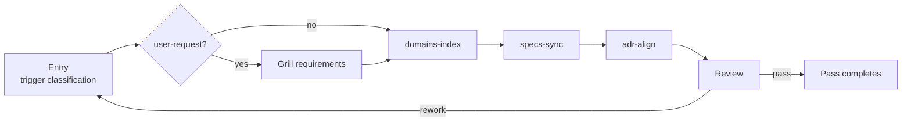
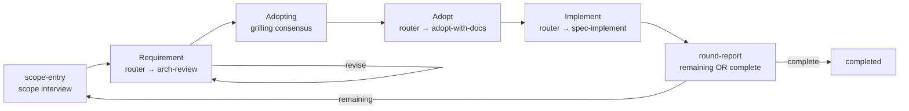
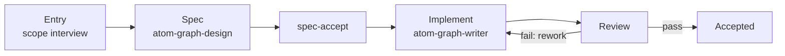

# graph-scheduler

> ⚠️ AI-generated README — edit [docs/readme-blueprint.md](../../docs/readme-blueprint.md) instead.

## Table of Contents

- [graph-scheduler](#graph-scheduler)
  - [Table of Contents](#table-of-contents)
  - [Overview](#overview)
  - [Requirements](#requirements)
  - [Install](#install)
  - [MCP Registration](#mcp-registration)
    - [Environment](#environment)
  - [Project Setup](#project-setup)
  - [Graph Format](#graph-format)
    - [Phase fields](#phase-fields)
    - [Top-level `flow` field](#top-level-flow-field)
  - [MCP Tools](#mcp-tools)
    - [NextNode types](#nextnode-types)
    - [Typical call flow](#typical-call-flow)
  - [Built-in Graphs](#built-in-graphs)
  - [arch-review-loop — one loop, one problem](#arch-review-loop--one-loop-one-problem)
  - [Making a Graph](#making-a-graph)
  - [Development](#development)
  - [FAQ](#faq)
    - [graph\_start returns a node but the agent doesn't respond?](#graph_start-returns-a-node-but-the-agent-doesnt-respond)
    - [Does graph\_start take a mode parameter?](#does-graph_start-take-a-mode-parameter)
    - [How do I see run history?](#how-do-i-see-run-history)
    - [How do I abort a stuck run?](#how-do-i-abort-a-stuck-run)
    - [Where is the database?](#where-is-the-database)

## Overview

Graph-Engineering for Real Engineers: Graphs define workflows; workflows build graphs. Based on mattpocock/skills.

Graph execution engine as a standalone **MCP Server** (stdio transport) — 10 MCP tools, no network port.

graph-scheduler is the infrastructure half of Atomic Workflow. It loads workflow YAML graph definitions (`.yaml` — schema-determined identity), schedules phases in topological order, manages approval decisions, and persists run state. The agent does all the actual work; the scheduler only issues work orders and tracks progress.

**Stack**: bun · Effect-TS · zod v4 (validation) · libsql (persistence) · MCP SDK

## Requirements

Two supported runtimes — pick one; the installer matches the runtime:

|Runtime|Version|Used by|
|-|-|-|
|[Node](https://nodejs.org)|>= 22|npm route — runs the compiled entry `dist/server.js`|
|[bun](https://bun.sh)|>= 1|bun route — runs the TypeScript entry `server.ts` natively|

## Install

Two routes — the runtime matches the installer:

**Option A: npm + Node runtime**

```bash
npm install -g @ai-atomic-workflow/graph-scheduler
```

Resolve the global path (used by the MCP registration below):

```bash
npm root -g   # → <npm-root>, e.g. /usr/local/lib/node_modules
```

**Option B: bun**

```bash
bun add -g @ai-atomic-workflow/graph-scheduler
```

Resolve the global bin folder:

```bash
bun pm bin -g   # → <bun-bin>, e.g. ~/.bun/bin
```

Verify either route:

```bash
npm list -g @ai-atomic-workflow/graph-scheduler
# @ai-atomic-workflow/graph-scheduler@0.6.0
```

This installs the `atom-graph-scheduler` bin alongside the package.

## MCP Registration

graph-scheduler speaks MCP JSON-RPC 2.0 over stdio. Register it in your platform's MCP config — the command invokes your chosen runtime explicitly:

**npm + Node** — replace `<npm-root>` with the `npm root -g` output:

```json
{
  "mcpServers": {
    "graph-scheduler": {
      "command": "node",
      "args": ["<npm-root>/@ai-atomic-workflow/graph-scheduler/dist/server.js"]
    }
  }
}
```

**bun** — replace `<bun-bin>` with the `bun pm bin -g` output:

```json
{
  "mcpServers": {
    "graph-scheduler": {
      "command": "bun",
      "args": ["<bun-bin>/atom-graph-scheduler"]
    }
  }
}
```

Config file locations: OMP → `~/.omp/agent/mcp.json`, OpenCode → `opencode.json` — same JSON either way.

The platform manages the process lifecycle: discover → spawn → connect → health check → reconnect. A crash doesn't kill the session — the platform reconnects automatically.

### Environment

|Variable|Default|Meaning|
|-|-|-|
|`GS_DB_PATH`|`:memory:`|libsql database file — stores `graph_runs` and the checkpoint store (`checkpoints` + `checkpoint_writes`). Scaffolded `config.json` supplies `.graph-scheduler/data/graph-scheduler.db`; env overrides config; falls back to `:memory:` when unset everywhere.|

## Project Setup

Initialize a project with the **setup-atomic-workflow** skill (the retired `atom-graph-config` CLI no longer exists):

```text
Use setup-atomic-workflow to initialize this project
```

The skill runs a four-step flow (explore → present → confirm → write) and scaffolds `.graph-scheduler/`:

- `config.json` — dbPath, taskflowDir, registryPaths; optional `context:` = USER-supplement layer (user-owned ambient files, existence-validated — never required; platform estate is organically discovered, no declaration needed)
- `graphs/` — where your custom workflow YAML graph files live (any `.yaml` passing schema validation)
- `constraints.md` — rules enforced on every graph run

Idempotent: never overwrites existing files. Re-running writes nothing.

## Graph Format

A workflow YAML graph declares phases and their dependencies — any `.yaml` file that passes schema validation is a graph (suffix-free, self-describing via `$schema` + `version` headers):

```yaml
name: e2e-minimal
$schema: workflow.schema.json
version: 1.0.0
phases:
  - id: agent-echo
    type: main
    dependsOn: []
    task: say hello in a random language.

  - id: approval-review
    type: main
    dependsOn: [agent-echo]
    task: |
      Review the agent output.

      Agent output produced. Accept → proceed. Recommendation: accept when the
      output is correct; free input overrides; dynamic option regenerate
      re-runs agent-echo with feedback.
```

### Phase fields

|Field|Meaning|
|-|-|
|`id`|Unique phase id — referenced by `dependsOn` and rework/branch targets|
|`type`|`main` (inline execution + decision) — the only phase type (the `flow` type is removed; subgraph composition via `use` is deleted — nested execution is `template: router` sibling runs)|
|`dependsOn`|Declared upstream phases — the graph runs a phase only when all of them completed|
|`task`|Main: the work order — exact prompt for the agent, `{args.key}` templates interpolated at run time; the main node's confirmation text follows the work order (Accept + free input + contextual options)|
|`skill`|Execution skill for this phase (e.g. `atom-scope-interview`) — how the phase's work gets done|
|`agent`|Priority hints — `string[]` of agent types (e.g. `[reviewer, task]`); advisory, consumed by skills when they dispatch sub-agents (main type only)|
|`operations`|Operation classes — declared execution classes (declarative only; scheduler passes through to NodeDetail, Tool usage check verifies evidence-only)|
|`channels`|Context patterns — graph-level global `context:` (config `context:` = the USER-supplement layer, merged once config-first) plus per-phase `channels:` additions. Entries are `skill:<name>` (skill content), file globs (workflow runtime artifacts only), or `node:<id>` (read edge to a non-`dependsOn` node's output stream; `context: [node:<id>]` promotes a stream into the global channel), resolved against the execution skill's Context Requirements contract; main carries any entry kind. The platform estate (`docs/adr/**`, `openspec/**`, CHANGELOG, README) is read organically by the agent when present — never declared in config|
|`template`|Builtin task-template reference — closed enum (`startup` \| `router`); the node's task text is injected from the template registry at load time. Mutually exclusive with `task` (the `use` field no longer exists); `startup` template nodes are graph entries (`dependsOn` empty), `router` nodes sit mid-graph and select among candidate graphs (paths). The `loop` template is removed (ADR 0238 → graph-flow) — loop/rework semantics are top-level `flow` self-edges|
|`template_args`|Template parameters — `{ paths: [<graph-name>, ...] }` for `template: router` (candidate graphs — the only selection form; required with the template, rejected without). The loop `{ graph, until }` shape does not exist|

### Top-level `flow` field

The workflow SHALL optionally declare a top-level `flow` array — mermaid-subset transition edges (`A --> B` unlabeled sequence default, `A -->|condition| B` condition-matched), compiled into the per-node transition table (node × condition → target). The backend routes a condition-matched advance mechanically (string equality — the condition vocabulary is flow-defined, zero machine validation axis; governance = graph-maintain flow audit + user maintenance, mirroring the inventory regime). Loop/rework semantics are flow self-edges (`review -->|fail| execute`) — inline bounded loops (constraint prose + retryCount), never a subgraph/task-template mechanism. The frontend never picks a next node — it reports the condition value and the graph decides.

## MCP Tools

10 tools, one action per tool, each with its own JSON Schema (MCP tool parameter schemas — distinct from the graph-format JSON Schema at `schemas/workflow.schema.json`):

|Tool|Parameters|What it does|
|-|-|-|
|`graph_start`|`graphName: string`, `args?: object`|Create a run, return the first ready node (NextNode) — plus resolution identity (`resolvedFrom` / `resolvedPath` / `description`) and load-time machine `problems` (inventory consistency, description drift; empty when clean)|
|`graph_advance`|`runId`, `nodeId`, `condition?`, `jump?`, `end?`|Report a node complete — notify + ask next in one step. Dual channel (graph-flow): `condition` = the reported flow-defined condition value — the backend matches it against the node's outgoing flow-edge labels (transition table) and activates the matched target (no match → loud error, missed-condition guard); `jump` = forced rework — backward-only (target ⊆ topological ancestors ∪ `__handoff`, forward rejected loudly, retryCount++). `end: true` = direct-end (adapter-level completion — reported node done, run completes `completed` without resuming the graph). No `branchTo` (removed — ADR 0238). Runs complete via natural drain. Output and duration are not passed in — content lives in the agent session, duration is derived from timestamps|
|`graph_jump`|`runId`, `targetPhaseId`|Jump to a specific phase — operator control (PCL back/jump/re-review); the only backward reset (graph-external, ADR 0238). Resets the target + downstream terminals to pending|
|`graph_force_end`|`runId`|Force-terminate a run — run marked terminated. Completed/terminated runs are a no-op. **Irreversible**. Returns the unified envelope `{ snapshot, node: null }`|
|`graph_status`|`runId`|Full run snapshot — the shared delta shape (`nodes` one-line rows + `changed` full-field rows)|
|`graph_list`|—|All run summaries (runId, graphName, fsmState, createdAt, updatedAt), newest first|
|`graph_assets`|—|All graph assets — the perception list: `{ id, description, run_conditions, source, problems }` per graph from the merged registries (project-first) plus schema-valid workflow YAMLs (`source: fallback`). `description`/`run_conditions` project from the loaded graph definition (catalog single source; registry entries are a pure `{name, path}` index). Read-only — never creates a run. The passive information channel for graph-workflow (graph selection, run-condition awareness, problem surfacing)|
|`graph_init`|—|Initialize the database (create tables + run migration) plus a full machine health check (schema + contract/inventory pass per graph, per-graph problems, config health report). Idempotent|
|`graph_clean_completed`|`before?: string`|Delete completed run records, optionally before an ISO 8601 date|
|`graph_clean_all`|—|Delete ALL run records — running/blocked/terminated. **Dangerous**|

### NextNode types

`graph_start` / `graph_advance` return a NextNode:

|type|Meaning|Agent behavior|
|-|-|-|
|`main`|Execution node|Execute the task inline — context assembled from `channels`, `## Agent hints:` injected when declared; completes with a confirmation card (Accept + free input + contextual options)|

Subgraph composition is deleted (graph-subgraph-route-unify) — `graph_start` / `graph_advance` only ever return `main` nodes, and every dispatched node is a root-graph phase. Nested execution is the `template: router` sibling run: the router node's agent selects a candidate graph (single candidate / hard criterion → auto, else recommendation card), starts it via `graph_start` with the required args, drives it to completion, and reports the result — downstream reads via `node:<router>`. Rework/loop = `template: loop` sibling-run execution: the loop node repeats the looped subgraph (fresh `graph_start` per iteration) until the `until` conditions hold — no `branchTo`, no in-run backward reset (ADR 0238); the operator `graph_jump` is the only backward reset (PCL, graph-external).

### Typical call flow

```text
graph_start({ graphName: "e2e-minimal" })
  → { runId, node: { nodeId: "agent-echo", type: "main", task: "say hello in a random language.", ... } }
  → agent executes the task
  → graph_advance({ runId, nodeId: "agent-echo" })
  → { snapshot, node: { nodeId: "approval-review", type: "main", completion: { default: "continue", direct_end: "end the round." }, ... } }
  → ... loop until node is null (graph complete)
```

## Built-in Graphs

12 graphs ship with the package (in `graphs/`, registered in `graphs/registry.json`). The project's `.graph-scheduler/graphs/` is searched first — a project graph with the same name overrides a built-in.

|Graph|What it does|
|-|-|
|**e2e-minimal**|Minimal E2E: main → main confirmation loop|
|**arch-review**|Requirement production graph, standalone: scope-entry interview (entry node — scope + output path + report input fresh\|existing) → arch-review report (improve-codebase-architecture — producer) → report output. Independently executable requirement production; arch-review-loop launches it as a sibling run (router stage) and hosts the requirement accept loop on its requirement node.|
|**adopt-with-docs**|Requirement adoption (adopt stage) + spec production: adopting (grilling conversation, inline domain-modeling side effects — the consensus IS the acceptance; the adoption goal is confirmed in the grilling first-round frontier, ADR 0247) → spec-propose (openspec-propose — adopted requirements materialize as the OpenSpec change). Standalone raw idea entry; launched by the loop's adopt router stage — receives the produced report via graph_start args (input document) and appends its record as a dated appendix section.|
|**graph-generate**|Graph production — the maker journey: entry (atom-scope-interview) → spec (atom-graph-design per atom-graph-spec) → spec-accept → implement (atom-graph-writer: writes .yaml + registry entry, load-probe validated) → review → rework decision. Single kind (graph), single operation (create)|
|**spec-implement**|Implementation graph: spec-extract (produced change — {args.changeName}, passed by the launching router) → track router (template: router — openspec-apply minimal / openspec-engineer detailed sibling run) → workflow-done. Pure implementation of an existing change — no spec generation; rework is the loop in arch-review-loop.|
|**openspec-apply**|OpenSpec apply workflow: apply change → dual review → bounded rework decision → plain archive (openspec-archive-change)|
|**openspec-engineer**|OpenSpec detailed implementation: spec synthesis → tickets → tdd implementation → dual review → rework decision → lifecycle closure (reverse-validated archive + ADR fold + index)|
|**arch-review-loop**|Three-stage loop with router-launched stage graphs: requirement (router → arch-review sibling run: scope → report; the requirement accept loop is caller-declared on the router node — accept → adopt, revise → flow self-edge re-run, ADR 0246) → adopt (router → adopt-with-docs sibling run: confirms the report via grilling consensus, appends dated appendix, produces the OpenSpec change) → implementation (router → spec-implement sibling run: consumes the change → track machinery → archive) → round-report (round condition remaining \| complete — flow self-edge re-entry or drain; termination at the direct-end options of scope-entry / adopt-scope / adopting)|
|**estate-maintain**|Estate maintenance graph: entry (trigger classification — domain-change/skill-change/proactive + workstream selection) → domains-index (atom-doc-maintain per atom-domain-spec) / specs-sync (atom-spec-maintain) / adr-align (atom-adr-maintain) → review (consistency gate + reverse-validation + read-only deployment-mirror check).|
|**release-prep**|Pre-release preparation — propose (release-prep-analyze: version from git tag history, deterministic + idempotent pre-tag, never executes git tag/commit/push) → plan-grill (grilling confirmation of every planned operation — interview, never auto-gated) → apply (release-prep-apply: version bump on release-line surfaces + CHANGELOG [Unreleased] fold per spec + README list sync vs ground truth, overwrite-style + verified) → release-review (main; continue completes the run — final report prints tag/commit commands, user executes manually; jump re-runs a phase).|
|**graph-maintain**|Graph file maintenance — the maintenance flow: entry (atom-scope-interview — target graph via graph_assets + maintenance intent) → audit (atom-graph-writer maintain mode: inventory compliance + content-vs-inventory) → propose (per-finding fix proposals) → confirm (mandatory user gate) → execute (two-path bundle apply + load-probe) → review → rework decision. Mirrors the maker journey; pairs with the problem-surfacing channel (graph_start problems / graph_init full pass / graph_assets query).|
|**first-principles-dev**|First-principles-prerequisite development flow — requirement (arch-review sibling run: scope + requirement/diff input → report; the requirement accept loop is caller-declared on the router node — accept → adopt, revise → flow self-edge re-run, ADR 0246) → adopt (adopt-with-docs: grilling consensus confirms, appends dated appendix, produces the OpenSpec change) → implement (spec-implement: change → track machinery → archive) → fp-doc-update (folds requirement/diff + reasoning conclusions into docs/first-principles/development-flow.md per the fp README update-maintenance contract; reports round condition remaining \| complete — flow self-edge re-entry or drain)|

**estate-maintain** — doc-estate maintenance as a graph: keeps the derived-view / normative / contract doc classes in sync after a domain or skill change. The root README features it; the skeleton at a glance:



The entry classifies the trigger (domain-change / skill-change / proactive / user-request — user-request adds a grilling confirmation step, no ADR), then runs the three workstreams in sequence — `domains-index` (atom-doc-maintain per atom-domain-spec), `specs-sync` (atom-spec-maintain), `adr-align` (atom-adr-maintain); the review is a consistency gate (requirements class + reverse-validation + read-only deployment-mirror check).

## arch-review-loop — one loop, one problem

The flagship graph: each loop round takes the biggest remaining architectural problem from review to shipped change. The loop at a glance — implementation runs on two tracks (minimal apply / detailed engineer), approval decisions merged into one display:



Phases (arch-review-loop — flat; stage graphs run as router-launched siblings):

|Phase|Type|Role|
|-|-|-|
|`startup`|main (template: startup)|Full startup — constraints session load + serena activation + jcodemunch indexing|
|`scope-entry`|main (input node)|Scope interview (`atom-scope-interview`) — **re-confirmed every round**, never auto-skipped: domain/feature/problem + focus dimensions, plus report input — `fresh` (write a new report to a confirmed output path) or `existing` (closed-loop re-review of a prior report; the path's Top Recommendation is read)|
|`requirement`|main (template: router)|Launches the arch-review graph as a sibling run (single path — auto-select) — the producer (`improve-codebase-architecture`) runs inside the sibling: explore → first-principles → present-candidates; then presents the caller-declared accept question (`template_args.questions` — accept → adopting via the unlabeled sequence default; revise → flow self-edge re-run; accept-node consolidation)|
|`adopting`|main|Adoption conversation (`grilling` skill) — challenges and confirms the produced requirements (adoption goal + trace intent confirmed in the first-round frontier), appends the adoption record as a dated appendix to the report, may offer an ADR; nothing to adopt (change_name empty) → direct end (accept-node consolidation)|
|`adopt`|main (template: router)|Launches the adopt-with-docs graph as a sibling run — the adopted requirements materialize as the OpenSpec change (spec-propose); report path + adoption echo pass via graph_start args|
|`implement`|main (template: router)|Launches the spec-implement graph as a sibling run — spec-extract reads `{args.changeName}`; track router picks openspec-apply minimal / openspec-engineer detailed|
|`round-report`|main|Round condition — reports `remaining \| complete` (flow-defined vocabulary): `remaining` re-enters scope-entry via the flow self-edge; `complete` drains to `__handoff`. Never a next-node choice|

Key semantics:

- **Round restart** loops back to `scope-entry` (an input node) via the flow self-edge `round-report -->|remaining| scope-entry`, so the whole input stage re-acquires (constraints re-loaded, scope re-confirmed) and the round (requirement → adopt → implement) re-runs.
- **One loop**: spec-implement has no internal auto-iteration — the loop is single (round-report self-edge); a failed implementation is re-judged in the next round's re-review.
- **Termination** = the user's decision at a direct-end option (scope-entry / adopting — `direct_end: true` → pilot advances with the end decision — run completes as `completed`, never `force_end`); the loop is human-bounded, not retryCount-capped (rework-law exception).

## Making a Graph

Atomic Workflow bootstraps itself — the maker journey for authoring graphs is a built-in graph:

**Generate a graph** — `graph-generate` is the maker journey graph: a concrete 6-phase workflow (entry → spec → spec-accept → implement → review → rework decision; the name states the operation). Entry (atom-scope-interview) confirms the graph name, topology scope, and save location (default `.graph-scheduler/graphs/`) — no CONTEXT.md dependency. Spec designs the phase topology against atom-graph-spec; implement writes the `.yaml` + registry entry; review validates per code-review with atom-graph-spec; a rework decision applies bounded rework; a clean review closes the run (natural drain). Single kind (graph), single operation (create) — no skill co-production:

```text
Use atom-pilot to run graph-generate: generate a workflow for release notes from merged PRs.
```

The maker journey at a glance:



**Post-archive closure** — each track owns it: openspec-apply archives plain (openspec-archive-change); openspec-engineer closes through atom-doc-lifecycle (reverse-validated archive + ADR decision-fold + index rebuild). Full estate maintenance moves to the next-phase maintain graph.

Skill production (create/edit) flows through `arch-review-loop` openspec changes (improver journey) — implementation loads the spec skill per affected domain (graph → atom-graph-spec, skill → atom-skill-spec, doc → atom-doc-maintain).

All of them are driven by `atom-pilot` from [graph-workflow](../graph-workflow/README.md).

## Development

```bash
cd packages/graph-scheduler

npm install        # install dependencies
npm run build      # build (tsup)
npm test           # run tests (vitest)
npm run typecheck  # type check
npm start          # start the server
```

Tests live in `tests/`, covering types, topology, state persistence, scheduler runtime, graph execution, graph definitions, and integration. Every zod schema in `src/schemas/` has unit tests (valid / invalid / boundary).

## FAQ

### graph_start returns a node but the agent doesn't respond?

Check the MCP connection. Confirm `command`/`args` in your `mcp.json` resolve, and that the scheduler process is alive (platform MCP health-check logs).

### Does graph_start take a mode parameter?

No — `graph_start` accepts only `graphName` and `args?` (opaque run data); there is no mode parameter. Runs complete via natural drain: `graph_advance` returns `node: null` when no node is active and none is eligible.

### How do I see run history?

`graph_list` for run summaries, then `graph_status({ runId })` for phase-level detail.

### How do I abort a stuck run?

`graph_force_end({ runId })`. **Irreversible** — the run is marked `terminated` and cannot be recovered.

### Where is the database?

Scaffolded `config.json` sets `.graph-scheduler/data/graph-scheduler.db` (relative to the working directory). Override with `GS_DB_PATH` (beats config.json); unset everywhere → in-memory. Tables: `graph_runs` (run metadata) and the checkpoint store (`checkpoints` + `checkpoint_writes` — per-node status, retry count, timestamps; duration is computed from timestamps, not stored). Output is **not** persisted — it lives in the agent session or on disk.
