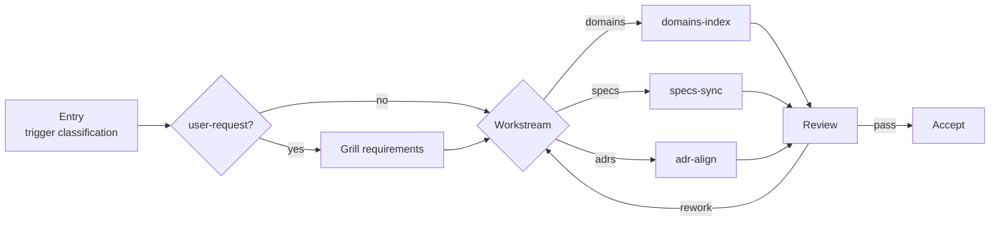
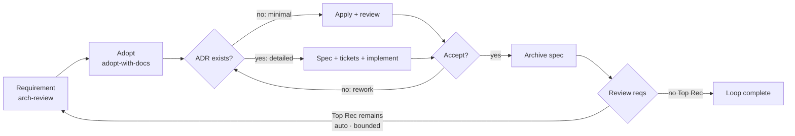
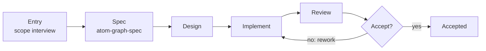

# graph-scheduler

> ⚠️ AI-generated README — edit [docs/readme-blueprint.md](../../docs/readme-blueprint.md) instead.

## Table of Contents

- [graph-scheduler](#graph-scheduler)
  - [Table of Contents](#table-of-contents)
  - [Overview](#overview)
  - [Requirements](#requirements)
  - [Install](#install)
  - [MCP Registration](#mcp-registration)
    - [Environment](#environment)
  - [Project Setup](#project-setup)
  - [Graph Format](#graph-format)
    - [Phase fields](#phase-fields)
  - [MCP Tools](#mcp-tools)
    - [NextNode types](#nextnode-types)
    - [Typical call flow](#typical-call-flow)
  - [Built-in Graphs](#built-in-graphs)
  - [arch-review-loop — one loop, one problem](#arch-review-loop--one-loop-one-problem)
  - [Making a Graph](#making-a-graph)
  - [Development](#development)
  - [FAQ](#faq)
    - [graph_start returns a node but the agent doesn't respond?](#graph_start-returns-a-node-but-the-agent-doesnt-respond)
    - [How do I see run history?](#how-do-i-see-run-history)
    - [How do I abort a stuck run?](#how-do-i-abort-a-stuck-run)
    - [Where is the database?](#where-is-the-database)

## Overview

Graph-Engineering for Real Engineers: Graphs define workflows; workflows build graphs. Based on mattpocock/skills.

DAG execution engine as a standalone **MCP Server** (stdio transport) — 9 MCP tools, no network port.

graph-scheduler is the infrastructure half of Atomic Workflow. It loads `.taskflow.yaml` graph definitions, schedules phases in topological order, manages approval decisions, and persists run state. The agent does all the actual work; the scheduler only issues work orders and tracks progress.

**Stack**: bun · Effect-TS · zod v4 (validation) · libsql (persistence) · MCP SDK

## Requirements

Two supported runtimes — pick one; the installer matches the runtime:

|Runtime|Version|Used by|
|-|-|-|
|[Node](https://nodejs.org)|>= 22|npm route — runs the compiled entry `dist/server.js`|
|[bun](https://bun.sh)|>= 1|bun route — runs the TypeScript entry `server.ts` natively|

## Install

Two routes — the runtime matches the installer:

**Option A: npm + Node runtime**

```bash
npm install -g @ai-atomic-workflow/graph-scheduler
```

Resolve the global path (used by the MCP registration below):

```bash
npm root -g   # → <npm-root>, e.g. /usr/local/lib/node_modules
```

**Option B: bun**

```bash
bun add -g @ai-atomic-workflow/graph-scheduler
```

Resolve the global bin folder:

```bash
bun pm bin -g   # → <bun-bin>, e.g. ~/.bun/bin
```

Verify either route:

```bash
npm list -g @ai-atomic-workflow/graph-scheduler
# @ai-atomic-workflow/graph-scheduler@0.5.0
```

This installs the `atom-graph-scheduler` bin alongside the package.

## MCP Registration

graph-scheduler speaks MCP JSON-RPC 2.0 over stdio. Register it in your platform's MCP config — the command invokes your chosen runtime explicitly:

**npm + Node** — replace `<npm-root>` with the `npm root -g` output:

```json
{
  "mcpServers": {
    "graph-scheduler": {
      "command": "node",
      "args": ["<npm-root>/@ai-atomic-workflow/graph-scheduler/dist/server.js"]
    }
  }
}
```

**bun** — replace `<bun-bin>` with the `bun pm bin -g` output:

```json
{
  "mcpServers": {
    "graph-scheduler": {
      "command": "bun",
      "args": ["<bun-bin>/atom-graph-scheduler"]
    }
  }
}
```

Config file locations: OMP → `~/.omp/agent/mcp.json`, OpenCode → `opencode.json` — same JSON either way.

The platform manages the process lifecycle: discover → spawn → connect → health check → reconnect. A crash doesn't kill the session — the platform reconnects automatically.

### Environment

|Variable|Default|Meaning|
|-|-|-|
|`GS_DB_PATH`|`:memory:`|libsql database file — stores `graph_runs` and `node_states` tables. Scaffolded `config.json` supplies `.graph-scheduler/data/graph-scheduler.db`; env overrides config; falls back to `:memory:` when unset everywhere.|

## Project Setup

Initialize a project with the **setup-atomic-workflow** skill (the retired `atom-graph-config` CLI no longer exists):

```text
Use setup-atomic-workflow to initialize this project
```

The skill runs a four-step flow (explore → present → confirm → write) and scaffolds `.graph-scheduler/`:

- `config.json` — dbPath, taskflowDir, registryPaths; optional `context:` = USER-supplement layer (user-owned ambient files, existence-validated — never required; platform estate is organically discovered, no declaration needed)
- `graphs/` — where your custom `.taskflow.yaml` files live
- `docs/` — attached-doc home for the maker journey (`.graph-scheduler/docs/<name>.md`)
- `constraints.md` — rules enforced on every graph run

Idempotent: never overwrites existing files. Re-running writes nothing.

## Graph Format

A `.taskflow.yaml` graph declares phases and their dependencies:

```yaml
name: e2e-minimal
phases:
  - id: agent-echo
    type: main
    dependsOn: []
    task: say hello in a random language.

  - id: approval-review
    type: approval
    dependsOn: [agent-echo]
    task: |
      Approval Review

      Agent output produced. Accept → proceed. Recommendation: accept when the
      output is correct; free input overrides; dynamic option regenerate
      re-runs agent-echo with feedback.
```

### Phase fields

|Field|Meaning|
|-|-|
|`id`|Unique phase id — referenced by `dependsOn` and jump/route targets|
|`type`|`main` (inline execution), `approval` (human decision card), `gate` (machine rework judgment), `flow` (composition — referenced sub-graph via `use`, flattened into the parent at load)|
|`dependsOn`|Declared upstream phases — the graph runs a phase only when all of them completed|
|`task`|Main: the work order — exact prompt for the agent, `{args.key}` templates interpolated at run time. Approval: decision-card prompt — first line = card header (≤30 chars), rest = card body|
|`skill`|Execution skill for this phase (e.g. `atom-scope-interview`) — how the phase's work gets done|
|`agent`|Priority hints — `string[]` of agent types (e.g. `[reviewer, task]`); advisory, consumed by skills when they dispatch sub-agents (main type only)|
|`channels`|Context patterns — graph-level global `context:` (config `context:` = the USER-supplement layer, merged once config-first) plus per-phase `channels:` additions. Entries are `skill:<name>` (skill content), file globs (workflow runtime artifacts only), or `node:<id>` (read edge to a non-`dependsOn` node's output stream; `context: [node:<id>]` promotes a stream into the global channel), resolved against the execution skill's Context Requirements contract; approval/gate carry `node:` entries only (judgment context). The platform estate (`docs/adr/**`, `openspec/**`, CHANGELOG, README) is read organically by the agent when present — never declared in config|
|`jumps`|Gate-only rework conditions — `[{when, to}]`, agent-evaluated in declaration order; first hit → backward jump to `to` (target + downstream reset, retry count incremented); no hit → pass through|
|`route`|Branch-route membership — declared route id; flows propagate their id to children; absent = implicit default route (always active). Approval branch options activate a route via `graph_advance` `branchTo`; unselected routes never activate|
|`routing`|Approval-only branch-route actions — `{ actions: [{ action, target?, value, label, description }] }`, declared only in branch-route scenarios; drives the decision-card options. Rejected on other types|
|`join`|Dependency resolution — `any` (one dep suffices; the only accepted literal)|
|`use`|Flow type — referenced graph name to compose in (required when `type: flow`)|

## MCP Tools

9 tools, one action per tool, each with its own JSON Schema:

|Tool|Parameters|What it does|
|-|-|-|
|`graph_start`|`graphName: string`, `args?: object`|Create a run, return the first ready node (NextNode)|
|`graph_advance`|`runId`, `nodeId`, `branchTo?`, `endRun?`|Report a node complete — notify + ask next in one step. `branchTo` passes a routing target (gate rework target / approval branch-route target); `endRun: true` completes the run immediately (approval end action). Output and duration are not passed in — content lives in the agent session, duration is derived from timestamps|
|`graph_jump`|`runId`, `targetPhaseId`|Jump to a specific phase — re-run it after an approval REWORK decision|
|`graph_force_end`|`runId`|Force-terminate a run — unfinished nodes marked aborted, run marked terminated. **Irreversible**|
|`graph_status`|`runId`|Full run snapshot — per-phase status, retry counts, timestamps|
|`graph_list`|—|All run summaries (runId, graphName, fsmState, createdAt, updatedAt), newest first|
|`graph_init`|—|Initialize the database (create tables + run migration) plus a machine health check (graph YAML parse + config health report). Idempotent|
|`graph_clean_completed`|`before?: string`|Delete completed run records, optionally before an ISO 8601 date|
|`graph_clean_all`|—|Delete ALL run records — running/blocked/terminated. **Dangerous**|

### NextNode types

`graph_start` / `graph_advance` return a NextNode:

|type|Meaning|Agent behavior|
|-|-|-|
|`main`|Execution node|Execute the task inline — context assembled from `channels`, `## Agent hints:` injected when declared|
|`gate`|Machine decision node|Evaluate `jumps` rework conditions — first hit → backward jump to the target (scheduler resets target + downstream terminals, upstream kept); no hit → pass through|
|`approval`|Human decision node|Present a Decision Card and collect the choice|

`flow` is a load-time composition type, not a dispatch type — sub-graphs via `use` are flattened into the parent graph before execution (depth cap 5). `graph_start` / `graph_advance` only ever return `main` / `approval` / `gate` nodes.

### Typical call flow

```text
graph_start({ graphName: "e2e-minimal" })
  → { runId, node: { nodeId: "agent-echo", type: "main", task: "say hello in a random language.", ... } }
  → agent executes the task
  → graph_advance({ runId, nodeId: "agent-echo" })
  → { snapshot, node: { nodeId: "approval-review", type: "approval", routingActions: [...], ... } }
  → ... loop until node is null (graph complete)
```

## Built-in Graphs

10 graphs ship with the package (in `graphs/`, registered in `graphs/registry.json`). The project's `.graph-scheduler/graphs/` is searched first — a project graph with the same name overrides a built-in.

|Graph|What it does|
|-|-|
|**e2e-minimal**|Minimal E2E: main → approval loop|
|**arch-review**|Requirement production graph, standalone: scope-entry interview (entry node — scope + output path + report input fresh\|existing) → arch-review report (improve-codebase-architecture — producer) → review-accept (Continue = requirement ready / Loop again / End). Independently executable requirement production; the loop composes it as its requirement stage (adopt + implement follow in arch-review-loop).|
|**adopt-with-docs**|Requirement adoption (adopt stage) + spec production: adopt-scope (interview: idea/goal or input document) → adopting (grilling conversation, inline domain-modeling side effects) → adopt-accept (adoption approval) → spec-propose (openspec-propose — adopted requirements materialize as the OpenSpec change). Standalone raw idea entry; composed as the loop's adopt stage — receives the produced report as input document and appends its record as a dated appendix section.|
|**graph-generate**|Graph production — the maker journey: entry (atom-scope-interview) → spec (atom-graph-design per atom-graph-spec) → spec-accept → implement (atom-graph-writer: writes .taskflow.yaml + registry entry + attached doc .graph-scheduler/docs/<name>.md, load-probe validated) → review → gate → accept. Single kind (graph), single operation (create)|
|**spec-implement**|Implementation graph: spec-extract (produced change — upstream channel when composed / {args.changeName} standalone) → track gate (minimal/detailed) → track-owned closure (plain archive / atom-doc-lifecycle) → pipeline-done. Pure implementation of an existing change — no spec generation; rework is the loop in arch-review-loop.|
|**openspec-apply**|OpenSpec apply pipeline: apply change → dual review → bounded auto-rework gate → plain archive (openspec-archive-change)|
|**openspec-engineer**|OpenSpec detailed implementation: spec synthesis → tickets → tdd implementation → dual review → bounded gate → approval → lifecycle closure (reverse-validated archive + ADR fold + index)|
|**arch-review-loop**|Three-stage composition with a single loop: requirement production (arch-review — scope → report → accept) → round-continue content gate (branch-route: continue activates the proceed route / end when no Top Recommendation remains) → adopt (adopt-with-docs — confirms the report, appends dated appendix, produces the OpenSpec change) → implementation (spec-implement — consumes the change → track machinery → archive) → loop-gate (auto jump to requirement/scope-entry while Top Rec remains, bounded) → loop-accept (Loop again default, Complete = user ends)|
|**estate-maintain**|Estate maintenance graph: entry (trigger classification — domain-change/skill-change/proactive + workstream selection) → domains-index (atom-doc-maintain per atom-domain-spec) / specs-sync (atom-spec-maintain) / adr-align (atom-adr-maintain) → review (consistency gate + reverse-validation + read-only deployment-mirror check) → accept.|
|**release-prep**|Pre-release preparation — propose (release-prep-analyze: version from git tag history, deterministic + idempotent pre-tag, never executes git tag/commit/push) → plan-grill (grilling confirmation of every planned operation — interview, never auto-gated) → apply (release-prep-apply: version bump on release-line surfaces + CHANGELOG [Unreleased] fold per spec + README list sync vs ground truth, overwrite-style + verified) → release-review (approval; continue completes the run — final report prints tag/commit commands, user executes manually; jump re-runs a phase).|

**estate-maintain** — doc-estate maintenance as a graph: keeps the derived-view / normative / contract doc classes in sync after a domain or skill change. The root README features it; the skeleton at a glance:



The entry classifies the trigger (domain-change / skill-change / proactive / user-request — user-request adds a grilling confirmation step, no ADR), then dispatches the matching workstream — `domains-index` (atom-doc-maintain per atom-domain-spec), `specs-sync` (atom-spec-maintain), `adr-align` (atom-adr-maintain); the review is a consistency gate (requirements class + reverse-validation + read-only deployment-mirror check).

## arch-review-loop — one loop, one problem

The flagship graph: each loop round takes the biggest remaining architectural problem from review to shipped change. The loop at a glance — implementation runs on two tracks (minimal apply / detailed engineer), pipeline gates merged into one display:



Phases (after composition):

|Phase|Type|Role|
|-|-|-|
|`requirement/scope-entry`|main (input node)|Scope interview (`atom-scope-interview`) — **re-confirmed every round**, never auto-skipped: domain/feature/problem + focus dimensions, plus report input — `fresh` (write a new report to a confirmed output path) or `existing` (closed-loop re-review of a prior report; the path's Top Recommendation is read)|
|`requirement/arch-review`|main|Runs the producer (`improve-codebase-architecture`) — Round 2+ re-reads the report (single source of truth, no path re-confirmation), marks per-Top-Rec implementation progress from code evidence, updates the report in place, rewrites the Top Recommendation (strongest remaining candidate, or empty)|
|`requirement/review-accept`|approval|Requirement-ready card — Continue (requirement ready) / Loop again (retry scope-entry) / End. Recommendation follows the report state|
|`round-continue`|approval|Content gate — explicit branch-route: Continue → `proceed` route (activates adopt + implement) / End. Empty rounds short-circuit structurally: no Top Rec → end recommended, unselected route members never activate|
|`adopt/adopting`|main|Adoption conversation (`grilling` skill) — challenges and confirms the produced requirements, appends the adoption record as a dated appendix to the report, may offer an ADR|
|`adopt/spec-propose`|main|Openspec-propose (upstream) — the adopted requirements materialize as the OpenSpec change|
|`implement/spec-extract`|main|Extracts the implementation scope from the produced change (no interview, no generation)|
|`implement/pipeline-accept`|approval|Track gate — minimal (apply directly) / detailed (engineer); recommendation follows the echoed ADR judgment|
|`loop-gate`|gate|THE loop — backward jump to `requirement/scope-entry` when: run mode is auto AND `requirement/arch-review` output shows `top_rec_remaining: true` AND `requirement/scope-entry` retryCount < 8. No match → pass through|
|`loop-accept`|approval|Round-end card — Loop again (default) or Complete (end action). Recommendation follows the report state and the loop bound; when nothing remains, ending IS the recommendation|

Key semantics:

- **Run mode** is a per-activation decision — the built-in `run-mode` input node (`args.mode` short-circuits, otherwise a question), never a graph topic. Auto mode executes the gate jump and the end actions without asking; manual mode presents every decision card.
- **Round restart** jumps back to `requirement/scope-entry` (an input node), so the whole input stage re-acquires (mode re-confirmed, constraints re-loaded, scope re-confirmed) and the round (requirement → adopt → implement) re-runs.
- **One loop**: spec-implement has no internal auto-iteration gate — a failed implementation is covered by the same loop condition (the report's `top_rec_remaining` is untouched mid-round) and the next round's re-review judges the evidence.
- **Normal end** = the review reports no remaining Top Recommendation (`top_rec_remaining: false`) — the loop finishes; the bound (`requirement/scope-entry` retryCount < 8) only caps forced auto rework.

## Making a Graph

Atomic Workflow bootstraps itself — the maker journey for authoring graphs is a built-in graph:

**Generate a graph** — `graph-generate` is the maker journey graph: a concrete 7-phase pipeline (entry → spec → spec-accept → implement → review → gate → accept; the name states the operation). Entry (atom-scope-interview) confirms the graph name, topology scope, and save location (default `.graph-scheduler/graphs/`) — no CONTEXT.md dependency. Spec designs the phase topology against atom-graph-spec; implement writes the `.taskflow.yaml` + registry entry + attached doc (`.graph-scheduler/docs/<name>.md`); review validates per code-review with atom-graph-spec; gate applies bounded rework; a single accept closes. Single kind (graph), single operation (create) — no skill co-production:

```text
Use atom-pilot to run graph-generate: generate a workflow for release notes from merged PRs.
```

The maker journey at a glance:



**Post-archive closure** — each track owns it: openspec-apply archives plain (openspec-archive-change); openspec-engineer closes through atom-doc-lifecycle (reverse-validated archive + ADR decision-fold + index rebuild). Full estate maintenance moves to the next-phase maintain graph.

Skill production (create/edit) flows through `arch-review-loop` openspec changes (improver journey) — implementation loads the spec skill per affected domain (graph → atom-graph-spec, skill → atom-skill-spec, doc → atom-doc-maintain).

All of them are driven by `atom-pilot` from [graph-workflow](../graph-workflow/README.md).

## Development

```bash
cd packages/graph-scheduler

npm install        # install dependencies
npm run build      # build (tsup)
npm test           # run tests (vitest)
npm run typecheck  # type check
npm start          # start the server
```

Tests live in `tests/`, covering types, topology, state persistence, scheduler runtime, graph execution, graph definitions, and integration. Every zod schema in `src/schemas/` has unit tests (valid / invalid / boundary).

## FAQ

### graph_start returns a node but the agent doesn't respond?

Check the MCP connection. Confirm `command`/`args` in your `mcp.json` resolve, and that the scheduler process is alive (platform MCP health-check logs).

### How do I see run history?

`graph_list` for run summaries, then `graph_status({ runId })` for phase-level detail.

### How do I abort a stuck run?

`graph_force_end({ runId })`. **Irreversible** — the run is marked `terminated` and cannot be recovered.

### Where is the database?

Scaffolded `config.json` sets `.graph-scheduler/data/graph-scheduler.db` (relative to the working directory). Override with `GS_DB_PATH` (beats config.json); unset everywhere → in-memory. Two tables: `graph_runs` (run metadata) and `node_states` (per-node status, retry count, timestamps; duration is computed from timestamps, not stored). Output is **not** persisted — it lives in the agent session or on disk.
