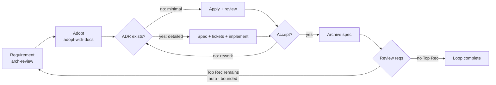
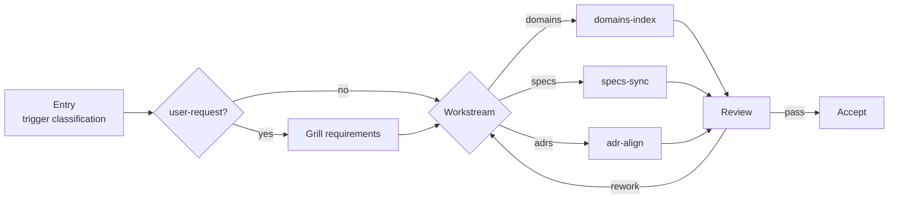
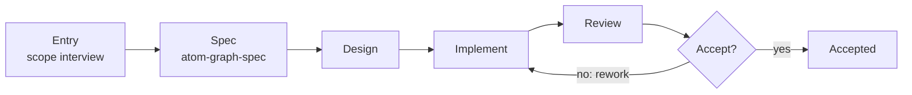

# graph-workflow

> ⚠️ AI-generated README — edit [docs/readme-blueprint.md](../../docs/readme-blueprint.md) instead.

## Table of Contents

- [graph-workflow](#graph-workflow)
  - [Table of Contents](#table-of-contents)
  - [Overview](#overview)
  - [How Skills Drive Graphs](#how-skills-drive-graphs)
  - [Making a Graph](#making-a-graph)
  - [Install](#install)
  - [Skill List](#skill-list)
  - [Development](#development)
  - [Related Docs](#related-docs)

## Overview

Graph-Engineering for Real Engineers: Graphs define workflows; workflows build graphs. Based on mattpocock/skills.

The skill system that drives graph execution — 16 built-in skills.

graph-workflow is the agent-side half of Atomic Workflow. [graph-scheduler](../graph-scheduler/README.md) issues runtime work orders; these skills execute them. Each phase of a graph maps to a skill: the graph declares the skill in the phase definition, and the skill knows how to run that phase — the interview, the review, the write, the approval. Distributed for any agent platform — Claude Code plugin, skills.sh, or copy the `skills/` folder.

Graph execution serves the two journeys: the **maker journey** (produce a new graph via `graph-generate`) and the **improver journey** (improve built-in graphs or project-owned skills via `arch-review-loop`).

The flagship loop these skills drive — one round composes requirement production, adoption, and implementation (two tracks: minimal apply / detailed engineer); `loop-gate` re-enters the loop while a Top Recommendation remains (auto mode, bounded):



estate-maintain keeps the doc estate in sync after a domain or skill change — the entry classifies the trigger (user-request adds a grilling confirmation step, no ADR), dispatches the matching workstream — `domains-index` (atom-doc-maintain), `specs-sync` (atom-spec-maintain), `adr-align` (atom-adr-maintain) — and the review is a consistency gate:



## How Skills Drive Graphs

The execution chain:

- `atom-pilot` — lifecycle manager: execute → advance loop (`graph_start` → dispatch → `graph_advance`)
- `atom-phase-handler` — central dispatch by node type (main/approval/gate base types; consumes input-node outputs, injects `## Agent hints:` / `## Run Mode:` / `## Constraints` blocks)
- `atom-kernel` — platform primitives (`task()` / `approval()` / `interview()` / `judge()`); sole dispatch-primitive source
- `atom-scope-interview` — shared entry interview for graph entry phases (arch-review, arch-review-loop, graph-generate, adopt-with-docs, estate-maintain)
- Entry skills — one per graph domain: `atom-doc-lifecycle` (end-of-workflow closure — close() contract), `atom-doc-maintain` (docs estate — maintain() contract + Format Reference), `setup-atomic-workflow` (project setup); review / idea grilling / ADR judgment run via upstream `improve-codebase-architecture` / `grilling` / `domain-modeling` (direct use, no local wrappers); implementation stages load spec skills per affected domain — graph → atom-graph-spec, skill → atom-skill-spec, doc → atom-doc-maintain
- Reference/spec skills — format specifications: `atom-graph-spec` (.taskflow.yaml), `atom-skill-spec` (SKILL.md), `atom-kernel` §Tool Schemas (exact parameter schemas for serena / jcodemunch / headroom / graph-scheduler; contract-missing tool → read full docs first); document format rules live inside `atom-doc-maintain` §Format Reference; graph-scheduler tool detection lives in `atom-kernel`

## Making a Graph

The maker journey is itself a graph — `graph-generate` is the concrete maker journey graph: entry (atom-scope-interview, no CONTEXT.md hard dependency) → spec (topology design per atom-graph-spec) → spec-accept → implement (writes the `.taskflow.yaml` + registry entry + attached doc `.graph-scheduler/docs/<name>.md`) → review → gate → accept. Single kind (graph), single operation (create). Driven the same way as every graph:

```text
Use atom-pilot to run graph-generate: generate a workflow for release notes from merged PRs.
```

The maker journey at a glance:



Skill production (create/edit) flows through `arch-review-loop` openspec changes (improver journey) — implementation loads the spec skill per affected domain (graph → atom-graph-spec, skill → atom-skill-spec, doc → atom-doc-maintain).

## Install

Two channels — pick one. **All 16 skills are required for graph execution.**

**Option A: Claude Code marketplace**

```bash
/marketplace install makara/ai-atomic-workflow
```

**Option B: skills.sh** (third-party CLI, 76+ agent platforms — OpenCode / Codex / Cursor etc.)

```bash
npx skills add makara/ai-atomic-workflow
```

Common flags (verified via `npx skills --help`): `-a <agent>` pick platform (`-a '*'` all), `-g` global install, `-y` non-interactive, `-l` preview without installing.

## Skill List

16 skills in `skills/`:

|Skill|What it does|
|-|-|
|**atom-pilot**|Graph lifecycle manager - execute->advance loop. Dispatch via atom-phase-handler (skill resolution convention) - single entry point, routes by node.type internally. Use when running taskflow graphs.|
|**atom-phase-handler**|Central dispatch handler - { node, snapshot? } schema and static dispatch by node.type (main/approval/gate base types). Use when processing graph_start/graph_advance/graph_jump response, executing phase nodes, routing by node.type.|
|**atom-scope-interview**|Generic entry procedure for graph entry phases - caller-declared contract (topics, output fields, behavior flags), collect -> propose -> interview() consensus -> derive -> check -> emit. Use when dispatching entry scope phases.|
|**atom-doc-lifecycle**|Entry skill for end-of-workflow lifecycle closure - one close() contract: reverse-validated openspec archive, ADR decision-fold, live index rebuild, lifecycle validation. Use when archiving a completed change, folding ADR records, rebuilding the ADR index, closing a workflow after approval, or running detailed-track post-archive closure.|
|**atom-doc-maintain**|Entry + reference skill for document estate maintenance - one maintain() contract: trigger classification (domain-change/skill-change/proactive), document taxonomy, per-class maintenance rules, consistency gate, Format Reference, Language Constraints. Use when maintaining documents, syncing docs after a domain or skill change, running a proactive consistency scan, or writing/reviewing markdown documents. Closure (archive + ADR fold) lives in atom-doc-lifecycle; CHANGELOG per §Document Types.|
|**atom-domain-spec**|Format reference for docs/domains.md - the single authority for domain split principles (bounded-context judgment + core/supporting/generic subdomain classification per clean-ddd-hexagonal, ubiquitous language per domain-modeling), domain count bound 10-100 with kind layering when exceeded, reverse-analysis provenance (asset -> domain, no forward design), the evolution four-step, the head-position Design Requirements block with constraints.json-equivalent standing, and the linkage rule (spec/ADR associations only in domain list tables). Use when writing, reviewing, or maintaining docs/domains.md, or when a maintain node validates domain index changes. Consumed by atom-doc-maintain (index class) and the estate-maintain graph domains-index node.|
|**atom-spec-maintain**|openspec/specs estate maintenance contract - one path: reverse-analyze (triple diff: actual capabilities <-> docs/domains.md <-> spec dirs) -> minimal change (delta specs only, no tickets) -> openspec-sync-specs -> openspec archive. Repairs drift, retires orphan capability dirs, registers real capabilities as domains, keeps spec dirs <-> domain IDs 1:1. Use when fixing openspec/specs drift, reorganizing spec domains, or dispatching the specs-sync workstream of estate-maintain. Distinct from the normal change -> apply -> sync -> archive flow (no implementation ceremony).|
|**atom-adr-maintain**|ADR estate alignment contract - keeps docs/adr/ consistent with decision reality: live statuses verified against actual decision effect, stale chains folded through atom-doc-lifecycle fold machinery (shared, never duplicated), index rebuilt, archive hygiene, dead citations repointed to superseding records. Also aligns CONTEXT.md (project glossary) per domain-modeling CONTEXT-FORMAT.md - structure verified, terms cross-referenced with the ADR estate. Use when aligning ADRs with current state, cleaning stale ADR history, or dispatching the adr-align workstream of estate-maintain. Distinct from closure (atom-doc-lifecycle close()) and from spec maintenance (atom-spec-maintain).|
|**setup-atomic-workflow**|Initialize graph-scheduler project config - setup .graph-scheduler, create config.json, scaffold constraints.md, verify existing layout. Trigger phrases: "initialize graph-scheduler project config", "setup .graph-scheduler", "create config.json", "setup-atomic-workflow".|
|**atom-graph-spec**|Reference for .taskflow.yaml graph format specification - PhaseSchema, topology, gate rework jumps, join modes, channels, approval decision confirmation, branch routes, Run Mode. Use when writing or reviewing taskflow graphs, mentions graph format, graph definition, PhaseSchema.|
|**atom-graph-design**|Entry skill for graph topology design - loads atom-graph-spec, analyzes requirements, designs phase list with dependsOn/jumps/channels. Trigger: spec phase in graph-generate graph.|
|**atom-graph-writer**|Entry skill for graph YAML generation - loads atom-graph-spec, validates topology, generates valid .taskflow.yaml. Trigger: implement phase in graph-generate graph.|
|**atom-skill-spec**|Reference for SKILL.md format specification - frontmatter rules, body content rules, content quality metrics (quantified norms), language constraints, reference boundaries, Context Requirements contract (four subsections incl. Operation classes). Use when writing or reviewing skills, mentions skill format, SKILL.md, skill spec, operation classes, skill quality, why/how ratio, skill length bands.|
|**atom-kernel**|Platform primitives - task() dispatch, approval() decision UI (mode-aware single decision - absorbs question(), 8 card rules), interview() consensus (single contract, consensus + solve modes), judge(), graph-scheduler tool detection, High-Level Tool Registry (closed tool set, scenario structure - key = target domain x operation -> exactly one adapter; in-project code two-plane chain (jcodemunch query head, serena mutation sole), platform-native adapters for out-of-project/special-type domains + permissive cells for in-project non-code text read/write, run platform shell, compress headroom-ai platform-neutral; utility classes optional; tool schemas for serena/jcodemunch/headroom/graph-scheduler). Use when dispatching sub-agents or presenting decisions, executing main-phase work, authoring execution skills, or mentions high-level tool, HLT registry, tool call, tool schema, evidence loop, verify loop.|
|**release-prep-analyze**|Pre-release analysis - propose next version from git tag history (never package.json), derive changelog inventory from actual diff. Deterministic, idempotent pre-tag, never executes git tag/commit/push. Use when dispatching the release-prep propose phase.|
|**release-prep-apply**|Pre-release writes - apply the confirmed release plan with overwrite-style writes - version bump on release-line surfaces, CHANGELOG fold per spec, README list sync vs ground truth. Idempotent + per-domain verification. Use when dispatching the release-prep apply phase.|

## Development

```bash
cd packages/graph-workflow

npm install        # install dependencies
npm test           # run tests (vitest)
npm run typecheck  # type check
```

## Related Docs

- [Root README](../../README.md) — project overview and the typical usage path
- [graph-scheduler README](../graph-scheduler/README.md) — MCP tools, graph format, built-in graphs
