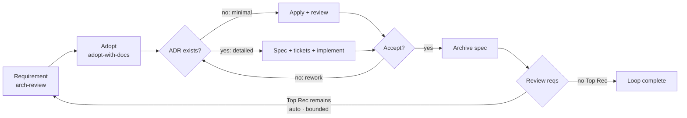
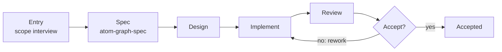

# graph-workflow

> ⚠️ AI-generated README — edit [docs/readme-blueprint.md](../../docs/readme-blueprint.md) instead.

## Table of Contents

- [graph-workflow](#graph-workflow)
  - [Table of Contents](#table-of-contents)
  - [Overview](#overview)
  - [How Skills Drive Graphs](#how-skills-drive-graphs)
  - [Making a Graph](#making-a-graph)
  - [Install](#install)
  - [Skill List](#skill-list)
  - [Development](#development)
  - [Related Docs](#related-docs)

## Overview

Graph-driven work-order system for AI agents — explicit phases, scoped context, and non-bypassable approval gates.

The skill system that drives graph execution — 12 built-in skills.

graph-workflow is the agent-side half of Atomic Workflow. [graph-scheduler](../graph-scheduler/README.md) issues runtime work orders; these skills execute them. Each phase of a graph maps to a skill: the graph declares the skill in the phase definition, and the skill knows how to run that phase — the interview, the review, the write, the approval. Graph execution serves the two journeys: the **maker journey** (produce a new graph via `graph-generate`) and the **improver journey** (improve built-in graphs or project-owned skills via `arch-review-loop`).

The graph basics: a graph is a work-order board declared in a `.taskflow.yaml` file — a named set of phases wired by `dependsOn` edges; the scheduler issues each ready phase as a work order and tracks progress, it executes nothing. Phases are `main` (inline execution), `approval` (human decision card), `gate` (machine rework judgment), plus `flow` composition via `use`. Built-in graphs ship in `packages/graph-scheduler/graphs/` (registered in `graphs/registry.json`); user graphs live in `.graph-scheduler/graphs/` and override built-ins by name (project-first).

The flagship loop these skills drive — one round composes requirement production, adoption, and implementation (two tracks: minimal apply / detailed engineer); `loop-gate` re-enters the loop while a Top Recommendation remains (auto mode, bounded):



## How Skills Drive Graphs

The execution chain:

|Skill|Role|
|-|-|
|`atom-pilot`|Graph lifecycle manager — runs the execute → advance loop (`graph_start` → dispatch → `graph_advance`)|
|`atom-phase-handler`|Central dispatch — routes each node by its `type` (main/approval/gate base types). The single entry point for running graphs; consumes prologue outputs, injects `## Agent hints:` / `## Run Mode:` / `## Constraints` blocks|
|`atom-kernel`|Platform primitives — `task()` dispatch, `question()` decision UI, `interview()` consensus (single contract, consensus + solve modes), graph-scheduler tool detection. Sole dispatch-primitive source|
|`atom-scope-interview`|Shared scope-confirmation interview for graph entry phases — search conversation, one-question-per-turn + solve mode, uniform `scope_complete` output contract; used by arch-review, arch-review-loop, adopt-with-docs, graph-generate|
|Entry skills|One per graph domain — `atom-doc-maintenance` (docs — maintain() contract, ADR 0091), `atom-openspec-archive` (change archival), `setup-atomic-workflow` (project setup), `atom-scope-interview` (shared scope-confirm interview for entry phases); review / idea grilling / ADR judgment run via upstream `improve-codebase-architecture` / `grilling` / `domain-modeling` (direct use, no local wrappers)|
|Reference skills|Format specifications — `atom-graph-spec` (.taskflow.yaml), `atom-skill-spec` (SKILL.md), `atom-mcp-contract` (exact parameter schemas for serena / jcodemunch / headroom / graph-scheduler; contract-missing tool → read full docs first). Document format rules live inside `atom-doc-maintenance` §Format Reference|

## Making a Graph

The maker journey is itself a graph — `graph-generate` is the concrete maker journey graph: entry (atom-scope-interview, no CONTEXT.md hard dependency) → spec (topology design per atom-graph-spec) → spec-accept → implement (writes the `.taskflow.yaml` + registry entry + attached doc `.graph-scheduler/docs/<name>.md`) → review → gate → accept. Single kind (graph), single operation (create). Driven the same way as every graph:

```text
Use atom-pilot to run graph-generate: generate a workflow for release notes from merged PRs.
```

The maker journey at a glance:



Skill production (create/edit) flows through `arch-review-loop` openspec changes (improver journey) — implementation loads the spec skill per affected domain (graph → atom-graph-spec, skill → atom-skill-spec, doc → atom-doc-maintenance).

## Install

Two channels — pick one. **All 12 skills are required for graph execution.**

**Option A: Claude Code marketplace**

```bash
/marketplace install makara/ai-atomic-workflow
```

**Option B: skills.sh** (third-party CLI, 76+ agent platforms — OpenCode / Codex / Cursor etc.)

```bash
npx skills add makara/ai-atomic-workflow
```

Common flags (verified via `npx skills --help`): `-a <agent>` pick platform (`-a '*'` all), `-g` global install, `-y` non-interactive, `-l` preview without installing.

## Skill List

12 skills in `skills/`:

|Skill|What it does|
|-|-|
|**atom-pilot**|Graph lifecycle manager — execute → advance loop. Dispatch via `atom-phase-handler`; single entry point, routes by node type internally|
|**atom-phase-handler**|Central dispatch — `{ node, snapshot? }` schema, static dispatch (main/approval/gate base types), agent-hint injection|
|**atom-kernel**|Platform primitives — `task()` dispatch, `question()` (8 rules), `interview()` (single contract — consensus + solve modes), graph-scheduler tool detection. Sole dispatch-primitive source|
|**atom-scope-interview**|Shared scope-confirmation interview for graph entry phases — search conversation, interview() one-question-per-turn, solve mode until complete, uniform `scope_complete` output contract|
|**atom-doc-maintenance**|Doc maintenance deep module — maintain() contract (trigger classification, document taxonomy, per-class rules, consistency gate) + Format Reference. Replaces atom-doc-spec/atom-doc-writer|
|**atom-openspec-archive**|Archive a completed OpenSpec change via `openspec archive` CLI — reverse-validates task completion against code evidence before archiving. Used as a graph phase post-approval (openspec-apply / openspec-engineer)|
|**setup-atomic-workflow**|Initialize graph-scheduler project config — setup `.graph-scheduler`, create config.json, scaffold constraints.md, verify existing layout. Replaces the retired `atom-graph-config` CLI|
|**atom-graph-spec**|Reference for the `.taskflow.yaml` format — PhaseSchema, topology constraints, gate rework jumps, join modes, channel requirements, approval decision confirmation, branch routes, Run Mode|
|**atom-graph-design**|Entry skill for graph topology design — loads atom-graph-spec, analyzes requirements, designs the phase list with dependsOn/when/channels. Trigger: spec phase in graph-generate|
|**atom-graph-writer**|Entry skill for graph YAML generation — loads atom-graph-spec, validates topology, generates valid `.taskflow.yaml`. Trigger: implement phase in graph-generate|
|**atom-skill-spec**|Reference for the SKILL.md format — frontmatter rules, body content rules, language constraints, reference boundaries|
|**atom-mcp-contract**|MCP tool-call contract — exact parameter schemas for serena / jcodemunch / headroom / graph-scheduler tools; schema-first protocol, failure recovery chain; contract-missing tool → read full docs first|

## Development

```bash
cd packages/graph-workflow

npm install        # install dependencies
npm test           # run tests (vitest)
npm run typecheck  # type check
```

## Related Docs

- [Root README](../../README.md) — project overview and the typical usage path
- [graph-scheduler README](../graph-scheduler/README.md) — MCP tools, graph format, built-in graphs
